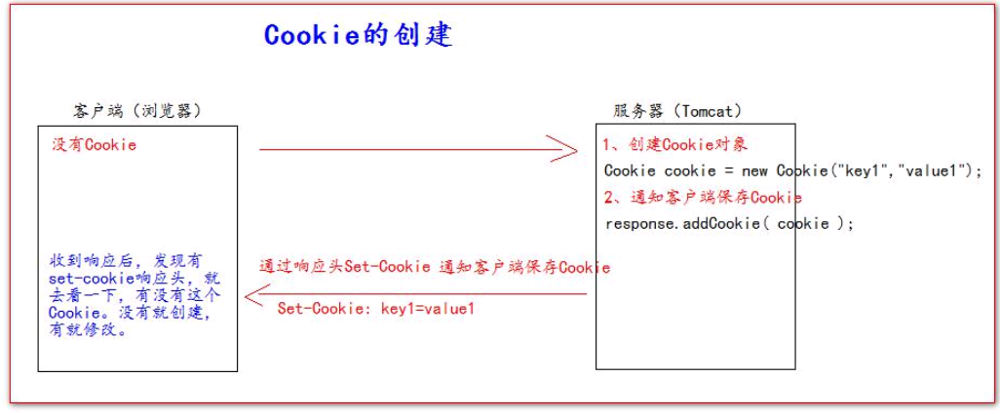
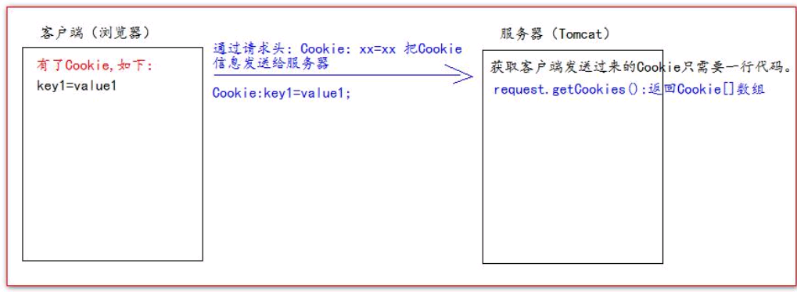

Cookie和Session的简单学习

<!-- more -->

# Cookie

## 什么是Cookie

- Cookie 翻译过来是饼干的意思。
- Cookie 是服务器通知客户端保存键值对的一种技术。
- 客户端有了 Cookie 后，每次请求**对应路径**时都发送**对应Cookie**给服务器。

## Cookie的特点

- 每个 Cookie 的大小不能超过 4kb
- 服务器可以一次向浏览器发送多个Cookie
- Cookie对象的key和value的类型必须是字符串，key不能是中文或特殊字符，且key和value中不能有空格
- Cookie默认无有效时长，默认保存在浏览器中，浏览器关闭，Cookie消失。
  - Cookie有效时长 = 0，直接被删除
  - Cookie有效时长 < 0，不会被存储
  - Cookie有效时长 > 0，存储在硬盘文件中

```java
// 设置Cookie的有效时长为1小时
cookie.setMaxAge(60 * 60);
```

## Cookie的创建


示例代代码

```java
protected void createCookie(HttpServletRequest req, HttpServletResponse resp) throws ServletException,
IOException {
  //1 创建 Cookie 对象
  Cookie cookie = new Cookie("key4", "value4");
  //2 通知客户端保存 Cookie
  resp.addCookie(cookie);
  //1 创建 Cookie 对象
  Cookie cookie1 = new Cookie("key5", "value5");
  //2 通知客户端保存 Cookie
  resp.addCookie(cookie1);
  resp.getWriter().write("Cookie 创建成功");
}
```

## 服务器如何获取Cookie


先封装一个获取Cookie的工具类

```java
public class CookieUtils {
  /**
  * 查找指定名称的 Cookie 对象
  * @param name
  * @param cookies
  * @return
  */
  public static Cookie findCookie(String name , Cookie[] cookies){
    if (name == null || cookies == null || cookies.length == 0) {
    return null;
  }
  for (Cookie cookie : cookies) {
    if (name.equals(cookie.getName())) {
      return cookie;
    }
  }
  return null;
  }
}
```

接着上示例代码

```java
protected void getCookie(HttpServletRequest req, HttpServletResponse resp) throws ServletException,
IOException {
  Cookie[] cookies = req.getCookies();
  for (Cookie cookie : cookies) {
  // getName 方法返回 Cookie 的 key（名）
  // getValue 方法返回 Cookie 的 value 值
  resp.getWriter().write("Cookie[" + cookie.getName() + "=" + cookie.getValue() + "] <br/>");
  }
  Cookie iWantCookie = CookieUtils.findCookie("key1", cookies);

  // 如果不等于 null，说明赋过值，也就是找到了需要的 Cookie
  if (iWantCookie != null) {
    resp.getWriter().write("找到了需要的 Cookie");
  }
}
```

## Cookie值的修改

### 方案一

1、先创建一个要修改的同名（指的就是 key）的 Cookie 对象
2、调用构造器，同时赋于新的 Cookie 值。
3、调用 response.addCookie( Cookie );

```java
// 1、先创建一个要修改的同名的 Cookie 对象
// 2、调用构造器，同时赋于新的 Cookie 值
  Cookie cookie = new Cookie("key1","newValue1");
// 3、调用 response.addCookie( Cookie ); 通知 客户端 保存修改
  resp.addCookie(cookie);
```

### 方案二

1、先查找到需要修改的 Cookie 对象
2、调用 setValue()方法赋于新的 Cookie 值。
3、调用 response.addCookie()通知客户端保存修改

```java
// 1、先查找到需要修改的 Cookie 对象
  Cookie cookie = CookieUtils.findCookie("key2", req.getCookies());
  if (cookie != null) {
// 2、调用 setValue()方法赋于新的 Cookie 值。
    cookie.setValue("newValue2");
// 3、调用 response.addCookie()通知客户端保存修改
  resp.addCookie(cookie);
}
```

## 常用方法

- String getName();
- String getValue();
- cookie.setValue(value)重置cookie的value值
- cookie.setMaxAge(60 * 60):设置有效时长
- cookie.setDomain(“域名”):当访问指定的域名时，才携带Cookie
- cookie.setPath(“路径”):当访问指定的路径时，才携带Cookie
  - Cookie 的 path 属性可以有效的过滤哪些 Cookie 可以发送给服务器。哪些不发。
  - path 属性是通过请求的地址来进行有效的过滤。
    CookieA path=/工程路径;CookieB path=/工程路径/abc
    请求地址如下：http://ip:port/工程路径/a.html
    CookieA 发送;CookieB 不发送。
    http://ip:port/工程路径/abc/a.html
    CookieA 发送;CookieB 发送。

```java
     protected void testPath(HttpServletRequest req, HttpServletResponse resp) throws ServletException,IOException {
     Cookie cookie = new Cookie("path1", "path1");
    // getContextPath() ===>>>> 得到工程路径
    cookie.setPath( req.getContextPath() + "/abc" ); // ===>>>> /工程路径/abc
    resp.addCookie(cookie);
    resp.getWriter().write("创建了一个带有 Path 路径的 Cookie");
    }
```

# Session

## 什么是Session

- Session表示会话，它是用来维护一个客户端和服务器之间关联的一种技术。在java中对应的类型是javax.servlet.http.HttpSession,简称session/会话
- 一次会话对应一个HttpSession对象，一次会话指Session对象从创建到超时销毁的过程
- session对象的超时默认为30分钟
- 因为本地Timcat服务器的xml文件里设置的就是30分钟

```xml
<session-config>
  <session-timeout>30</session-timeout>
</session-config>
```

- Session 会话中，经常用来保存用户登录之后的信息。

## Session的常用方法

- **void setAttribute(String name, Object value)**
- **Object getAttribute(String name)**
- **void removeAttribute(String name)**
- **String getId()**:获取sessionId
- **boolean isNew()**:判断是否是新用户
- **void invalidate()** :销毁session
- **void setMaxInactiveInterval(second)**:设置最大有效 非活动时间，即超时时间。Session的超时时间，指客户端的两次请求的最大间隔时间。
- **void getMaxInactiveInterval(second)**:获取最大有效 非活动时间

## Session的原理简述

- 浏览器首次发送请求，服务器会创建一个HttpSession对象，该对象代表一次会话
- 同时生成HttpSession对象对应的Cookie对象，Cookie对象的name是“JSESSIONID”，Cookie的value是32位长度的字符串。
- 服务器将Cookie的value和HttpSession对象绑定到session列表中
- 然后服务器将Cookie完整发给浏览器客户端，浏览器客户端将Cookie保存到缓存中(浏览器不关闭，Cookie不消失)
- 当浏览器再次发送请求时，会自动提交缓存中的Cookie
- 服务器接收Cookie后，通过Cookie的name得到其value,然后去session列表中检索对应的HttpSession对象

## 浏览器禁用Cookie的问题

- 禁用后，浏览器缓存中不会再保存Cookie
- 导致一个会话中，每次刷新获取新的会话对象，无法获取对应的会话对象
- 禁用Cookie后，每次获取的会话对象都是新的
  浏览器禁用Cookie后，若想拿到对应的Session对象，需用URL重写机制
  例：

```html
http://localhost/xxxx/user/xxxxxSession;jsessionid=**xxxxxxxxxxxxxxxxxxxxxxxxx(Cookie的32位value)
```