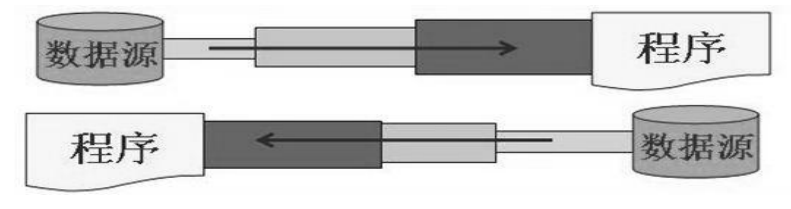
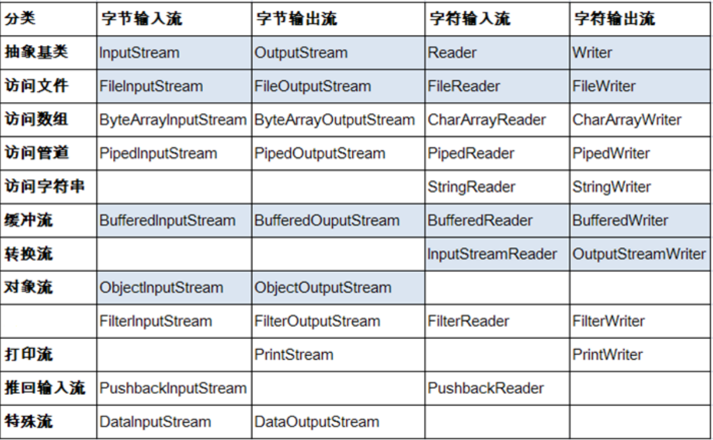

各种各样的流

<!-- more -->

# [笔记]-IO流

## File

### 基本叙述

- **java.io.File**类：**文件**和**文件目录路径**的抽象表示形式，与平台无关
- **File** 能新建、删除、重命名文件和目录，但 **File 不能访问文件内容本身**。如果需要访问文件内容本身，则需要使用**输入**/**输出**流。
- 在Java程序中表示一个真实存在的文件或目录，那么必须有一个File对象。但是Java程序中的一个File对象，可能没有一个真实存在的文件或目录。
- **File对象**可以作为**参数**传递给流的构造器

### 路径分隔符

路径中的每级目录之间用一个路径分隔符隔开。

- **UNIX**和**URL**使用`/`来表示

File类提供了一个常量：**public static final String separator**。可根据操作系统，动态的提供分隔符

例：

```java
File file1 = new File("d:\\xxxx\\info.txt");// windows和DOS系统中用 \\,用了两个 \ 是因为要转义
File file2 = new File("d:" + File.separator + "xxxx" + File.separator + "info.txt");
File file3 = new File("d:/xxxx");// UNIX和URL使用 /
```

### 常用方法

#### FIle的构造方法

- **public File(String pathnam)**：以pathname为路径创建File对象，可以是**绝对路径**或者**相对路径**，如果pathname是**相对路径**，则默认的当前路径在系统属性`user.dir`中存储。
  - 绝对路径：是一个固定的路径,从盘符开始
  - 相对路径：是相对于某个位置开始
- **public File(String parent,String child)**：以parent为**父路径**，child为**子路径**创建File对象。
- **public File(File parent,String child)**：根据一个**父File对象**和**子文件路径**创建File对象

#### File的获取方法

- **public String getAbsolutePath()**：获取绝对路径
- **public String getPath()** ：获取路径
- **public String getName()**：获取名称
- **public String getParent()**：获取上层文件目录路径。若无，返回null
- **public long length()**：获取文件长度（即：字节数）。不能获取目录的长度。
- **public long lastModified()**：获取最后一次的修改时间，毫秒值
- **public String[] list()**：获取指定目录下的所有文件或者文件目录的名称数组
- **public File[] listFiles()**：获取指定目录下的所有文件或者文件目录的File数组

例：

```java
import java.io.File;

public class FileTest {
    public static void main(String[] args) {
        File file1 = new File("D:\\213.txt");
        File file2 = new File("D:\\");
        
        // 1. file1.getAbsoluteFile(),获取当前文件的绝对路径,返回一个File类型
        File absoluteFile = file1.getAbsoluteFile();
        System.out.println(absoluteFile);// D:\213.txt
        
        // 2. getAbsolutePath(),获取文件的绝对路径,返回值类型：String
        String absolutePath = file1.getAbsolutePath();
        System.out.println(absolutePath);// D:\213.txt
        
        // 3. getName(),获取文件或文件夹的名称
        String name = file1.getName();
        System.out.println(name);// 213.txt
        
        // 4. getPath(),获取其相对路径
        String path = file1.getPath();
        System.out.println(path);// D:\213.txt
        
        // 5. getParentFile(),获取父路径
        File parentFile = file1.getParentFile();
        System.out.println(parentFile);// D:\
        System.out.println(parentFile.equals(file2));// true
        
        // 6. getParent(),获取父路径名的字符串
        String parent = file1.getParent();
        System.out.println(parent);// D:\       
    }
}
```

#### File的判断方法

- **public boolean isDirectory()**：判断是否是文件目录
- **public boolean isFile()**：判断是否是文件
- **public boolean exists()**：判断是否存在
- **public boolean canRead()**：判断是否可读
- **public boolean canWrite()** ：判断是否可写
- **public boolean isHidden()** ：判断是否隐藏

例：

```java
import java.io.File;

public class FileTest {
    public static void main(String[] args) {
        File file = new File("D:\\213.txt");
        // 1. isDirectory(),判断该目录是否存在
        boolean directory = file.isDirectory();
        System.out.println(directory);// false
        
        // 2. isFile(),判断是否为文件
        boolean file2 = file.isFile();
        System.out.println(file2);// true
        
        // 3. isHidden(),判断文件是否隐藏
        boolean hidden = file.isHidden();
        System.out.println(hidden);// false
        
        // 4. canRead(),判断文件是否可读
        boolean canRead = file.canRead();
        System.out.println(canRead);// true
        
        // 5. canExecute(),判断是否可执行
        boolean canExecute = file.canExecute();
        System.out.println(canExecute);// true
        
        // 6. canWrite(),判断是否可写
        boolean canWrite = file.canWrite();
        System.out.println(canWrite);// true
    }
}
```

#### File的创建方法

- **public boolean createNewFile()**：创建文件。若文件存在，则不创建，返回false。
- **public boolean mkdir()**：创建文件目录。如果此文件目录存在，就不创建了。如果此文件目录的上层目录不存在，也不创建。
- **public boolean mkdirs()**：创建文件目录。如果上层文件目录不存在，一并创建。

注：如果创建文件或者文件目录没有写盘符路径，那么，默认在**项目路径**下

#### File的其他方法

- **public boolean renameTo(File dest)**：把文件重命名为指定的文件路径
- **public boolean delete()**：删除文件或者文件夹。Java 中的删除不走回收站，且该文件目录内**不能包含文件或者文件目录**。
- **public long length()**：获取文件的大小或文件夹的隐藏属性

例：

```java
import java.io.File;
import java.io.IOException;

public class FileTest {
    public static void main(String[] args) throws IOException {
        File file = new File("D:\\123.txt");
        boolean createNewFile = file.createNewFile();
              
        // 1. length(),获取文件的大小或文件夹的隐藏属性
        long length = file.length();
        System.out.println(length);
 
        File file3 = new File("E:\\123.txt");
        // 2. renameTo(),要想返回true，需file存在，fiel3不存在
        // 可以移动已存在的文件
        file.renameTo(file3); 
        
        // 3. delete(),删除文件或文件夹，但只能删除空文件夹，且不会进回收站
        boolean delete = file.delete();
        System.out.println(delete);// true       
    }
}
```

## IO流原理简述

- I/O是**Input**/**Output**的缩写，用于处理设备之间的数据传输。如**读/写文件**，**网络通讯**等。
- Java程序中，对于数据的**输入**/**输出**操作以“**流(stream)**” 的方式进行。
- **java.io**包下提供了各种“**流**”类和接口，用以获取不同种类的数据，并通过标准的方法**输入**或**输出**数据。

**输入input**：**读取**外部数据（磁盘、光盘等存储设备的数据）到程序（内存）中。

**输出output**：将程序（内存）数据**写入**到磁盘、光盘等存储设备中。

注：程序中打开的文件 IO 资源**不属于内存里的资源**，**垃圾回收机制无法回收该资源**，所以应该**显式关闭文件 IO 资源**。

## 流的分类

- 按操作**数据单位不同**分为：**字节流**(8 bit)，**字符流**(16 bit)

- 按数据流的**流向不同**分为：**输入流**，**输出流**

- 按流的**角色不同**分为：**节点流**，**处理流**

  - **节点流**：直接从数据源或目的地读写数据

  

  - **处理流**：不直接连接到数据源或目的地，而是“连接”在已存在的流（节点流或处理流）之上，通过对数据的处理为程序提供更为强大的读写功能。

  

| (抽象基类) |      字节流      |   字符流   |
| :--------: | :--------------: | :--------: |
| **输入流** | **InputStream**  | **Reader** |
| **输出流** | **OutputStream** | **Writer** |

Java的**IO流**共涉及40多个类，实际上非常规则，都是从**以上4个抽象基类派生**的。由这四个类派生出来的子类名称都是**以其父类名作为子类名后缀**。

IO流体系图



## 字符流

### 字符输入流

**Reader**,所有字符输入流的基类。它的典型实现是**FileReader**，用来读取字符流。

#### 常用方法

- **public int read()**：读取单个字符。作为整数读取的字符，范围在 0 到 65535 之间 (0x00-0xffff)（2个
  字节的Unicode码），如果已到达流的末尾，则返回 -1
- **public int read(char[] cbuf)**：将字符读入数组。如果已到达流的末尾，则返回 -1。否则返回本次读取的字符数。
- **public int read(char[] cbuf,int off,int len)**：将字符读入数组的某一部分。存到数组cbuf中，从off处开始存储，最多读len个字符。如果已到达流的末尾，则返回 -1。否则返回本次读取的字符数。
- **public void close() throws IOException**：关闭此输入流并释放与该流关联的所有系统资源

### 字符输出流

**Writer**，所有字符输出流的基类。因为直接以字符作为操作单位，所以 Writer 可以用**字符串来替换字符数组。**

#### 常用方法

- **public void write(int c)**：写入单个字符。要写入的字符包含在给定整数值的 16 个低位中，16 高位被忽略。 即写入0 到 65535 之间的Unicode码。
- **public void write(char[] cbuf)**：写入字符数组。
- **public void write(char[] cbuf,int off,int len)**：写入字符数组的某一部分。从off开始，写入len个字符
- **public void write(String str)**：写入字符串。
- **public void write(String str,int off,int len)**：写入字符串的某一部分。
- **public void flush()**：刷新该流的缓冲，则立即将它们写入预期目标。
- **public void close() throws IOException**：关闭此输出流并释放与该流关联的所有系统资源。

