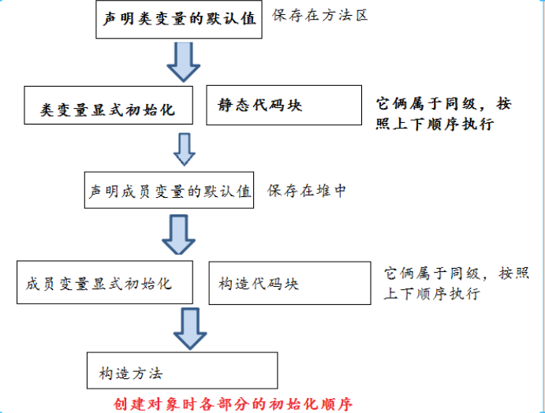

简单了解下面向对象咯

<!-- more -->

<meta name="referrer" content="no-referrer" />

# 面向对象

## 0. 面向对象与面向过程的区别

>面向过程：关注具体实现过程，以函数为最小单位
>
>面向对象：关注调用哪个对象，以对象/类为最小单位

## 1. 类与对象

### 1.0. 概念

> 类：对一类具有相同特征的事物的抽象描述
>
> 对象：类的实例，是具体的个体

### 1.1. 关系

> 类是对象的设计图，是创建对象的模板；对象是类的实例，是一个具体的个体

### 1.2. 类的设计，成员

#### 1.2.0. 属性

- 声明的位置：类中，方法外
- 保存的位置：静态属性(static修饰)保存在**方法区**中，非静态的属性保存在**堆**中
- 默认值：byte,short,int,long是**0**，float,double是**0.0**，boolean是**false**，char是**\u0000**，引用数据类型都是**null**
- 作用域：整个类中
- 生命周期：随着对象的创建而创建，到垃圾回收为止

#### 1.2.1. 构造器

- 作用：和**new**一起创建对象；为属性赋值
- 声明格式：
  - 无参格式：[修饰符] 类名 () {}
  - 有参格式：[修饰符] 类名 (形参列表) {}
- 特点：
  - 构造器名与类名**必须**完全相同
  - 构造器没有返回值，也不能写void。实际每个构造方法结束后都有返回值，其类型为构造方法所在类的类型
  - 构造器可以重载
  - 如果一个类没有声明过构造器，编译器将**默认添加一个无参构造器**；如果这个类声明了构造器，编译器将不再自动添加无参构造器
- 调用方式：
  - 和new一起：new 构造器 ()；new 构造器 (实参列表)
  - 在本类的其他构造器中：this () 或 this (实参列表)
  - 在子类的构造器中：super () 或 super (实参列表)

#### 1.2.2. 方法

> 无参无返回值;有参无返回值;无参有返回值;有参有返回值

#### 1.2.3. 代码块

> 静态代码块：随着类的加载而执行，一个类的静态代码块只执行一次。初始化静态变量
>
> 非静态代码块：对象创建一次，调用一次，而且先于构造器调用。初始化实例变量
>
> 局部代码块：在方法中
>
> 赋值和执行的顺序：父类的静态代码块 --> 子类的静态代码块  --> 父类的构造块 --> 父类的构造器 --> 子类的构造块 --> 子类的构造器

**图示**




#### 1.2.4. 内部类

> 当一个事物的内部，还有一个部分需要一个完整的结构进行描述，而这个内部的完整的结构又只为外部事物提供服务，那么整个内部的完整结构最好使用内部类
>
> **内部类可以访问外部类的所有的成员，包括私有成员**

##### 静态内部类

> - 修饰符：static必须要有；可以用final和abstract修饰；
> - 成员情况：所有类型的成员都可以有

调用问题：

- 静态内部类中**只能**使用外部类的静态成员
- 外部类中可以使用静态内部类的**任何**成员
- 其他类**调用格式**：
  - 外部类名.内部类名.静态成员；
  - 外部类名.内部类   变量 = new   外部类名.内部类()；变量.非静态成员；

##### 成员内部类(非静态内部类)

>修饰符：没有static修饰；可以用final和abstract修饰；
>
>成员情况：允许定义常量；非静态内部类中**不能含有**静态属性、方法及静态代码块！！！！！

调用问题：

- 成员内部类中可以使用外部类的任何成员
- 在外部类的**静态成员**中不能使用**非静态成员内部类**
- 其他类中使用成员内部类：
  - **外部类  out = new  外部类();外部类.内部类  in = out.new 内部类();in.成员**
- 外部类和内部类成员重名问题：
  - 默认访问的是内部类的同名成员
  - 要想访问外部同名成员，格式为外部类.this.成员
- 关于"非静态内部类中不能有static成员变量，却可以有static final 属性的编译期常量？"的问题可参照：
  - <https://www.jianshu.com/p/4dbe68850e1b?from=timeline&isappinstalled=0>

##### 局部内部类

> 修饰符：4 种修饰符都不行；static不行；final和abstract可以
>
> 成员情况：静态成员不能有；其他的可以有

调用情况：

- **不可以**在外部类的其他方法中调用局部内部类
- **不可以**在其他类中调用局部内部类
- 只能在声明**局部内部类**的方法中使用，而且在声明之后使用
- 可以在内部类中使用外部类的**局部变量**，该变量得是final修饰的
- 在内部类中使用外部类的成员时，受所在方法的约束，如果所在方法是静态的，那么只能使用外部类的静态成员，如果所在方法是非静态的，那么都可以使用

##### 匿名内部类(其使用情况待修改)

> 修饰符：没有任何修饰符修饰
>
> 成员情况：除了非静态的都可以，但是一般很少自定义方法等成员，它的成员都是重写父类的，父接口的方法
>
> 特点：声明类和创建对象同时进行；子类一定会调用父类的构造器。

## 2. 面向对象的基本特征

### 2.0. 封装

> 安全，使用方便(对于使用者屏蔽实现细节)

### 2.1. 继承

- 通过继承可以简化代码
- 通过extends关键字继承

#### 2.1.0. 继承的影响

- 对属性的影响

  > 子类继承父类时，一定会继承父类的所有的属性，包括私有的，但是由于私有的关键字private的原因，在子类中无法直接操作它，但是可以通过get/set方式操作它

  > 当子类的属性与父类的属性重名时，而且父类的属性没有私有化，如果要访问父类的属性那么通过super.属性进行访问，如果子类中没有通过super.属性访问，那这个属性就表示是子类自己的

- 对方法的影响

  > 子类继承父类时，一定会继承父类的所有的方法，包括私有的，但是由于private，在子类中无法直接操作，但是可以间接操作

  > 当父类的方法实现不适用于子类时，子类可以对父类的方法的进行重写

- 对构造器的影响

  > 子类继承父类时，不会继承父类的构造器

  > 子类继承父类时，一定会调用父类的构造器
  >
  > >如果父类有无参构造，那么子类会默认去调用父类的无参构造。如果父类没有无参构造，只有有参构造，那么子类必须在子类构造器中手动调用父类的有参构造！！！
  >
  > >调用父类的无参构造的语句：super();调用父类的有参构造的语句：super(实参列表);而且这两个语句必须在子类的构造器的首行。

#### 2.1.1. 继承的特点

- 单继承。Java中只支持单继承
	 多层继承。在Java中，父类还可以有父类，而且在子类中会继承父类以及父类的父类的所有的属性与方法	
- 一个类可以有很多个子类，子类还可以有子类

### 2.2. 多态

#### 2.2.0. 多态的表现形式

- 方法形式的多态。
  - 方法重载：同一个类中，功能的多种实现形式
  - 方法重写：父子类中，功能的不同实现形式
- 对象的多态性：父类引用指向子类对象。
  - 编译时类型与运行时的类型不一致，编译时看“左边”，运行时看“右边”。编译时从“父类”中寻找方法，运行时执行的是“子类”重写过的代码
  - 对象多态性的前提：继承；方法的重写；多态的引用

#### 2.2.1. 类型的转换

- 向上转型：子类对象赋值给父类变量

- 向下转型：

  - 把父类变量赋值给子类变量

  - 是强制类型转换

  - 若想向下转型成功，父类限量本身指向的就是该子类的对象

  - 向下转型时，要用`instanceof`判断

    ```java
    if(变量  instanceof  子类类型){
    	子类类型  temp = (子类类型)变量;
    }
    ```

## 3. 关键字

### 3.0. class

> 用于声明类

### 3.1. new

> 用于创建对象，创建实例；new后面跟的是构造器

### 3.2. this

- 表示当前对象，里面存的是内存地址
- 当成员变量与局部变量或形参重名时，使用this.属性进行区别
- this.方法
  - 表示调用“当前类”的方法
  - 如果子类继承了父类，子类没有重写父类的方法，**this.方法**是调用从父类继承的方法
  - 如果子类继承了父类，子类重写父类的方法，**this.方法**表示调用子类重写过的方法
  - this()或this(实参列表)，表示调用本类的其他构造器，而且必须在构造器的**首行**
  - **this不能用在静态方法中**

### 3.3. super

> 父类引用，存的是空间标识

- 当子类的属性与父类的属性重名时，而且父类的属性没有私有化。如果需要调用父类的属性，那么通过**super.属性**进行调用。
- 当子类的方法重写了父类的方法时，如果需要调用父类的被重写的方法，那么通过**super.方法**进行调用。
- 当子类需要调用父类的构造器时，通过**super()**或**super(实参列表)**进行调用。而且这两个语句必须在子类的构造器的**首行**。

### 3.4. 权限修饰符

> **public**：公共的，范围：**任意位置可以调用**，可以修饰   类、成员
>
> **protected**：受保护的，范围：**本包或子类中可以调用**，可以修饰  成员
>
> **缺省(default)**：默认的，范围：**本包中可以调用**，可以修饰   类、成员
>
> **private**：私有的，范围：**本类中可以调用**，可以修饰   成员

图示


### 3.5. static

> 静态的，可修饰成员(属性、方法、代码块、内部类)

- static修饰的属性称为**类变量**或**静态变量**，它的值是所有对象共享的，存储在**方法区**。该变量的get/set方法也是静态的
- static修饰的方法就称为**类方法**或**静态方法**，调用它不需要创建对象，直接可以通过”**类名.方法**“调用
- 用static修饰的代码块称为**静态代码块**。随着类的加载并初始时而执行，而且一个类的静态代码块只执行一次。如果静态变量有显式初始化和静态代码块初始化，它俩属于同级，谁在前谁先执行

### 3.6. final

> final修饰的类和方法**不能被继承**。
>
> final修饰的变量不能被**修改** ，必须**手动初始化**(显示赋值、代码块赋值或构造器赋值)

### 3.7. native

> 原生的

- 修饰的方法的方法体是非Java语言实现的
- 对于调用者来说，和普通Java方法一样使用
- 如果有需要，也可以进行重写

## 4. 包

### 4.0. 包的作用

> 避免类重名；访问权限的控制；便于管理

###4.1. 包的声明

- 格式：package 包名
- 必须在源文件的首行，一个源文件只能有一句
- 遵循命名规范，所有字母都小写，单词之间使用.，一般以公司的域名倒置

### 4.2. 使用其他包的类

- import 包.类名;
- 要求：在package和class之间声明，可以import多句
- 被使用的类必须是public 或 protected（父子类）
- 导包形式：
  - 一一列举：import java.util.Random;import java.util.Scanner;
  - 导入某个包的全部类：import java.util.*;
  - 静态导入：import static java.lang.Math.*;

### 4.3. 打包编译处理命令

> javac -d . xxx.java
>
> -d 表示生成的目录；点表示在当前所在目录生成程序类文件

## 5. 重载和重写的区别

> **overload**:方法的重载。在同一类，方法名称相同，形参列表不同的两个或多个方法称为重载。
>
> **override**:方法的重写。在子类继承父类时，如果父类的方法实现不适用于子类，子类就可以对父类的方法进行重写，覆盖。

图示


