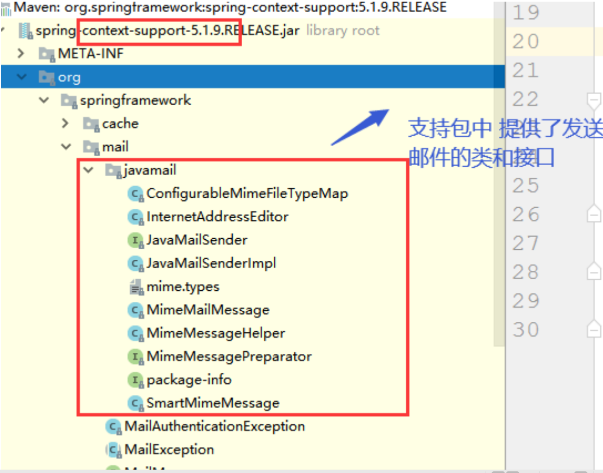

几种发送邮件的方式

<!-- more -->

## 发送邮件最原始的方式

该方式依赖javamail，这里使用的是javax.mail包。

下面的是封装的用来发送又见的工具类。

```java
public class SendCodeUtils {

	/**
	 * 该方法是使用javax.email包进行发送邮件的原始方式
	 * @param email 收件人邮箱
	 */
	public static void basicSendEmail (String email) throws Exception {
		//设置参数
		Properties properties = new Properties();
		properties.put("mail.transport.protocol", "smtp");// 连接协议
		properties.put("mail.smtp.host", "smtp.163.com");// 主机名 smtp.163.com
		properties.put("mail.smtp.port", 465);
		properties.put("mail.smtp.auth", "true");
		properties.put("mail.smtp.ssl.enable", "true");// 设置是否使用ssl安全连接 ‐‐‐一般都使用
		properties.put("mail.debug", "true");// 设置是否显示debug信息 true 会在控制台显示相关信息
		// 得到回话对象
		Session session = Session.getInstance(properties);
		// 获取邮件对象
		Message message = new MimeMessage(session);
		// 设置发件人邮箱地址
		message.setFrom(new InternetAddress("发件人邮箱"));
		// 设置收件人邮箱地址
		//message.setRecipients(Message.RecipientType.TO, new InternetAddress[]{new InternetAddress("xxxxx@qq.com"),new InternetAddress("xxxx@163.com")});
		message.setRecipient(Message.RecipientType.TO, new InternetAddress(email));//一个收件人
		// 设置邮件标题
		message.setSubject("登陆验证码");
		// 设置邮件内容
		message.setText("你的验证码为aaaaa");
		// 得到邮差对象
		Transport transport = session.getTransport();
		// 连接自己的邮箱账户 密码是授权码
		transport.connect("发件人邮箱", "授权码");
		// 发送邮件
		transport.sendMessage(message, message.getAllRecipients());
	}
}
```

## 用Spring发送邮件

spring发送邮件需要依赖一个`context-support`包 因为在这个包中 提供了一些java发送的接口和实现类 让
我们发送邮件更加简单。



### 引入相关依赖 

```xml
<dependencies>
    <!‐‐ 发送邮件需要的包‐‐>
    <dependency>
        <groupId>com.sun.mail</groupId>
        <artifactId>javax.mail</artifactId>
        <version>1.6.2</version>
    </dependency>
    <!‐‐发邮箱需要的支持包‐‐>
    <dependency>
        <groupId>org.springframework</groupId>
        <artifactId>spring‐context‐support</artifactId>
        <version>5.1.9.RELEASE</version>
    </dependency>
</dependencies>
```

### 配置Spring配置文件

```xml
<!‐‐配置发送邮件的bean‐‐>
<bean id="javaMailSender" class="org.springframework.mail.javamail.JavaMailSenderImpl">
    <property name="username" value="发件人邮箱"/>
    <property name="password" value="邮箱授权码"/>
    <property name="host" value="smtp.163.com"/>
    <property name="javaMailProperties">
        <props>
            <!‐‐ 设置认证开关 ‐‐>
            <prop key="mail.smtp.auth">true</prop>
            <!‐‐ 启动调试开关 ‐‐>
            <prop key="mail.debug">true</prop>
            <!‐‐ 设置发送延时 ‐‐>
            <prop key="mail.smtp.timeout">0</prop>
        </props>
    </property>
</bean>
```

### 普通邮件测试

```java
public class CodeTest {
	public static void main(String[] args) {
		ClassPathXmlApplicationContext applicationContext =
				new ClassPathXmlApplicationContext("classpath:spring-sendmail.xml");
		JavaMailSender javaMailSender = applicationContext.getBean(JavaMailSender.class);
        // 配置发送简单消息的Bean
		SimpleMailMessage simpleMailMessage = new SimpleMailMessage();
        // 配置各项参数，setFrom配置的时候，邮箱用尖括号括起来，尖括号前面的内容即可显示为未打开邮件时的标题样式
		simpleMailMessage.setFrom("天天通<发件人邮箱>");
		simpleMailMessage.setTo("收件人邮箱");
		simpleMailMessage.setSubject("邮件标题");
		simpleMailMessage.setText("邮件内容");
		javaMailSender.send(simpleMailMessage);
	}
}
```

### 内容为html标签的邮件测试

```java
public class CodeTest {
	public static void main(String[] args) {
		ClassPathXmlApplicationContext applicationContext =
				new ClassPathXmlApplicationContext("classpath:spring-sendmail.xml");
		JavaMailSender javaMailSender = applicationContext.getBean(JavaMailSender.class);
		MimeMessage mimeMessage = javaMailSender.createMimeMessage();
		try {
			// 没有附件的话，构造方法第二个参数可以写false，也可以不写，第三个参数是解决乱码的
			MimeMessageHelper helper = new MimeMessageHelper(mimeMessage, false, "utf-8");
			helper.setFrom("显示的标题<发件人邮箱>");
			helper.setTo("收件人邮箱");
			helper.setSubject("邮件标题");
            // setText方法的第二个参数需设置为true
			helper.setText("<h1>这是一级标签嘞</h1>", true);
		} catch (MessagingException e) {
			e.printStackTrace();
		}

		javaMailSender.send(mimeMessage);
	}
}
```

### 携带本地附件的邮件测试

```java
public class CodeTest {
	public static void main(String[] args) {
		ClassPathXmlApplicationContext applicationContext =
				new ClassPathXmlApplicationContext("classpath:spring-sendmail.xml");
		JavaMailSender javaMailSender = applicationContext.getBean(JavaMailSender.class);
		MimeMessage mimeMessage = javaMailSender.createMimeMessage();
		try {
			MimeMessageHelper helper = new MimeMessageHelper(mimeMessage, true);
			helper.setFrom("今天通<发件人邮箱>");
			helper.setTo("收件人邮箱");
			helper.setSubject("邮件标题");
			helper.setText("邮件内容");
			// 添加本地附件
			helper.addAttachment("附件啊.txt", new File("E:\\附件啊.txt"));
		} catch (MessagingException e) {
			e.printStackTrace();
		}

		javaMailSender.send(mimeMessage);
	}
}
```

### 携带网络上传附件的邮件测试

#### 后端代码

##### Controller层代码

```java
@Controller
public class SendEmailController {

	@Autowired
	private JavaMailSender javaMailSender;
	@PostMapping("/sendEmailByFile")
	public ResponseEntity sendEmail (String to, String subject, String text, @RequestPart Part file) {
		MimeMessage mimeMessage = javaMailSender.createMimeMessage();
		try {
			// 没有附件的话，构造方法第二个参数可以写false，也可以不写
			MimeMessageHelper helper = new MimeMessageHelper(mimeMessage, true, "utf-8");
			helper.setFrom("每天通<pearjk777@163.com>");
			helper.setTo(to);
			helper.setSubject(subject);
			helper.setText(text, true);

			InputStream in = file.getInputStream();
			byte[] bytes = new byte[in.available()];
			in.read(bytes);
			helper.addAttachment(file.getSubmittedFileName(), new ByteArrayResource(bytes));
		} catch (Exception e) {
			e.printStackTrace();
		}

		javaMailSender.send(mimeMessage);
		return ResponseEntity.ok(new ResponseBean(StatusEnum.EMAIL_SUCCESS));
	}
}
```

##### 配置web.xml

```xml
<?xml version="1.0" encoding="UTF-8"?>
<web-app xmlns="http://xmlns.jcp.org/xml/ns/javaee"
         xmlns:xsi="http://www.w3.org/2001/XMLSchema-instance"
         xsi:schemaLocation="http://xmlns.jcp.org/xml/ns/javaee http://xmlns.jcp.org/xml/ns/javaee/web-app_4_0.xsd"
         version="4.0">
    <!-- 设置欢迎页 -->
    <welcome-file-list>
        <welcome-file>index.html</welcome-file>
    </welcome-file-list>

    <context-param>
        <param-name>contextConfigLocation</param-name>
        <param-value>classpath*:spring-*.xml</param-value>
    </context-param>
    
    <listener>
        <listener-class>org.springframework.web.context.ContextLoaderListener</listener-class>
    </listener>

    <servlet>
        <servlet-name>dispatcherServlet</servlet-name>
        <servlet-class>org.springframework.web.servlet.DispatcherServlet</servlet-class>
        <init-param>
            <param-name>contextConfigLocation</param-name>
            <param-value>classpath:springmvc.xml</param-value>
        </init-param>
        <!-- 配置上传文件用的标签 -->
        <multipart-config></multipart-config>
    </servlet>
    <servlet-mapping>
        <servlet-name>dispatcherServlet</servlet-name>
        <url-pattern>/</url-pattern>
    </servlet-mapping>

    <!-- 配置字符编码集过滤器 -->
    <filter>
        <filter-name>characterEncodingFilter</filter-name>
        <filter-class>org.springframework.web.filter.CharacterEncodingFilter</filter-class>
        <init-param>
            <param-name>encoding</param-name>
            <param-value>utf-8</param-value>
        </init-param>
    </filter>
    <filter-mapping>
        <filter-name>characterEncodingFilter</filter-name>
        <url-pattern>/*</url-pattern>
    </filter-mapping>
</web-app>
```

#### 前端代码

##### HTML代码

```html
<!DOCTYPE html>
<html lang="en">
<head>
    <meta charset="UTF-8">
    <title>Title</title>
</head>
<body>
    <div id="app">
        <form>
            收件人：<input type="text" name="to" v-model="to"/><br/>
            邮件标题：<input type="text" name="subject" v-model="subject"/><br/>
            邮件内容：<input type="text" name="text" v-model="text"/><br/>
            附件：<input type="file"  @change="change"/><br/>
        </form>
        <button @click="sendEmail">发送</button>
    </div>

</body>

<script src="js/vue.js"></script>
<script src="js/axios.min.js"></script>
<script src="js/sendEmail.js"></script>
</html>
```

##### JS代码

```javascript
const app = new Vue ({
   el: "#app",
   data: {
       to: "",
       subject: "",
       text: "",
       file: ""
   },
   methods: {
       sendEmail () {
           let formData = new FormData();
           // 上传的文件的属性名需和后端的Part对象的对象名一致
           formData.append("file", this.file);
           formData.append("to", this.to);
           formData.append("subject", this.subject);
           formData.append("text", this.text);
           axios.post("http://localhost:8080/sendEmailByFile", formData, {header : {"ContentType" : "multipart/form-data"}}).then(response => {

           });
       },
       change (e) {
           this.file = e.target.files[0];
           console.log(this.file);
       }
   }
});
```

### 内联格式的邮件测试

#### 后端代码

```java
@Controller
public class SendEmailController {

	@Autowired
	private JavaMailSender javaMailSender;

	@PostMapping("/sendEmailByInline")
	public ResponseEntity sendEmailByInline (String to, String subject, String text, @RequestPart Part file) {
		MimeMessage mimeMessage = javaMailSender.createMimeMessage();
		try {
			// 没有附件的话，构造方法第二个参数可以写false，也可以不写
			MimeMessageHelper helper = new MimeMessageHelper(mimeMessage, true, "utf-8");
			helper.setFrom("昨天通<发件人邮箱>");
			helper.setTo(to);
			helper.setSubject(subject);
			// cid是固定写法，即content-Id,mimeMessage.setContentID()
			helper.setText("<html><body><h1>图片</h1><br/></body></html>",  true);

			// 被注释的方式不能将图片转为内联方式进行发送
			// InputStream in = file.getInputStream();
			// byte[] bytes = new byte[in.available()];
			// in.read(bytes);
			// helper.addInline("imageUrl", new ByteArrayResource(bytes));

			helper.addInline("imageUrl",
					new File("C:\\Users\\JAVASM\\Pictures\\测试.png"));
		} catch (Exception e) {
			e.printStackTrace();
		}

		javaMailSender.send(mimeMessage);
		return ResponseEntity.ok(new ResponseBean(StatusEnum.EMAIL_SUCCESS));
	}
}
```


