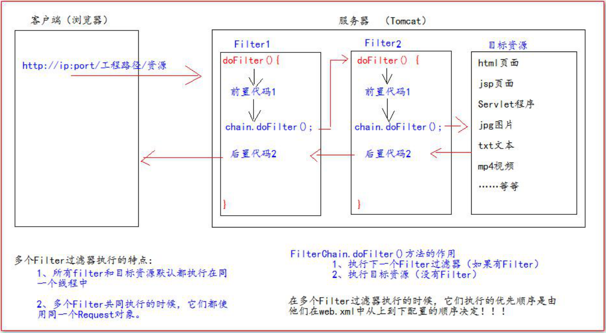

简单了解下Filter和Listener

<!-- more -->

# Filter

Filter，JavaWeb 三大组件之一。Filter是 JavaEE 的规范，也就是接口。

### 作用

- **统一编码**，在doFilter方法中统一设置编码方法
- **登录拦截**，在doFilter方法中获取Session来判断是否登录
- **过滤关键字**

### 使用步骤

#### 编写类实现Filter接口

实现Filter接口，并重写doFilter方法

```java
public class AdminFilter implements Filter {
    /**
    * doFilter 方法，专门用于拦截请求。可以做权限检查
    */
    @Override
    public void doFilter(ServletRequest servletRequest, ServletResponse servletResponse, FilterChain filterChain) throws IOException, ServletException {
        HttpServletRequest httpServletRequest = (HttpServletRequest) servletRequest;
        HttpSession session = httpServletRequest.getSession();
        Object user = session.getAttribute("user");
        // 如果等于 null，说明还没有登录
        if (user == null) {
        servletRequest.getRequestDispatcher("/login.jsp").forward(servletRequest,servletResponse);
        return;
        } else {
        // 让程序继续往下访问用户的目标资源
        filterChain.doFilter(servletRequest,servletResponse);
        }
    }
}
```

#### 前端代码

略

#### 配置拦截路径

##### 方式一 在web.xml中配置

```xml
<!--filter 标签用于配置一个 Filter 过滤器-->
<filter>
<!--给 filter 起一个别名-->
<filter-name>AdminFilter</filter-name>
<!--配置 filter 的全类名-->
<filter-class>com.atguigu.filter.AdminFilter</filter-class>
</filter>

<!--filter-mapping 配置 Filter 过滤器的拦截路径-->
<filter-mapping>
<!--filter-name 表示当前的拦截路径给哪个 filter 使用-->
<filter-name>AdminFilter</filter-name>
<!--url-pattern 配置拦截路径
	/ 表示请求地址为：http://ip:port/工程路径/ 映射到 IDEA 的 web 目录
	/admin/* 表示请求地址为：http://ip:port/工程路径/admin/*
-->
<url-pattern>/admin/*</url-pattern>
</filter-mapping>
```

##### 方式二 注解方式配置

在实现Filter的类上添加**@WebFilter**注解即可。

### 执行流程简述

- 执行过滤器
- 执行放行后的资源
- 再执行过滤器放行代码下的代码

### Filter的生命周期

- init：服务器启动时创建Filter对象，调用init方法。只执行一次。用于加载资源
- doFilter：每一次请求被拦截资源时，会执行。执行多次
- destroy：服务器**正常**关闭Filter对象销毁，只执行一次。用于释放资源

### 过滤器配置

#### 配置拦截路径

1.  具体资源路径：**/xxx.jsp**。只有访问xxx.jsp资源时，过滤器才会执行
2.  拦截目录：**/user/**。访问/user下的所有资源时，过滤器才会执行
3.  后缀名拦截：**\*.jsp**或**\*.do**等。访问所有后缀名为jsp或do等资源时，过滤器才会执行
4.  拦截所有资源：**/***。访问所有资源时，过滤器才会执行

#### 配置拦截方式

##### 注解方式配置

- **@WebFilter(value=" /* ", dispatcherTypes=DispatcherType.REQUEST)**：浏览器直接请求**资源**时，过滤器会被执行(不写默认REQUEST)
- **@WebFilter(value=" /* ", dispatcherTypes=DispatcherType.FORWARD)**：只有转发访问**资源**时，过滤器会被执行
- **@WebFilter(value=" /* ", dispatcherTypes=DispatcherType.INCLUDE)**：包含访问资源？？？
- **@WebFilter(value=" /* ", dispatcherTypes=DispatcherType.ERROR)**：错误跳转资源？？？
- **@WebFilter(value=" /* ", dispatcherTypes=DispatcherType.ASYNC)**：异步访问资源？？？

注：dispatcherTypes可有多个值，例dispatcherTypes={DispatcherType.REQUEST,DispatcherType.FORWARD}

##### web.xml方式配置

在\<filter-mapping>标签里设置\<dispatcher>标签。值还是那五个值

### FilterChain

#### 执行顺序

**过滤器A---->过滤器B---->资源执行---->过滤器B---->过滤器A**

#### 配置顺序

- 如果是按注解配置，**按照类名的字符串比较规则，值小的先执行**。例：AFilter先执行，BFilter后执行
  FilterDemo17先执行，FilterDemo7后执行
- 如果是按web.xml配置，谁的\<filter>标签定义在上面谁先执行

#### 图示


# Listener

## 事件监听相关概念

- 事件：一件事情
- 事件源：事件发生的地方
- 监听器：一个对象
- 注册监听：将事件、事件源、监听器绑定在一起，当事件源发生某个事件时，执行监听器代码

## 监听器分类

1.  监听域对象(pageContext，request，application)自身创建和销毁的事件监听器，需在web.xml文件中注册。
2.  监听域对象中属性的增加和删除的事件监听器，需在web.xml文件中注册。
3.  监听绑定到HttpSession域中的某个对象状态的事件监听器,HttpSessionBindingListener接口和HttpSessionActivationListener接口。较少使用，无需配置，其实现类如未实现Serializable接口，则只能写到磁盘上，不能读取出来。
## ServletContextListener(接口)
### 使用步骤

1.  定义类去实现ServletContextListener接口
2.  重写方法
3.  配置

  - 注解方式配置，实现类上配个@WebListener注解

  - web.xml方式配置

    ```xml
    <!--配置监听器-->
    <listener>
    	<listener-class>类路径</listener-class>
    </listener>
    ```

### 相关方法
- void contextDestroyed(ServletContextEvent sce)：ServletContext对象被销毁**前**会调用该方法
- void contextInitialized(ServletContextEvent sce)：ServletContext对象创建**后**会调用该方法
  - 在contextInitialized方法中加载资源文件的步骤

```java
// 1.  获取Servletcontext对象
ServletContext servletContext = servletContextEvent.getServletContext();
// 2.  加载资源文件 加载前要在web.xml里配置相关标签,指定初始化参数
/ * <!--指定初始化参数-->
  *	<context-param>
  *		<param-name>
  *			contextConfigLocation
  *		</param-name>
  *		<param-value>
  *			xml文件的相对路径
  *		</param-value>
  * </context-param>
  **/
String contextConfigLocation = servletContext.getInitParameter("contextConfigLocation");
// 3.  获取真实路径
String realPath = servletContext.getRealPath(contextConfigLocation);
// 4.  通过流加载进内存
FileInputStream fis = new FileInputStream(realPath);
```

