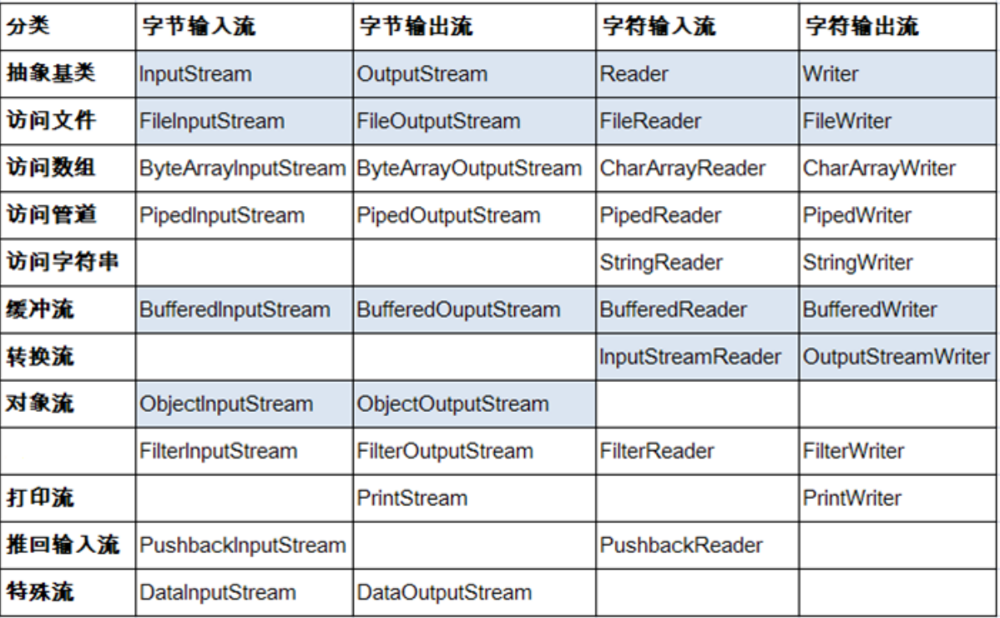

各种各样的流

<!-- more -->

# IO流

## File

### 基本叙述

- **java.io.File**类：**文件**和**文件目录路径**的抽象表示形式，与平台无关
- **File** 能新建、删除、重命名文件和目录，但 **File 不能访问文件内容本身**。如果需要访问文件内容本身，则需要使用**输入**/**输出**流。
- 在Java程序中表示一个真实存在的文件或目录，那么必须有一个File对象。但是Java程序中的一个File对象，可能没有一个真实存在的文件或目录。
- **File对象**可以作为**参数**传递给流的构造器

### 路径分隔符

路径中的每级目录之间用一个路径分隔符隔开。

- **UNIX**和**URL**使用`/`来表示

File类提供了一个常量：**public static final String separator**。可根据操作系统，动态的提供分隔符

例：

```java
File file1 = new File("d:\\xxxx\\info.txt");// windows和DOS系统中用 \\,用了两个 \ 是因为要转义
File file2 = new File("d:" + File.separator + "xxxx" + File.separator + "info.txt");
File file3 = new File("d:/xxxx");// UNIX和URL使用 /
```

### 常用方法

#### FIle的构造方法

- **public File(String pathnam)**：以pathname为路径创建File对象，可以是**绝对路径**或者**相对路径**，如果pathname是**相对路径**，则默认的当前路径在系统属性`user.dir`中存储。
  - 绝对路径：是一个固定的路径,从盘符开始
  - 相对路径：是相对于某个位置开始
- **public File(String parent,String child)**：以parent为**父路径**，child为**子路径**创建File对象。
- **public File(File parent,String child)**：根据一个**父File对象**和**子文件路径**创建File对象

#### File的获取方法

- **public String getAbsolutePath()**：获取绝对路径
- **public String getPath()** ：获取路径
- **public String getName()**：获取名称
- **public String getParent()**：获取上层文件目录路径。若无，返回null
- **public long length()**：获取文件长度（即：字节数）。不能获取目录的长度。
- **public long lastModified()**：获取最后一次的修改时间，毫秒值
- **public String[] list()**：获取指定目录下的所有文件或者文件目录的名称数组
- **public File[] listFiles()**：获取指定目录下的所有文件或者文件目录的File数组

例：

```java
import java.io.File;

public class FileTest {
    public static void main(String[] args) {
        File file1 = new File("D:\\213.txt");
        File file2 = new File("D:\\");
        
        // 1. file1.getAbsoluteFile(),获取当前文件的绝对路径,返回一个File类型
        File absoluteFile = file1.getAbsoluteFile();
        System.out.println(absoluteFile);// D:\213.txt
        
        // 2. getAbsolutePath(),获取文件的绝对路径,返回值类型：String
        String absolutePath = file1.getAbsolutePath();
        System.out.println(absolutePath);// D:\213.txt
        
        // 3. getName(),获取文件或文件夹的名称
        String name = file1.getName();
        System.out.println(name);// 213.txt
        
        // 4. getPath(),获取其相对路径
        String path = file1.getPath();
        System.out.println(path);// D:\213.txt
        
        // 5. getParentFile(),获取父路径
        File parentFile = file1.getParentFile();
        System.out.println(parentFile);// D:\
        System.out.println(parentFile.equals(file2));// true
        
        // 6. getParent(),获取父路径名的字符串
        String parent = file1.getParent();
        System.out.println(parent);// D:\       
    }
}
```

#### File的判断方法

- **public boolean isDirectory()**：判断是否是文件目录
- **public boolean isFile()**：判断是否是文件
- **public boolean exists()**：判断是否存在
- **public boolean canRead()**：判断是否可读
- **public boolean canWrite()** ：判断是否可写
- **public boolean isHidden()** ：判断是否隐藏

例：

```java
import java.io.File;

public class FileTest {
    public static void main(String[] args) {
        File file = new File("D:\\213.txt");
        // 1. isDirectory(),判断该目录是否存在
        boolean directory = file.isDirectory();
        System.out.println(directory);// false
        
        // 2. isFile(),判断是否为文件
        boolean file2 = file.isFile();
        System.out.println(file2);// true
        
        // 3. isHidden(),判断文件是否隐藏
        boolean hidden = file.isHidden();
        System.out.println(hidden);// false
        
        // 4. canRead(),判断文件是否可读
        boolean canRead = file.canRead();
        System.out.println(canRead);// true
        
        // 5. canExecute(),判断是否可执行
        boolean canExecute = file.canExecute();
        System.out.println(canExecute);// true
        
        // 6. canWrite(),判断是否可写
        boolean canWrite = file.canWrite();
        System.out.println(canWrite);// true
    }
}
```

#### File的创建方法

- **public boolean createNewFile()**：创建文件。若文件存在，则不创建，返回false。
- **public boolean mkdir()**：创建文件目录。如果此文件目录存在，就不创建了。如果此文件目录的上层目录不存在，也不创建。
- **public boolean mkdirs()**：创建文件目录。如果上层文件目录不存在，一并创建。

注：如果创建文件或者文件目录没有写盘符路径，那么，默认在**项目路径**下

#### File的其他方法

- **public boolean renameTo(File dest)**：把文件重命名为指定的文件路径
- **public boolean delete()**：删除文件或者文件夹。Java 中的删除不走回收站，且该文件目录内**不能包含文件或者文件目录**。
- **public long length()**：获取文件的大小或文件夹的隐藏属性

例：

```java
import java.io.File;
import java.io.IOException;

public class FileTest {
    public static void main(String[] args) throws IOException {
        File file = new File("D:\\123.txt");
        boolean createNewFile = file.createNewFile();
              
        // 1. length(),获取文件的大小或文件夹的隐藏属性
        long length = file.length();
        System.out.println(length);
 
        File file3 = new File("E:\\123.txt");
        // 2. renameTo(),要想返回true，需file存在，fiel3不存在
        // 可以移动已存在的文件
        file.renameTo(file3); 
        
        // 3. delete(),删除文件或文件夹，但只能删除空文件夹，且不会进回收站
        boolean delete = file.delete();
        System.out.println(delete);// true       
    }
}
```

## IO流原理简述

- I/O是**Input**/**Output**的缩写，用于处理设备之间的数据传输。如**读/写文件**，**网络通讯**等。
- Java程序中，对于数据的**输入**/**输出**操作以“**流(stream)**” 的方式进行。
- **java.io**包下提供了各种“**流**”类和接口，用以获取不同种类的数据，并通过标准的方法**输入**或**输出**数据。

**输入input**：**读取**外部数据（磁盘、光盘等存储设备的数据）到程序（内存）中。

**输出output**：将程序（内存）数据**写入**到磁盘、光盘等存储设备中。

注：程序中打开的文件 IO 资源**不属于内存里的资源**，**垃圾回收机制无法回收该资源**，所以应该**显式关闭文件 IO 资源**。

## 流的分类

- 按操作**数据单位不同**分为：**字节流**(8 bit)，**字符流**(16 bit)

- 按数据流的**流向不同**分为：**输入流**，**输出流**

- 按流的**角色不同**分为：**节点流**，**处理流**

  - **节点流**：直接从数据源或目的地读写数据

  

  - **处理流**：不直接连接到数据源或目的地，而是“连接”在已存在的流（节点流或处理流）之上，通过对数据的处理为程序提供更为强大的读写功能。

  

| (抽象基类) |      字节流      |   字符流   |
| :--------: | :--------------: | :--------: |
| **输入流** | **InputStream**  | **Reader** |
| **输出流** | **OutputStream** | **Writer** |

Java的**IO流**共涉及40多个类，实际上非常规则，都是从**以上4个抽象基类派生**的。由这四个类派生出来的子类名称都是**以其父类名作为子类名后缀**。

IO流体系图



## 字符流

### 字符输入流

**Reader**,所有字符输入流的基类。它的典型实现是**FileReader**，用来读取字符流。

#### 常用方法

- **public int read()**：读取单个字符。作为整数读取的字符，范围在 0 到 65535 之间 (0x00-0xffff)（2个
  字节的Unicode码），如果已到达流的末尾，则返回 -1

```java
public class FileReaderWriterTest {  
    
    @Test
    public void testFileReader() { 
        FileReader fileReader = null;
        try {
            // 1. 实例化File类对象 
            File file = new File("hello.txt");
            // 2. 提供具体的流
            fileReader = new FileReader(file);
            
            //方式一 read()返回的是读取到内容对应的ASCII码
            int data = fileReader.read();
            while (data != -1) {
                System.out.println((char)data);
                data = fileReader.read();
            }
            
            // 方式二
            int data1;
            while ((data1 = fileReader.read()) != -1) {
                System.out.print((char)data1);
            }
        } catch (Exception e) {
            e.printStackTrace();
        } finally {
            try {
                // 流的关闭操作,手动操作
            	if (fr != null) {
                	fr.close();
            	}
        	} catch (IOException e) {
            	e.printStackTrace();
        	}   
        }  
    }
}
```

- **public int read(char[] cbuf)**：将字符读入数组。如果已到达流的末尾，则返回 -1。否则返回本次读取的字符数。

```java
public class FileReaderWriterTest {
    
    @Test
    public void testFileReader() {
        FileReader fileReader = null;
        try {
            // 1. File类的实例化
            File file = new File("hello.txt");
            // 2. FileReader流的实例化
            fileReader = new FileReader(file);
            
            // 3. 读入的操作
            // read(char[] cbuf):每次返回读入字符的个数或者-1，读取的内容保存在数组中
            char[] cbuf = new char[5];
            int len;
            while ((len = fileReader.read(cbuf)) != -1) {
                // 错误的写法一
				// for (int i = 0;i < cbuf.length;i ++) {
				//System.out.println(cbuf[i]);
				//}
                
                // 正确的写法一
                for (int i = 0;i < len;i ++) {
                    System.out.print(cbuf[i]);
                }
                // 错误写法二
				// String str = new String(cbuf);
				// System.out.println(str);
                
                // 正确写法二
                String str = new String(cbuf,0,len);
                System.out.print(str);
            }
        } catch (Exception e) {
            e.printStackTrace();
        }finally {
            if (fr != null) {
                // 4. 资源的关闭
                try {
                    fileReader.close();
                } catch (Exception e) {
                    e.printStackTrace();
                }
            }
        }   
    }
}
```

- **public int read(char[] cbuf,int off,int len)**：将字符读入数组的某一部分。存到数组cbuf中，从off处开始存储，最多读len个字符。如果已到达流的末尾，则返回 -1。否则返回本次读取的字符数。
- **public void close() throws IOException**：关闭此输入流并释放与该流关联的所有系统资源

### 字符输出流

**Writer**，所有字符输出流的基类。因为直接以字符作为操作单位，所以 Writer 可以用**字符串来替换字符数组。**

#### 常用方法

- **public void write(int c)**：写入单个字符。要写入的字符包含在给定整数值的 16 个低位中，16 高位被忽略。 即写入0 到 65535 之间的Unicode码。


```java
public class FileWriterTest {
    public static void main(String[] args) throws IOException {
        
        FileWriter fw = null;
        try {
            // 1.提供File类的对象，指明写出的文件
            File file1 = new File("hello1.txt");
            
            // 2. 提供 FileWriter的对象，用于数据的写出,对应的文件如不存在会自动创建;
            fileWriter = new FileWriter(file1);
            
            // 3. 写出的操作
            // write(file,true): 在原有文件上追加内容;
            // write(file,false) 或 write(file):会重写原有文件
            fileWriter.write("I have a dream!\n");
            fileWriter.write("You need have a dream!");
        } catch (Exception e) {
            e.printStackTrace();
        }finally {
         // 4. 流资源的关闭
            if (fileWriter != null) {
                try {
                    fileWriter.close();
                } catch (Exception e) {
                    e.printStackTrace();
                }  
            }    
        } 
    }
}
```

- **public void write(char[] cbuf)**：写入字符数组。
- **public void write(char[] cbuf,int off,int len)**：写入字符数组的某一部分。从off开始，写入len个字符
- **public void write(String str)**：写入字符串。
- **public void write(String str,int off,int len)**：写入字符串的某一部分。
- **public void flush()**：刷新该流的缓冲，则立即将它们写入预期目标。
- **public void close() throws IOException**：关闭此输出流并释放与该流关联的所有系统资源。


## 字节流

### 字节输入流

**InputStream**是所有输入流的基类。它的典型实现是**FileInputStream**。**FileInputStream** 从文件系统中的某个文件中获得输入字节。**FileInputStream**用于**读取非文本数据**之类的原始字节流。

#### 常用方法

- **public int read()**：从输入流中读取数据的下一个字节。返回 0 到 255 范围内的 int 字节值。如果因为已经到达流末尾而没有可用的字节，则返回值 -1。
- **public int read(byte[] b)**：从此输入流中将最多 b.length 个字节的数据读入一个 byte 数组中。如果因为已
  经到达流末尾而没有可用的字节，则返回值 -1。否则以整数形式返回实际读取的字节数。
- **public int read(byte[] b, int off,int len)**：将输入流中最多 len 个数据字节读入 byte 数组。尝试读取 len 个字节，但读取的字节也可能小于该值。以整数形式返回实际读取的字节数。如果因为流位于文件末尾而没有可用的字节，则返回值 -1。
- **public void close() throws IOException**：关闭此输入流并释放与该流关联的所有系统资源。

### 字节输出流

**OutputStream**，所有字节输出流的基类。**FileOutputStream** 从文件系统中的某个文件中获得输出字节。**FileOutputStream** 用于**写出非文本数据**之类的原始字节流。

#### 常用方法

- **public void write(byte[] b)**：将 b.length 个字节从指定的 byte 数组写入此输出流。write(b) 的常规协定是：应该与调用 write(b, 0, b.length) 的效果完全相同。
- **public void write(byte[] b,int off,int len)**：将指定 byte 数组中从偏移量 off 开始的 len 个字节写入此输出流。
- **public void flush()throws IOException**：刷新此输出流并强制写出所有缓冲的输出字节，调用此方法指示应将这些字节立即写入它们预期的目标。
- **public void close() throws IOException**：关闭此输出流并释放与该流关联的所有系统资源。

## 处理流

### 处理流之一 缓冲流

- 为了**提高数据读写的速度**，Java API提供的带缓冲功能的流类，在使用这些流类时，会创建一个**内部缓冲区数组**，缺省使用**8192个字节(8Kb)**的缓冲区。
- 缓冲流要“套接”在相应的节点流之上，根据数据操作单位可以把缓冲流分为：
  - **BufferedInputStream** 和 **BufferedOutputStream**
  - **BufferedReader** 和 **BufferedWriter**
- 使用**BufferedInputStream**读取字节文件时，**BufferedInputStream**会一次性从文件中读取8192个(8Kb)，存在缓冲区中，直到缓冲区装满了，才重新从文件中读取下一个8192个字节数组。
- 向流中写入字节时，不会直接写到文件，先**写到缓冲区中直到缓冲区写满**，才会把缓冲区中的数据一次性写到文件里。
- 关闭流的顺序和打开流的顺序相反。只要关闭最外层流即可，**关闭最外层流也会相应关闭内层节点流**。
- `flush()`方法可以强制将输入流的缓冲区的内容全部写入到文件中。

#### 字符缓冲流示例

```java
public class Test05 {
    public static void main(String[] args) throws IOException {
        BufferedReader br = new BufferedReader(new FileReader("D:" + File.separator + "ttt.txt"));
        BufferedWriter bw = new BufferedWriter(new FileWriter("E:" + File.separator + "ttt.txt"));
        
          //方式一
//        char[] ch = new char[1024];
//        int len;
//        while ((len = br.read(ch)) != -1) {
//            bw.write(ch,0,len);
//            bw.flush();
//        }
//        
//        br.close();
//        bw.close();
        
        // 方式二 使用String和readLine()
        // readLine() 读到末尾返回null,readLine读取不了\n和\r
        String data;
        while ((data = br.readLine()) != null) {
            bw.write(data + "\n");
        }
        bw.flush();
        bw.close();
    }
}
```

#### 字节缓冲流示例

```java
public class Test0002 {
    public static void main(String[] args) {
        BufferedInputStream bis = null;
        BufferedOutputStream bos = null;
        try {
            //  1.造文件
            File srcFile = new File("C:\\Users\\JAVASM\\Downloads\\YNote.exe");
            File destFile = new File("E:\\Y.exe");
            // 2.造流
            // 2.1造节点流
            FileInputStream fis = new FileInputStream(srcFile);
            FileOutputStream fos = new FileOutputStream(destFile);
            // 2.2造缓冲流
            bis = new BufferedInputStream(fis);
            bos = new BufferedOutputStream(fos);
            
            // 3.复制细节：读取，写入
            byte[] b = new byte[1024];
            int len;
            while ((len = bis.read(b)) != -1) {
                bos.write(b,0,len);
            }
        } catch (FileNotFoundException e) {
            e.printStackTrace();
        } catch (IOException e) {
            e.printStackTrace();
        }finally {
            // 4.资源关闭
            // 先关闭外层的流，再关闭内层的流。注：关闭外层流的同时，内层流会自动关闭     
            try {
                if (bis != null) {
                    bis.close();
                }
            } catch (IOException e) {
                e.printStackTrace();
            }
            
            try {
                if (bos != null) {
                    bos.close();
                }
            } catch (IOException e) {
                e.printStackTrace();
            }
        }
    }
}
```

### 处理流之二 转换流

- 转换流用于转换字节流和字符流
- 常用来处理文件乱码问题，实现编码和解码的功能
- Java API提供了两个转换流：
  - **InputStreamReader**：将InputStream转换为Reader，字节、字节数组 --> 字符数组、字符串(解码)
    - 实现将字节的输入流按指定字符集转换为字符的输入流。**需要和InputStream“套接**
  - **OutputStreamWriter**：将Writer转换为OutputStream，字符数组、字符串 --> 字节、字节数组(编码)
    - 实现将字符的输出流按指定字符集转换为字节的输出流。**需要和OutputStream“套接”。**

#### 示例

```java
// InputStreamReader:字节、字节数组 --> 字符数组、字符串(解码)
// OutputStreamWriter：字符数组、字符串 --> 字节、字节数组(编码)
public class InputStreamReaderAndOutputStreamWriter {
   public static void main(String[] args) {
       InputStreamReader isr = null;
       OutputStreamWriter osw = null;
       try {
           FileInputStream fis = new FileInputStream("test.txt");
           FileOutputStream fos = new FileOutputStream("test_gbk.txt");
           
           isr = new InputStreamReader(fis,"gbk");
           osw = new OutputStreamWriter(fos,"utf-8");
           
           char[] cbuf = new char[20];
           int len;
           while ((len = isr.read(cbuf)) != -1) {
               osw.write(cbuf,0,len);
           }
       } catch (FileNotFoundException e) {
           e.printStackTrace();
       } catch (UnsupportedEncodingException e) {
           e.printStackTrace();
       } catch (IOException e) {
           e.printStackTrace();
       }finally {
           
           try {
               if (isr != null) {
                   isr.close();
               }
           } catch (IOException e) {
               e.printStackTrace();
           }
           try {
               if (osw != null) {
                   osw.close();
               }
           } catch (IOException e) {
               e.printStackTrace();
           }        
       }     
   }
}
```

### 处理流之三 标准输入、输出流

- **System.in**和**System.out**分别代表了系统标准的输入和输出设备
- 默认输入设备是：键盘，输出设备是：显示器
- System.in的类型是**InputStream**
- System.out的类型，是OutputStream的子类FilterOutputStream 的子类**PrintStream**
- 重定向：通过System类的setIn，setOut方法对默认设备进行改变。
  - **public static void setIn(InputStream in)**
  - **public static void setOut(PrintStream out)**

### 处理流之四 打印流

打印流，**PrintStream**和**PrintWriter**。可将基本数据类型的数据格式转化为字符串输出。

- 提供了一系列重载的print()和println()方法，用于多种数据类型的输出
- **PrintStream**和**PrintWriter**的输出不会抛出IOException异常
- **PrintStream**和**PrintWriter**有自动flush功能
- **PrintStream** 打印的所有字符都使用平台的默认字符编码转换为字节。在需要写入字符而不是写入字节的情况下，应该使用 **PrintWriter** 类

例：

```java
PrintStream ps = null;
try {
    FileOutputStream fos = new FileOutputStream(new File("D:\\IO\\text.txt"));
    // 创建打印输出流,设置为自动刷新模式(写入换行符或字节 '\n' 时都会刷新输出缓冲区)
    ps = new PrintStream(fos, true);
    if (ps != null) {// 把标准输出流(控制台输出)改成文件
        System.setOut(ps);
    }	
    for (int i = 0; i <= 255; i++) { // 输出ASCII字符
        System.out.print((char) i);
        if (i % 50 == 0) { // 每50个数据一行
            System.out.println(); // 换行
        }
    }
} catch (FileNotFoundException e) {
    e.printStackTrace();
} finally {
    if (ps != null) {
        ps.close();
    }
}
```


### 处理流之五 数据流

数据流，**DataInputStream** 和 **DataOutputStream**。为了方便地操作Java语言的基本数据类型和String的数据，可以使用数据流。

DataInputStream “套接”在 **InputStream**子类的流上。DataOutputStream“套接”在**OutputStream** 子类的流上。

例：

```java
DataOutputStream dos = null;
try { // 创建连接到指定文件的数据输出流对象
    dos = new DataOutputStream(new FileOutputStream("destData.dat"));
    dos.writeUTF("我爱北京天安门"); // 写UTF字符串
    dos.writeBoolean(false); // 写入布尔值
    dos.writeLong(1234567890L); // 写入长整数
    System.out.println("写文件成功!");
} catch (IOException e) {
    e.printStackTrace();
} finally { // 关闭流对象
    try {
        if (dos != null) {
            // 关闭过滤流时,会自动关闭它包装的底层节点流
            dos.close();
        }
    } catch (IOException e) {
        e.printStackTrace();
    }
}
```

```java
DataInputStream dis = null;
try {
    dis = new DataInputStream(new FileInputStream("destData.dat"));
    String info = dis.readUTF();
    boolean flag = dis.readBoolean();
    long time = dis.readLong();
    System.out.println(info);
    System.out.println(flag);
    System.out.println(time);
} catch (Exception e) {
    e.printStackTrace();
} finally {
    if (dis != null) {
        try {
            dis.close();
        } catch (IOException e) {
            e.printStackTrace();
        }
    }
}
```

### 处理流之六 对象流

对象流，**ObjectInputStream**和**OjbectOutputSteam**。可用于存储和读取基本数据类型数据或对象的处理流。可以把Java中的对象写入到数据源中，也能把对象从数据源中还原回来。

#### 对象的序列化

- **序列化**：用**ObjectOutputStream**类保存基本类型数据或对象的机制
- **反序列化**：用**ObjectInputStream**类读取基本类型数据或对象的机制


- 对象序列化机制允许把**内存中的Java对象转换成平台无关的二进制流**，从而允许把这种二进制流持久地保存在磁盘上，或通过网络将这种二进制流传输到另一个网络节点。
- 序列化的好处在于可将任何实现了Serializable接口的对象转化为字节数据，使其在保存和传输时可被还原。
- 凡是实现Serializable接口的类都有一个**表示序列化版本标识符的静态变量**：`private static final long serialVersionUID;`
  - `serialVersionUID`用来表明类的不同版本间的兼容性。简言之，其目的是以序列化对象进行版本控制，有关各版本反序列化时是否兼容。
  - 如果类没有显示定义这个静态常量，它的值是Java运行时环境根据类的内部细节自动生成的。若类的实例变量做了修改，serialVersionUID 可能发生变化。故建议，显式声明。

##### 自定义类序列化的要求

1. 必须实现Serializable接口或Externalizable接口
   - Externalizable接口继承自 Serializable接口，**仅实现Serializable接口的类采用默认的序列化方式** ，而实现Externalizable接口的类完全由自身来控制序列化的行为。
2. 提供全局常量：private static final long serialVersionUID
3. 保证当前类的内部属性可序列化（默认情况下，基本数据类型可序列化）

注：ObjectOutputStream和ObjectInputStream不能序列化**static**和**transient**修饰的成员变量

#### 序列化示例

```java
ObjectOutputStream oos = new ObjectOutputStream(new FileOutputStream(“data.txt"));
Person p = new Person("韩梅梅", 18, "中华大街", new Pet());
oos.writeObject(p);
oos.flush();
oos.close();
```

#### 反序列化示例

```java
ObjectInputStream ois = new ObjectInputStream(new FileInputStream(“data.txt"));
Person p1 = (Person)ois.readObject();
System.out.println(p1.toString());
ois.close();
```

未完待续……