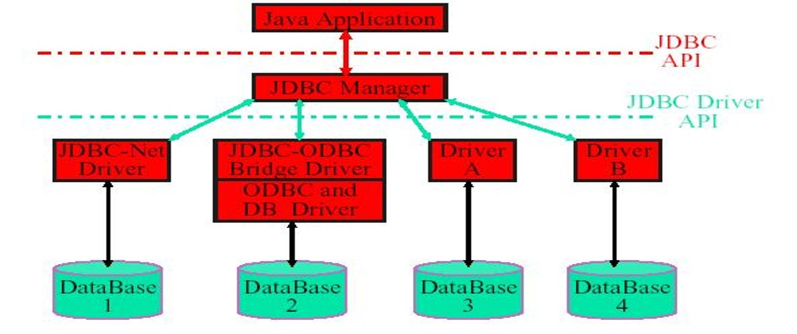
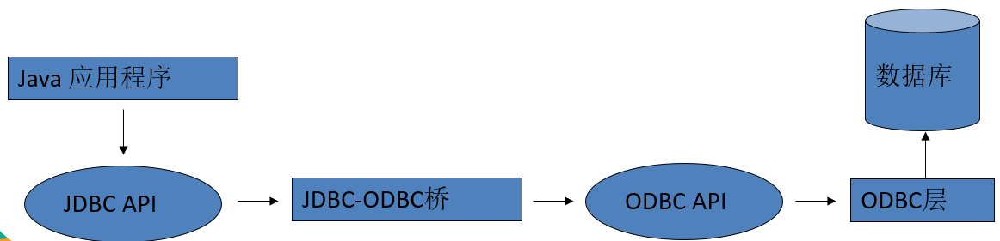
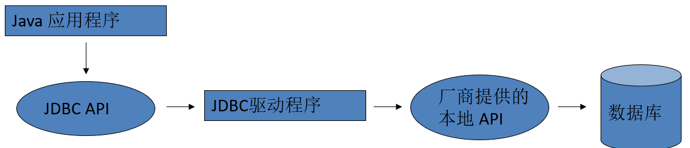
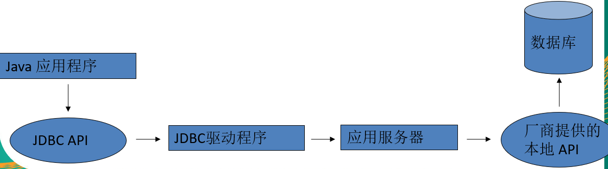
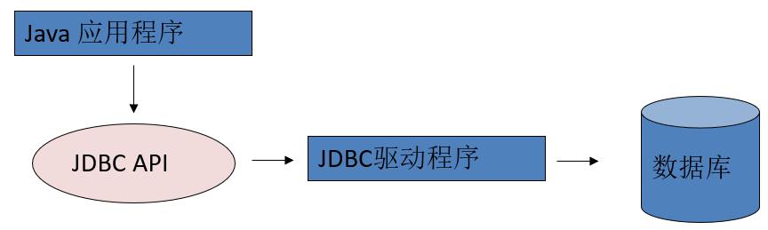

施工中。JDBC的简单使用……

<!-- more -->

# JDBC

## 基本概述

**JDBC**(**Java Database Connectivity**)是一个独立于特定数据库管理系统、通用的SQL数据库存取和操作的公共接口（一组API），定义了用来访问数据库的标准Java类库，使用这个类库可以以一种标准的方法、方便地访问数据库资源。
JDBC为访问不同的数据库提供了一种统一的途径，为开发者屏蔽了一些细节问题。
**JDBC的目标是使Java程序员使用JDBC可以连接任何提供了JDBC驱动程序的数据库系统**，这样就使得程序员无需对特定的数据库系统的特点有过多的了解，从而大大简化和加快了开发过程。

## JDBC体系结构

JDBC接口（API）包括两个层次：

- **面向应用的API**：**JavaAPI**，抽象接口，供应用程序开发人员使用（连接数据库，执行SQL语句，获得结果）。
- **面向数据库的API**：**JavaDriver API**，供开发商开发数据库驱动程序用。



## JDBC驱动程序分类

JDBC驱动程序：各个数据库厂商根据JDBC的规范制作的JDBC 实现类的类库  

共有四种类型：

- 第一类：JDBC-ODBC桥。 
- 第二类：部分本地API部分Java的驱动程序。
- 第三类：JDBC网络纯Java驱动程序。
- 第四类：本地协议的纯Java驱动程序。 

第三、四两类都是纯Java的驱动程序，因此，对于Java开发者来说，它们在性能、可移植性、功能等方面都有优势。 

### JDBC-ODBC桥 

- JDBC-ODBC桥本身也是一个驱动，利用这个驱动，可以使用JDBC-API通过ODBC 去访问数据库。这种机制实际上是把标准的JDBC 调用转换成相应的ODBC 调用，并通过ODBC 访问数据库。
- 需要通过多层调用，所以**利用JDBC-ODBC桥访问数据库的效率较低**。
- 在JDK 中，提供了JDBC-ODBC桥的实现类(sun.jdbc.odbc.JdbcOdbcDriver)



### 部分本地API部分Java的驱动程序

- 这种类型的JDBC 驱动程序使用Java 编写，它**调用数据库厂商提供的本地API**
- 通过这种类型的JDBC 驱动程序访问数据库**减少了ODBC 的调用环节**，提高了数据库访问的效率
- 在这种方式下需要在客户的机器上安装本地JDBC 驱动程序和特定厂商的本地API 



### JDBC网络纯Java驱动程序

- 这种驱动**利用中间件的应用服务器来访问数据库**。应用服务器作为一个到多个数据库的网关，客户端通过它可以连接到不同的数据库服务器。
- 应用服务器通常有自己的网络协议，Java 用户程序通过JDBC 驱动程序将JDBC 调用发送给应用服务器，应用服务器使用本地程序驱动访问数据库，从而完成请求。



### 本地协议的纯Java 驱动程序

- 多数数据库厂商已经支持允许客户程序通过网络直接与数据库通信的网络协议。
- 这种类型的驱动程序完全使用Java 编写，通过与数据库建立的Socket连接，采用具体与厂商的网络协议把JDBC 调用转换为直接连接的网络调用



## Driver接口

- **Java.sql.Driver 接口是所有JDBC 驱动程序需要实现的接口**。这个接口是提供给数据库厂商使用的，不同数据库厂商提供不同的实现
- 在程序中不需要直接去访问实现了Driver接口的类，而是由驱动程序管理器类(java.sql.DriverManager)去调用这些Driver实现

## JDBC编程六步

1. **加载与注册JDBC驱动**(连接哪个品牌的数据库)
2. **建立连接**(表示JVM进程和数据库进程间的通道打开了)
3. **获取数据库操作对象**(专门执行SQL语句的对象)
4. **执行SQL语句**(statement专门执行SQL语句)
5. **处理查询结果集**
6. **释放资源**

### 示例

```java
public class Test_Query {
    public static void main(String[] args) {
        Connection conn = null;
        Statement stmt = null;
        ResultSet rs = null;
        try {
            // 1.注册驱动
            Class.forName("com.mysql.jdbc.Driver");
            // 也可以用这种方式注册驱动
            // DriverManager.registerDriver(new Driver());
            
            // 2.获取连接
            String url = "jdbc:mysql://localhost:3306/stu?useSSL=false&useUnicode=true&characterEncoding=utf8";
            conn = DriverManager.getConnection(url,"root","rootrr");
            // 3.获取数据库操作对象，使用此种方式会被SQl注入
            stmt = conn.createStatement();
            
            // 4.执行SQL语句
            String sql = "select * from class";
            rs = stmt.executeQuery(sql);
            
            // 5.处理查询结果集
            
            // 一、以getString()形式取出，参数可以是下标或**实际列名**
            /*while(rs.next()) {
                // getString(),不管什么类型都以String形式取出
                String cid = rs.getString("cid"); 
                String cname = rs.getString("cname"); 
                String cnum = rs.getString("cnum"); 
                System.out.println(cid + "," + cname + "," + cnum);
            }*/
            // 二、以其他getXxxx方法取出
            while(rs.next()) {
                int cid = rs.getInt("cid");
                String cname = rs.getString("cname");
                int cnum = rs.getInt("cnum");
                System.out.println(cid + "," + cname + "," + cnum);
            }
        } catch (ClassNotFoundException e) {
            e.printStackTrace();
        } catch (SQLException e) {
            e.printStackTrace();
        }finally {
            // 6.释放资源
            if (rs != null) {
                try {
                    rs.close();
                } catch (SQLException e) {
                    e.printStackTrace();
                }      
            }
            if (stmt != null) {
                try {
                    stmt.close();
                } catch (SQLException e) {
                    e.printStackTrace();
                }
            }
            if (conn != null) {
                try {
                    conn.close();
                } catch (SQLException e) {
                    e.printStackTrace();
                }                
            }            
        }       
    }
}
```

### 加载与注册JDBC驱动

- DriverManager 类是驱动程序管理器类，负责管理驱动程序
- 加载 JDBC 驱动可以调用Class类的静态方法forName()，向其传递要加载的JDBC 驱动的类名
- 通常不用显式调用DriverManager 类的 registerDriver() 方法来注册驱动程序类的实例，因为**Driver接口的驱动程序类都包含了静态代码块**，在这个静态代码块中，**会调用DriverManager.registerDriver() 方法来注册自身的一个实例**

### 建立连接

- 可以调用DriverManager 类的 getConnection() 方法建立到数据库的连接
- JDBCURL 用于标识一个被注册的驱动程序，驱动程序管理器通过这个URL 选择正确的驱动程序，从而建立到数据库的连接。
- JDBCURL的标准由三部分组成，各部分间用冒号分隔。
  - 例：`jdbc:mysql://localhost:3306/stu`
  - 协议：JDBCURL中的协议总是**jdbc** 
  - 子协议：子协议用于标识一个数据库驱动程序， 例：mysql
  - 子名称：一种标识数据库的方法。子名称可以依不同的子协议而变化，用子名称的目的是为了定位数据库提供足够的信息，例：localhost:3306/stu

### 获取数据库操作对象

- 在 java.sql包中有 3 个接口分别定义了对数据库的调用的不同方式
  - Statement
  - PrepatedStatement
  - CallableStatement

#### Statement

- 通过调用 Connection对象的 createStatement 方法创建该对象。该对象用于执行静态的SQL 语句，并且返回执行结果
- Statement接口中定义了下列方法用于执行SQL 语句：
  - **ResultSet excuteQuery(String sql)**
  - **int excuteUpdate(String sql)**

##### ResultSet

- 通过调用 Statement对象的excuteQuery()方法创建该对象
- ResultSet 对象以逻辑表格的形式封装了执行数据库操作的结果集，**ResultSet接口由数据库厂商实现**
- ResultSet 对象维护了一个指向当前数据行的游标，初始的时候，游标在第一行之前，可以通过ResultSet对象的next()方法移动到下一行
- ResultSet 接口的常用方法：
  - booleannext()
  - getString()
  - ……

#### PreparedStatement

- 可以通过**调用Connection对象的 preparedStatement() 方法获取** PreparedStatement 对象
- PreparedStatement 接口是 Statement的子接口，它表示一条预编译过的SQL 语句
- PreparedStatement 对象所代表的SQL 语句中的参数用问号`?`来表示，调用PreparedStatement 对象的 **setXXX() 方法来设置这些参数**. setXXX() 方法有两个参数，第一个参数是要设置的SQL 语句中的参数的索引(**从 1 开始**)，第二个是设置的SQL 语句中的参数的值


## Apache—DBUtils

commons-dbutils是 Apache组织提供的一个**开源JDBC工具类库**，它是对**JDBC的简单封装**。

### QueryRunner类 

该类简单化了SQL查询，它与**ResultSetHandler**组合在一起使用可以完成大部分的数据库操作，能够大大减少编码量。

QueryRunner类提供了两个构造方法：

- 默认的无参构造方法
- 需要一个 javax.sql.DataSource来作参数的构造方法。

### ResultSetHandler接口 

该接口用于处理java.sql.ResultSet，将数据按要求转换为另一种形式。ResultSetHandler接口提供了一个单独的方法：Object handle (java.sql.ResultSet .rs)。

#### ResultSetHandler 接口的实现类

- **ArrayHandler**：把结果集中的第一行数据转成对象数组
- **ArrayListHandler**：把结果集中的每一行数据都转成一个数组，再存放到List中。
- **BeanHandler**：将结果集中的第一行数据封装到一个对应的JavaBean实例中。
- **BeanListHandler**：将结果集中的每一行数据都封装到一个对应的JavaBean实例中，存放到List里。
- **ColumnListHandler**：将结果集中某一列的数据存放到List中
- **KeyedHandler(name)**：将结果集中的每一行数据都封装到一个Map里，再把这些map再存到一个map里，其key为指定的key。
- **MapHandler**：将结果集中的第一行数据封装到一个Map里，key是列名，value就是对应的值。
- **MapListHandler**：将结果集中的每一行数据都封装到一个Map里，然后再存放到List。


