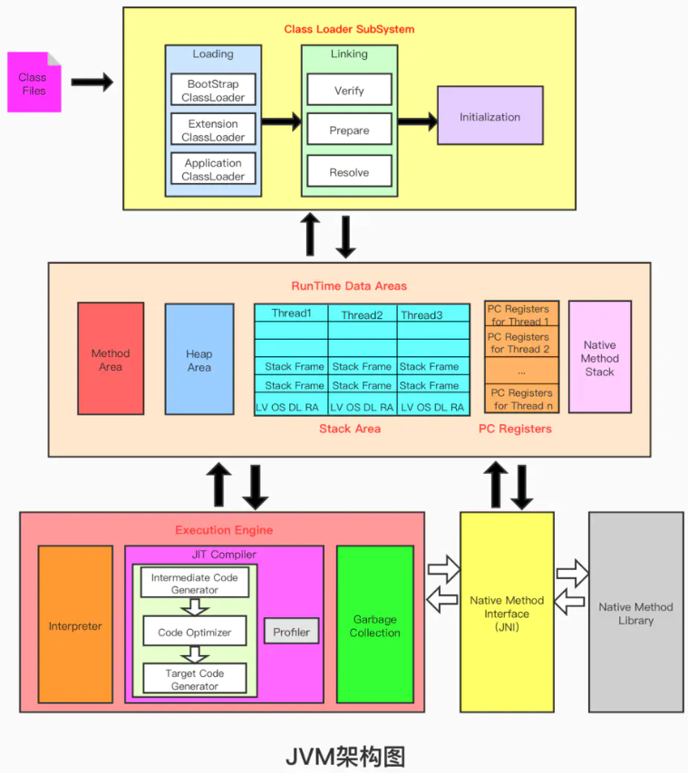
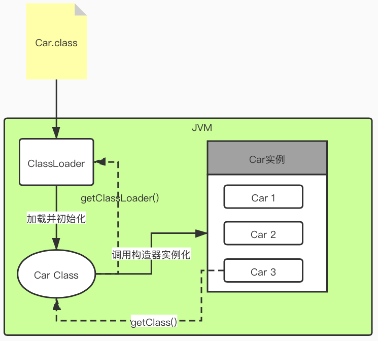
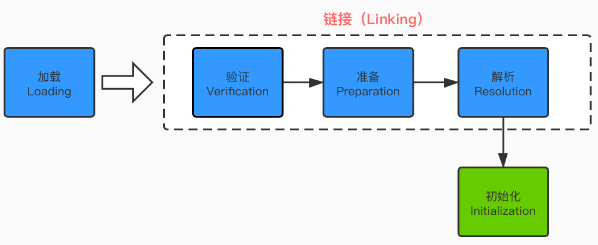
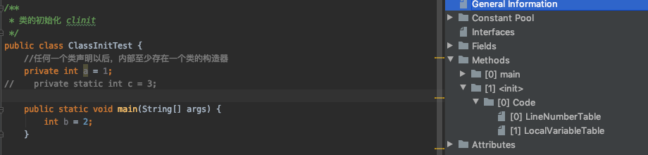
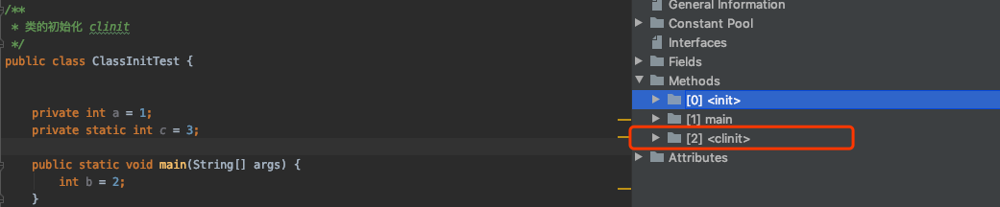
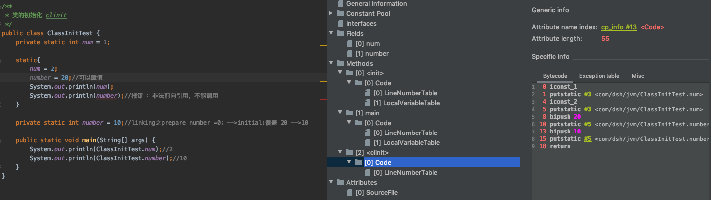
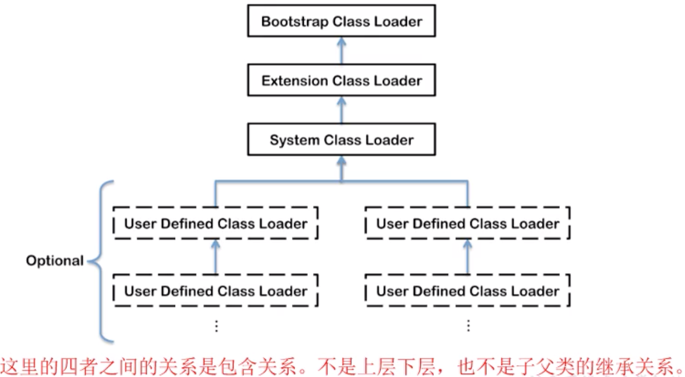
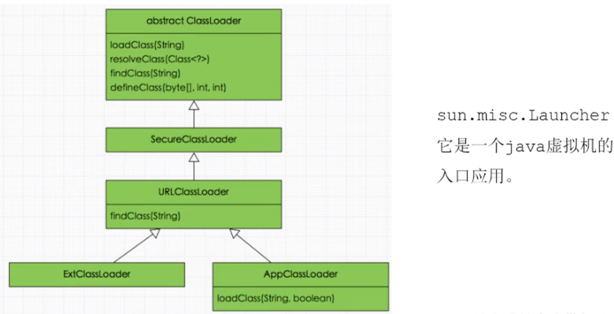
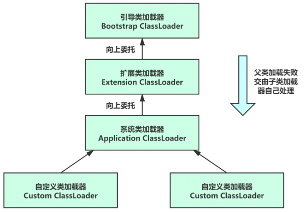
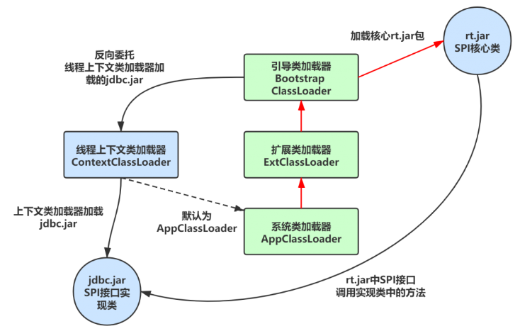

JVM类加载子系统的介绍，本笔记来自宋红康JVM课件，掘金上别人的[笔记](https://juejin.im/post/5e71c5c96fb9a07c98550df2)

<!-- more -->

# JVM之类加载子系统 

## JVM架构图



## 类加载子系统

### 类加载子系统的角色位置



### 类加载子系统的作用

- 类加载子系统负责**从文件系统或者网络中加载Class文件**，class文件在文件开头有特定的文件标识
- ClassLoader**只负责class文件的加载**，至于它是否可以运行，则由Execution Engine决定
- **加载的类信息存放于一块成为方法区的内存空间**。除了类信息之外，方法区还会存放运行时常量池信息，可能还包括字符串字面量和数字常量（这部分常量信息是Class文件中常量池部分的内存映射）


### 类加载的过程 



### 1. 加载

- 通过一个类的全限定明获取定义此类的二进制字节流；
- 将这个字节流所代表的的静态存储结构转化为方法区的运行时数据；
- 在内存中生成一个代表这个类的java.lang.Class对象，作为方法区这个类的各种数据的访问入口

### 2. 链接

#### 2.1. 验证

- 目的在于确保Class文件的字节流中包含信息符合当前虚拟机要求，保证被加载类的正确性，不会危害虚拟机自身安全。
- 主要包括四种验证，文件格式验证，源数据验证，字节码验证，符号引用验证。

#### 2.2.  准备

- 为类变量分配内存并且设置该类变量的默认初始值，即零值；
- 这里不包含用final修饰的static，因为final在编译的时候就会分配了，准备阶段会显式初始化；
- 这里不会为实例变量分配初始化，类变量会分配在方法区中，而实例变量是会随着对象一起分配到java堆中。

#### 2.3. 解析

- 将常量池内的符号引用转换为直接引用的过程。
- 事实上，解析操作往往会伴随着jvm在执行完初始化之后再执行
- 符号引用就是一组符号来描述所引用的目标。符号应用的字面量形式明确定义在《java虚拟机规范》的class文件格式中。直接引用就是直接指向目标的指针、相对偏移量或一个间接定位到目标的句柄
- 解析动作主要针对类或接口、字段、类方法、接口方法、方法类型等。对应常量池中的CONSTANT_Class_info/CONSTANT_Fieldref_info、CONSTANT_Methodref_info等。

### 3. 初始化

- 初始化阶段就是执行**类构造器方法**`clinit()`的过程。
- **此方法不需要定义**，是javac编译器自动收集类中的所有类变量的赋值动作和静态代码块中的语句合并而来。 我们注意到**如果没有静态变量**c，那么**字节码文件中就不会有clinit方法**





- **构造器方法中指令按语句在源文件中出现的顺序执行**



- clinit()不同于类的构造器。（关联：构造器是虚拟机视角下的init()）
- 若该类具有父类，jvm会保证子类的clinit()执行前，父类的clinit()已经执行完毕

执行前，父类的clinit()已经执行完毕.png)

- 虚拟机必须保证一个类的clinit()方法在**多线程下被同步加锁**

方法在多线程下被同步加锁.png)

### 类加载器的分类

- JVM支持两种类型的加载器，分别为**引导类加载器（BootStrap ClassLoader）和自定义类加载器（User-Defined ClassLoader）**
- 从概念上来讲，自定义类加载器一般指的是程序中由开发人员自定义的一类类加载器，但是java虚拟机规范却没有这么定义，而是**将所有派生于抽象类ClassLoader的类加载器都划分为自定义类加载器**。
- 无论类加载器的类型如何划分，在程序中我们最常见的类加载器始终只有三个，如下所示：



注：上图的Extension Class Loader和System Class Loader都属于自定义类加载器。

#### 示例

```java
/**
 * ClassLoader加载
 */
public class ClassLoaderTest {
    public static void main(String[] args) {
        //获取系统类加载器
        ClassLoader systemClassLoader = ClassLoader.getSystemClassLoader();
        System.out.println(systemClassLoader);//sun.misc.Launcher$AppClassLoader@18b4aac2

        //获取其上层  扩展类加载器
        ClassLoader extClassLoader = systemClassLoader.getParent();
        System.out.println(extClassLoader);//sun.misc.Launcher$ExtClassLoader@610455d6

        //获取其上层 获取不到引导类加载器
        ClassLoader bootStrapClassLoader = extClassLoader.getParent();
        System.out.println(bootStrapClassLoader);//null

        //对于用户自定义类来说：使用系统类加载器进行加载
        ClassLoader classLoader = ClassLoaderTest.class.getClassLoader();
        System.out.println(classLoader);//sun.misc.Launcher$AppClassLoader@18b4aac2

        //String 类使用引导类加载器进行加载的  -->java核心类库都是使用引导类加载器加载的
        ClassLoader classLoader1 = String.class.getClassLoader();
        System.out.println(classLoader1);//null

    }
}
```

- 对于**用户自定义类**来说：**使用系统类加载器AppClassLoader**进行加载
- java**核心类库**都是使用引导类加载器**BootStrapClassLoader**加载的

### 虚拟机自带的加载器

- ①启动类加载器（引导类加载器，**BootStrap ClassLoader**）
  - 这个类加载使用**C/C++语言实现的**，嵌套在JVM内部
  - 它用来加载java的核心库（**JAVA_HOME/jre/lib/rt.jar/resources.jar或sun.boot.class.path路径下的内容**），用于提供JVM自身需要的类
  - 并不继承自java.lang.ClassLoader,**没有父加载器**
  - 加载拓展类和应用程序类加载器，并指定为他们的父加载器
  - **处于安全考虑，BootStrap启动类加载器只加载包名为java、javax、sun等开头的类**
- ②拓展类加载器（**Extension ClassLoader**）
  - java语言编写 ，由sun.misc.Launcher$ExtClassLoader实现。
  - **派生于ClassLoader类**
  - **父类加载器为启动类加载器**
  - 从**java.ext.dirs**系统属性所指定的目录中加载类库，或从JDK的安装目录的**jre/lib/ext子目录**（扩展目录）下加载类库。**如果用户创建的JAR放在此目录下，也会由拓展类加载器自动加载**
- ③应用程序类加载器（系统类加载器，**AppClassLoader**）
  - java语言编写， 由sun.misc.Launcher$AppClassLoader实现。
  - **派生于ClassLoader类**
  - **父类加载器为拓展类加载器**
  - 它负责加载环境变量classpath或系统属性 java.class.path指定路径下的类库
  - **该类加载器是程序中默认的类加载器**，一般来说，java应用的类都是由它来完成加载
  - 通过ClassLoader#getSystemClassLoader()方法可以获取到该类加载器

代码演示

```java
/**
 * 虚拟机自带加载器
 */
public class ClassLoaderTest1 {
    public static void main(String[] args) {
        System.out.println("********启动类加载器*********");
        URL[] urls = sun.misc.Launcher.getBootstrapClassPath().getURLs();
        //获取BootStrapClassLoader能够加载的api路径
        for (URL e:urls){
            System.out.println(e.toExternalForm());
        }

        //从上面的路径中随意选择一个类 看看他的类加载器是什么
        //Provider位于 /jdk1.8.0_171.jdk/Contents/Home/jre/lib/jsse.jar 下，引导类加载器加载它
        ClassLoader classLoader = Provider.class.getClassLoader();
        System.out.println(classLoader);//null

        System.out.println("********拓展类加载器********");
        String extDirs = System.getProperty("java.ext.dirs");
        for (String path : extDirs.split(";")){
            System.out.println(path);
        }
        //从上面的路径中随意选择一个类 看看他的类加载器是什么:拓展类加载器
        ClassLoader classLoader1 = CurveDB.class.getClassLoader();
        System.out.println(classLoader1);//sun.misc.Launcher$ExtClassLoader@4dc63996
    }
}
```

### 用户自定义类加载器

在Java的日常应用程序开发中，类的加载几乎是上述三种类加载器互相配合执行的。**在必要时**，我们可以自定义类加载器，来定制类的加载方式。

自定义类加载器解决的问题：

1. 隔离加载类（解决模块、中间件之间jar包冲突）
2. 修改类加载的方式
3. 扩展加载源
4. 防止源码泄露（加密解密避免反编译）

自定义类加载器的步骤：

1. 通过继承抽象类Java.lang.ClassLoader类的方式，实现自己的类加载器。
2. JDK1.2之后不再建议用户去覆盖loadClass()方法，而是建议把自定义的类加载逻辑写在findClass()方法中。
3. 编写自定义类加载器时，如果没有太过于复杂的需求，可以直接**继承URLClassLoader类**，避免自己去编写findClass()方法及其获取字节码流的方式，使自定义类加载器编写更加简洁。

### ClassLoader类

ClassLoader类，它是一个**抽象类**，其后所有的类加载器都继承自ClassLoader（不包括启动类加载器）

#### 常用方法

| 方法名称                                             | 描述                                                         |
| :--------------------------------------------------- | ------------------------------------------------------------ |
| getParent（）                                        | 返回该类加载器的超类加载器                                   |
| loadClass（String name）                             | 加载名称为name的类，返回结果为java.lang.Class类的实例        |
| findClass（String name）                             | 查找名称为name的类，返回结果为java.lang.Class类的实例        |
| findLoadedClass（String name）                       | 查找名称为name的已经被加载过的类，返回结果为java.lang.Class类的实例 |
| defineClass（String name，byte[] b,int off,int len） | 把字节数组b中的内容转换为一个Java类 ，返回结果为java.lang.Class类的实例 |
| resolveClass（Class<?> c）                           | 连接指定的一个java类                                         |

#### ClassLoader继承关系

**拓展类加载器和系统类加载器间接继承于ClassLoader抽象类**



#### 获取ClassLoader的途径

| 获取方式                        | 具体方法                                           |
| ------------------------------- | -------------------------------------------------- |
| 获取当前类的ClassLoader         | **clazz.getClassLoader()**                         |
| 获取当前线程上下文的ClassLoader | **Thread.currentThread().getContextClassLoader()** |
| 获取系统的ClassLoader           | **ClassLoader.getSystemClassLoader()**             |
| 获取调用者的ClassLoader         | **DriverManger.getCallerClassLoader()**            |

##### 示例

```java
public class Test1 {
    public static void main(String[] args) {
        try {
            //1. 获取String类的类加载器，为引导类加载器，显示为null
            ClassLoader classLoader1 = Class.forName("java.lang.String").getClassLoader();
            System.out.println(classLoader1);
            //2. 获取当前线程上下文的类加载器
            ClassLoader classLoader2 = Thread.currentThread().getContextClassLoader();
            System.out.println(classLoader2);
            //3. 获取系统类加载器的父类加载器
            ClassLoader classLoader3 = ClassLoader.getSystemClassLoader().getParent();
            System.out.println(classLoader3);
        } catch (ClassNotFoundException e) {
            e.printStackTrace();
        }
    }
}
```

### 双亲委派机制

Java虚拟机对Class文件采用的是**按需加载**的方式，也就是说当需要使用该类时才会将它的Class文件加载到内存生成class对象。而且加载某个类的class文件时，Java虚拟机采用的是双亲委派模式，即把请求交由父类处理，它是一种任务委派模式。

如果创建java.lang并自我声明了一个String类，因为双亲委派的缘故， 就算正常执行，结果也不会出现自定义String的输出。

#### 双亲委派机制的优势

1. 防止重复加载一个类。通过委托去向上面问一问，加载过了，就不用再加载一遍。
2. 保证核心类不能被篡改。保证了类执行安全。（特别是以上例子中java.lang内的类会报安全异常，避免恶意代码或错误程序被引导类加载器加载产生问题）

#### 双亲委派机制的工作原理

1. 如果一个类加载器收到了类加载请求，它并不会自己先去加载，而是把这个请求委托给父类的加载器去执行。
2. 如果父类的加载器还存在父类加载器，则进一步向上委托，依次递归，请求最终将达到顶层的启动类加载器。
3. 如果父类加载器可以完成类加载任务，就成功返回，如果父类加载器无法完成此加载任务，子加载器才会尝试去自己加载，这就是双亲委派模式。




#### 反向委派



SPI接口实现类通过双亲委派机制加载SPI核心的jar包，但SPI核心类存在接口需要实现类，涉及第三方的jar包，需要加载jdbc.jar。而**jdbc.jar属于第三方，由系统类加载器加载**，所以产生反向委派，一直委派到系统类加载器，通过线程的getContextClassLoader获取到，并加载SPI接口的具体实现类。

#### 沙箱安全机制

自定义String类，但是在加载自定义String类的时候会率先使用引导类加载器加载，而引导类加载器在加载过程中会先加载jdk自带的文件（rt.jar包中的java\lang\String.class）,报错信息说没有main方法就是因为加载的是rt.jar包中的String类。这样可以保证对java核心源代码的保护，这就是**沙箱安全机制**。

### 其它

##### 在JVM中表示两个class对象是否为同一个类存在两个必要条件

1. 类的完整类名必须一致，包括包名。
2. 加载这个类的ClassLoader（指ClassLoader实例对象）必须相同。

换句话说，在JVM中，即使这两个类对象（class对象）来源同一个Class文件，被同一个虚拟机所加载，但只要加载它们的ClassLoader实例对象不同，这两个类对象也是不相等的。

如果一个类是由用户类加载器加载的，那么JVM会**将这个类加载器的一个引用作为类型信息的一部分保存在方法区中**。当解析一个类型到另一个类型的引用的时候，JVM需要保证这两个类型的类加载器是相同的。

#### 类的主动使用和被动使用

主动使用：

1. 创建类的实例
2. 访问某个类或接口的静态变量，或者对该静态变量赋值
3. 调用类的静态方法
4. 反射：如Class.forName(“”)
5. 初始化一个类的子类
6. Java虚拟机启动时被标明为启动类的类
7. JDK7开始启用的动态语言支持：java.lang.invoke.MethodHandle实例的解析结果REF_getStatic、REF_putStatic、REF_invokeStatic句柄对应的类没有初始化，则初始化。

除了以上七种情况，**其他使用Java类的方式都被看作是对类的被动使用，都不会导致类的初始化**。


