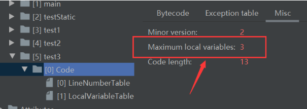
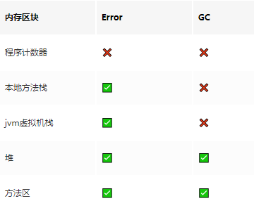

PC计数器、虚拟机栈、本地方法栈的简单了解，本笔记来自宋红康JVM课件，掘金上别人的[笔记](https://juejin.im/post/5e71d675f265da5711264f46)，[阿月的记事本](https://www.wjhandzhy.top/2020/03/26/jvm%e7%ac%94%e8%ae%b0%ef%bc%88%e4%ba%94%ef%bc%89/)

<!-- more -->

# 运行时数据区一

## 内存 

内存是硬盘和cpu的中间仓库及桥梁，承载着操作系统和应用程序的实时运行。
JVM内存布局规定了JAVA在运行过程中内存申请、分配、管理的策略，保证了JVM的高效稳定运行。**不同的jvm对于内存的划分方式和管理机制存在着部分差异**（对于Hotspot主要指方法区）

运行时数据区图示


JDK8的**元数据区**+**JIT编译产物** 就是JDK8以前的方法区

## 分区介绍

Java虚拟机定了了若干种程序运行期间会使用到的运行时数据区。
其中有一些会随着虚拟机启动而创建，随着虚拟机退出而销毁。另外一些则是与线程一一对应的，这些与线程对应的数据区域会随着线程开始和结束而创建和销毁。

如图，**灰色的区域为单独线程私有的**，**红色的为多个线程共享的**，即

- 每个线程：独立包括程序计数器、栈、本地栈
- 线程间共享：堆、堆外内存（方法区、永久代或元空间、代码缓存）


**一般来说，jvm优化95%是优化堆区，5%优化的是方法区**

## 线程的简单回顾

- 线程是一个程序里的运行单元，JVM允许一个程序有多个线程并行的执行
- 在HotSpot JVM，每个线程都与操作系统的本地线程直接映射。
  - 当一个java线程准备好执行以后，此时一个操作系统的本地线程也同时创建。
  - java线程执行终止后。本地线程也会回收。
- 操作系统负责所有线程的安排调度到任何一个可用的CPU上。一旦本地线程初始化成功，它就会调用java线程中的run()方法.

### JVM系统线程

- 如果你使用**jconsole**或者任何一个调试工具，都能看到在后台有许多线程在运行。这些后台线程不包括调用main方法的main线程以及所有这个main线程自己创建的线程；
- 这些主要的后台系统线程在HotSpot JVM里主要是以下几个：
  - **虚拟机线程**：这种线程的操作时需要JVM达到安全点才会出现。这些操作必须在不同的线程中发生的原因是他们都需要JVM达到安全点，这样堆才不会变化。这种线程的执行包括“stop-the-world”的垃圾收集，线程栈收集，线程挂起以及偏向锁撤销
  - **周期任务线程**：这种线程是时间周期事件的提现（比如中断），他们一般用于周期性操作的调度执行。
  - **GC线程**：这种线程对于JVM里不同种类的垃圾收集行为提供了支持
  - **编译线程**：这种线程在运行时会将字节码编译成本地代码
  - **信号调度线程**：这种线程接收信号并发送给JVM,在它内部通过调用适当的方法进行处理。

## 程序计数器(PC寄存器)

JVM中的PC寄存器是对物理PC寄存器的一种抽象模拟。**PC寄存器用来储存指向下一条指令的地址**，也就是指向即将要执行的指令代码，**由执行引擎读取下一条指令**。


### 作用

- 它是一块很小的内存空间，几乎可以忽略不计。也是运行速度最快的存储区域
- 在jvm规范中，每个线程都有它自己的程序计数器，是线程私有的，生命周期与线程的生命周期保持一致
- 任何时间一个线程都只有一个方法在执行，也就是所谓的**当前方法**。程序计数器会存储当前线程正在执行的java方法的JVM指令地址；或者，如果是在执行native方法，则是未指定值（undefined）。
- 它是程序控制流的指示器，分支、循环、跳转、异常处理、线程恢复等基础功能都需要依赖这个计数器来完成
- 字节码解释器工作时就是通过改变这个计数器的值来选取下一条需要执行的字节码指令
- 它是唯一一个在java虚拟机规范中没有规定任何OOM情况的区域
- 不会发生垃圾回收

### 图示


### 图示说明

上图的PC寄存器保存指令地址，执行引擎去PC寄存器所代表的的5的位置取出对应的操作指令。执行引擎会操作局部变量表和栈结构实现数据的存取，也会将操作指令翻译成机器指令，由CPU进行运算。

简单来说，PC寄存器用来储存指向下一条指令的地址，即将要执行的指令代码，由执行引擎读取下一条指令。

问：**使用PC寄存器存储字节码指令地址有什么用呢？/为什么使用PC寄存器记录当前线程的执行地址呢？**
答：**因为CPU需要不停的切换各个线程，这时候切换回来以后，就得知道接着从哪开始继续执行JVM的字节码解释器就需要通过改变PC寄存器的值来明确下一条应该执行什么样的字节码指令**

问：**PC寄存器为什么会设定为线程私有**

答：**为了能够准确地记录各个线程正在执行的当前字节码指令地址，最好的办法自然是为每一个线程都分配一个PC寄存器**，这样一来各个线程之间便可以进行独立计算，从而不会出现相互干扰的情况。

## 虚拟机栈

### 背景

由于跨平台性的设计，java的指令都是根据栈来设计的。不同平台CPU架构不同，所以不能设计为基于寄存器的。
**优点是跨平台，指令集小，编译器容易实现，缺点是性能下降，实现同样的功能需要更多的指令。**

### 内存中的堆与栈

- **栈是运行时的单位，而堆是存储的单位**
  即：栈解决程序的运行问题，即程序如何执行，或者说如何处理数据。堆解决的是数据存储的问题，即数据怎么放、放在哪儿。
- 一般来讲，对象主要都是放在堆空间的，是运行时数据区比较大的一块
- **栈空间存放基本数据类型的局部变量，以及引用数据类型的对象的引用**

### 虚拟机栈是什么

- java虚拟机栈（Java Virtual Machine Stack），早期也叫Java栈。**每个线程在创建时都会创建一个虚拟机栈，其内部保存一个个的栈帧（Stack Frame）**，对应这个一次次的java方法调用。它是**线程私有**的
- 生命周期和线程是一致的
- 作用：主管java程序的运行，它保存方法的局部变量（8种基本数据类型、对象的引用地址）、部分结果，并参与方法的调用和返回。
  - 局部变量：相对于成员变量（或属性）
  - 基本数据变量： 相对于引用类型变量（类，数组，接口）

### 栈的特点

- 栈是一种快速有效的分配存储方式，访问速度仅次于PC寄存器（程序计数器）
- JVM直接对java栈的操作只有两个
  - 每个方法执行，伴随着**进栈**（入栈，压栈）
  - 执行结束后的**出栈**工作
- **对于栈来说不存在垃圾回收问题**，但可能会发生OOM

### 栈中可能出现的异常

java虚拟机规范允许**Java栈的大小是动态的或者是固定不变的**

- 如果采用固定大小的Java虚拟机栈，那每一个线程的Java虚拟机栈容量可以在线程创建的时候独立选定。如果线程请求分配的栈容量超过java虚拟机栈允许的最大容量，java虚拟机将会抛出一个 **StackOverFlowError**异常

```java
/**
 * 演示栈中的异常
 */
public class StackErrorTest {
    public static void main(String[] args) {
        main(args);
    }
}
```

- 如果Java虚拟机栈可以动态拓展，并且在尝试拓展的时候无法申请到足够的内存，或者在创建新的线程时没有足够的内存去创建对应的虚拟机栈，那java虚拟机将会抛出一个 **OutOfMemoryError**异常

### 设置栈的内存大小

我们可以使用参数`-Xss`选项来设置线程的最大栈空间，**栈的大小直接决定了函数调用的最大可达深度**。（IDEA设置方法：**Run-EditConfigurations-VM options 填入指定栈的大小**，例`-Xss256k`）

```
/**
 * 演示栈中的异常
 *
 * 默认情况下：count 11403
 * 设置栈的大小： -Xss256k count 2475
 */
public class StackErrorTest {
    private static int count = 1;
    public static void main(String[] args) {
        System.out.println(count);
        count++;
        main(args);
    }
}
```

### 栈的存储结构和运行原理

- 每个线程都有自己的栈，栈中的数据都是以**栈帧(Stack Frame)**的格式存在
- 在这个线程上正在执行的**每个方法都对应各自的一个栈帧**
- 栈帧是一个内存区块，是一个数据集，维系着方法执行过程中的各种数据信息
- JVM直接对java栈的操作只有两个，就是对栈帧的**压栈**和**出栈**，遵循**先进后出/后进先出**的原则
- 在一条活动线程中，一个时间点上，只会有一个活动的栈帧。即只有当前正在执行的方法的栈帧（栈顶栈帧）是有效的，这个栈帧被称为**当前栈帧(Current Frame)**,与当前栈帧对应的方法就是**当前方法（Current Frame）**
- 执行引擎运行的所有字节码指令只针对当前栈帧进行操作
- 如果在该方法中调用了其他方法，对应的新的栈帧会被创建出来，放在栈的顶端，成为新的当前栈帧。
- 不同线程中所包含的栈帧是不允许相互引用的，即不可能在另一个栈帧中引用另外一个线程的栈帧
- 如果当前方法调用了其他方法，方法返回之际，当前栈帧会传回此方法的执行结果给前一个栈帧，接着，虚拟机会丢弃当前栈帧，使得前一个栈帧重新成为当前栈帧
- Java方法有两种返回函数的方式，**一种是正常的函数返回，使用return指令；另外一种是抛出异常。不管使用哪种方式，都会导致栈帧被弹出。**


### 栈帧的内部结构

每个栈帧中存储着：

- **局部变量表**（Local Variables）
- **操作数栈**（Operand Stack）(或表达式栈)
- 动态链接（Dynamic Linking）(或执行运行时常量池的方法引用)
- 方法返回地址（Return Adress）（或方法正常退出或者异常退出的定义）
- 一些附加信息


### 局部变量表（Local Variables）

#### 概述

- 局部变量表也被称之为**局部变量数组**或本地变量表
- **定义为一个数字数组，主要用于存储方法参数和定义在方法体内的局部变量**。这些数据类型包括各类基本数据类型、对象引用（reference），以及returnAddress类型
- 由于**局部变量表**是建立在线程的栈上，**是线程私有的数据**，因此不存在数据安全问题
- **局部变量表所需的容量大小是在编译期确定下来的**,并保存在方法的Code属性的maximum local variables数据项中。在方法运行期间是不会改变局部变量表的大小的
- **方法嵌套调用的次数由栈的大小决定。一般来说，栈越大，方法嵌套调用次数越多。**对一个函数而言，他的参数和局部变量越多，使得局部变量表膨胀，它的栈帧就越大，以满足方法调用所需传递的信息增大的需求。进而函数调用就会占用更多的栈空间，导致其嵌套调用次数就会减少。
- **局部变量表中的变量只在当前方法调用中有效。**在方法执行时，虚拟机通过使用局部变量表完成参数值到参数变量列表的传递过程。**当方法调用结束后，随着方法栈帧的销毁，局部变量表也会随之销毁。**

利用javap命令对字节码文件进行解析查看局部变量表，如图：


“`[L`”中L表示引用类型，`[`表示数组，是对参数的解释


**Start PC**和**Length**合起来可以表示变量的作用域范围

#### Slot(变量槽)

Slot（变量槽）是**局部变量表最基本的储存单元**。

- 局部变量表的参数值的存放总是从局部变量数组的**index0开始**，到数组长度-1的索引结束。
- 局部变量表中，**32位以内的类型只占用一个Slot**（包括returnAddress[引用]类型），64位的类型（long和double）占用两个Slot。
  - byte、short、char、float在储存前被转换成int，boolean也被转换成int，0表示false，非0表示true。
  - long和double占用两个Slot。
- JVM会为局部变量表中的**每一个Slot都分配一个访问索引**（即为上图中的Index），通过这个索引即可成功访问到局部变量表中指定的局部变量值。
- 当一个实例方法被调用的时候，它的方法参数和方法体内部定义的局部变量将会**按照顺序被复制**到局部变量表中的每一个Slot上。
- 需要访问局部变量表中一个64bit的局部变量值时，**只需要使用前一个索引**即可。如下图，访问long m使用索引1而非索引2。


- 如果当前帧是由构造方法或者实例方法（非静态）创建的，那么**该对象引用this将会存放在index为0的Slot处**，其余的参数按照参数顺序表继续排列。例：

```java
public class Test1_1 {
    private int count = 0;
    public void test2(){
        count++;
    }
}
```

由于test2方法里的count是实例变量，所以结果的LocalVariableTable内容如下图所示


而且，就算代码中未调用count，this依然是会加入到局部变量表中的，如下图：


因此对于构造方法和实例方法，this变量需要放到局部变量表当中。而静态方法的局部变量表中没有this，因此在静态方法中调用this会报错。


- **栈帧中的局部变量表中的槽位是可以重用的**，如果一个局部变量出了其作用域，那么在其作用域之后申明的新的局部变量就很有可能会复用过期局部变量的槽位，从而达到节省资源的目的。

```java
public class Test1_1 {
	public void test3(){
        int a = 0;
        {
            int b = 0;
            b = a + 1;
        }
        int c = a + 1;
	}   
}
```

以上测试代码中，局部变量表的长度为3。




观察局部变量表我们可以看到，虽然总共声明了4个变量，但是**b过了其作用域后，它的slot被c复用了**。

#### 对局部变量表的补充说明

**在栈帧中，与性能调优关系最为密切的部分就是局部变量表**。在方法执行中，虚拟机使用局部变量表完成方法的传递。

局部变量表中的变量也是重要的垃圾回收根节点，只要被局部变量表中直接或间接引用的对象都不会被回收。

### 操作数栈（Operand Stack）

#### 概述

- 操作数栈，**主要用于保存计算过程的中间结果，同时作为计算过程中变量临时的存储空间。**
- 操作数栈就是jvm执行引擎的一个工作区，当一个方法开始执行的时候，一个新的栈帧也会随之被创建出来，这个方法的操作数栈是空的
- 每一个操作数栈都会拥有一个明确的栈深度用于存储数值，其所需的最大深度在编译器就定义好了，保存在方法的code属性中，为max_stack的值。
  - 32bit的类型占用一个栈单位深度
  - 64bit的类型占用两个栈单位深度
- 操作数栈**并非采用访问索引的方式来进行数据访问**的，而是只能通过标准的入栈(push)和出栈(pop)操作来完成一次数据访问
- **如果被调用的方法带有返回值的话，其返回值将会被压入当前栈帧的操作数栈中，**并更新PC寄存器中下一条需要执行的字节码指令。
- 操作数栈中的元素的数据类型必须与字节码指令的序列严格匹配，这由编译器在编译期间进行验证，同时在类加载过程中的类验证阶段的数据流分析阶段要再次验证。
- 我们所说的Java虚拟机的**解释引擎是基于栈的执行引擎**,其中的栈指的就是操作数栈。

#### 操作数栈的字节码指令简单分析

1、指令地址**0**对应操作指令`bipush`，执行引擎调用该指令将15压入操作数栈


2、指令地址**2**对应操作指令`istore_1`，执行引擎调用该指令将操作数栈顶的15出栈，并放到局部变量表中索引为**1**的变量槽(slot)中


3、指令地址**3**对应操作指令`bipush`，执行引擎调用该指令将8压入操作数栈


4、指令地址**5**对应操作指令`istore_2`，执行引擎调用该指令将操作数栈顶的8出栈，并放到局部变量表中索引为**2**的变量槽(slot)中


5、指令地址**6**对应操作指令`iload_1`，执行引擎调用该指令将局部变量表中索引为1的15拿出来，压入操作数栈


6、指令地址**7**对应操作指令`iload_2`，执行引擎调用该指令将局部变量表中索引为2的8拿出来，压入操作数栈


7、指令地址**8**对应操作指令`iadd`，将8和15出栈，执行引擎将该指令翻译成机器指令，并调用CPU运算出结果23，并压入操作数栈


8、指令地址**9**对应操作指令`istore_3`，执行引擎调用该指令将操作数栈顶的23出栈，并放到局部变量表中索引为**3**的变量槽(slot)中


#### 栈顶缓存技术ToS（Top-of-Stack Cashing）

- 基于栈式架构的虚拟机所使用的**零地址指令**更加紧凑，但完成一项操作的时候必然需要使用更多的入栈和出栈指令，这同时也就意味着将需要更多的指令分派（instruction dispatch）次数和内存读/写次数
- 由于操作数是存储在内存中的，因此频繁地执行内存读/写操作必然会影响执行速度。为了解决这个问题，HotSpot JVM的设计者们提出了栈顶缓存技术，**将栈顶元素全部缓存在物理CPU的寄存器中，以此降低对内存的读/写次数，提升执行引擎的执行效率**

### 动态链接（Dynamic Linking）

动态链接，可简单理解为**指向运行时常量池的方法的引用**

- **每一个栈帧内部都包含一个指向运行时常量池或该栈帧所属方法的引用**。包含这个引用的目的就是为了支持当前方法的代码能够实现动态链接。比如invokedynamic指令
- 在Java源文件被编译成字节码文件中时，所有的变量和方法引用都作为符号引用（symbolic Refenrence）保存在class文件的常量池里。比如：描述一个方法调用了另外的其他方法时，就是通过常量池中指向方法的符号引用来表示的，那么**动态链接的作用就是为了将这些符号引用转换为调用方法的直接引用。**

<div style="position: relative; width: 100%; height: 0; padding-bottom: 75%;"><iframe src="//player.bilibili.com/player.html?aid=83638407&bvid=BV1BJ41177cp&cid=143084938&page=55" scrolling="no" border="0" frameborder="no" framespacing="0" allowfullscreen="true"> </iframe></div>

#### 图示


#### **方法的调用**

- **静态链接**
  当一个 字节码文件被装载进JVM内部时，如果**被调用的目标方法在编译期可知**，且**运行期保持不变**时。这种情况下将调用方法的符号引用转换为直接引用的过程称之为静态链接。
- **动态链接**
  如果**被调用的方法在编译期无法被确定下来**，也就是说，只能够在程序运行期将调用方法的符号引用转换为直接引用，由于这种引用转换过程具备**动态性**，因此也就被称之为动态链接。

对应的方法的绑定机制为：早起绑定（Early Binding）和晚期绑定（Late Bingding）。绑定是一个字段、方法或者类在符号引用被替换为直接引用的过程，这仅仅发生一次。

**在JVM中，将符号引用转换为调用方法的直接引用与方法的绑定机制相关**

- **早期绑定**
  早期绑定就是指被调用的目标方法如果在编译期可知，且运行期保持不变时，即可将这个方法与所属的类型进行绑定，这样一来，由于明确了被调用的目标方法究竟是哪一个，因此也就可以使用静态链接的方式将符号引用转换为直接引用。
- **晚期绑定**
  如果被调用的方法在编译期无法被确定下来，只能够在程序运行期根据实际的类型绑定相关的方法，这种绑定方式也就被称之为晚期绑定。

Java中任何一个普通的方法其实都具备**虚函数**的特征，它们相当于C++语言中的虚函数（C++中则需要使用关键字`virtual`来显式定义）。如果在Java程序中不希望某个方法拥有虚函数的特征时，则可以使用关键字`final`来标记这个方法。

#### 虚方法和非虚方法

##### 非虚方法

- 如果方法在编译期间就确定了具体的调用版本，这个版本在运行时是不可变的。这样的方法称为非虚方法
- **静态方法、私有方法、final方法、实例构造器、父类方法都是非虚方法**
- 其他方法称为虚方法

##### 虚拟机中的下几条方法调用指令

###### 普通调用指令

1. **invokestatic**：调用静态方法，解析阶段确定唯一方法版本
2. **invokespecial**：调用方法、私有及父类方法，解析阶段确定唯一方法版本
3. **invokevirtual**：调用所有虚方法，final修饰的方法除外
4. **invokeinterface**：调用接口方法

###### 动态调用指令

5. **invokedynamic**：动态解析出需要调用的方法，然后执行 

前四条指令固化在虚拟机内部，方法的调用执行不可人为干预，而invokedynamic指令则支持由用户确定方法版本。其中**invokestatic指令和invokespecial指令调用的方法称为非虚方法，其余的（final修饰的除外）称为虚方法。**

###### invokedynamic指令

- JVM字节码指令集一直比较稳定，一直到java7才增加了一个**invokedynamic**指令，这是**Java为了实现【动态类型语言】支持而做的一种改进**
- 但是java7中并没有提供直接生成invokedynamic指令的方法，需要借助ASM这种底层字节码工具来产生invokedynamic指令.**直到Java8的Lambda表达式的出现，invokedynamic指令的生成，在java中才有了直接生成方式**
- Java7中增加的动态语言类型支持的本质是对java虚拟机规范的修改，而不是对java语言规则的修改，这一块相对来讲比较复杂，增加了虚拟机中的方法调用，最直接的受益者就是运行在java平台的动态语言的编译器

##### 动态类型语言和静态类型语言

- 动态类型语言和静态类型语言两者的却别就在于**对类型的检查是在编译期还是在运行期**，满足前者就是静态类型语言，反之则是动态类型语言。
- 直白来说 **静态语言是判断变量自身的类型信息；动态类型预言是判断变量值的类型信息，变量没有类型信息，变量值才有类型信息**,这是动态语言的一个重要特征。
- Java是静态类型语言（尽管lambda表达式为其增加了动态特性），js，python是动态类型语言。

##### 虚方法表

在面向对象编程中，会很频繁期使用到动态分派，如果在每次动态分派的过程中都要重新在类的方法元数据中搜索合适的目标的话就可能影响到执行效率。因此，为了提高性能，jvm采用在类的方法区建立一个虚方法表（virtual method table）（非虚方法不会出现在表中）来实现。使用索引表来代替查找。

每个类中都有一个虚方法表，表中存放着各个方法的实际入口。

##### 虚方法表的创建时间

**虚方法表会在类加载的链接阶段被创建并开始初始化**，类的变量初始值准备完成之后，jvm会把该类的方法表也初始化完毕。

### 方法返回地址(Return Address)

- 方法返回地址存放的是**存放调用该方法的PC寄存器的值**。
- 一个方法的结束，有两种方式：
  - **正常执行完成**
  - 出现未处理的异常，**非正常退出**
- 无论通过哪种方式退出，在方法退出后都返回到该方法被调用的位置。方法正常退出时，**调用者的pc计数器的值作为返回地址，即调用该方法的指令的下一条指令的地址。**而通过异常退出时，返回地址是要通过异常表来确定，栈帧中一般不会保存这部分信息。
- 本质上，方法的退出就是当前栈帧出栈的过程。此时，需要恢复上层方法的局部变量表、操作数栈、将返回值也如调用者栈帧的操作数栈、设置PC寄存器值等，让调用者方法继续执行下去。

当一个方法开始执行后，只有两种方式可以退出这个方法：

1、执行引擎遇到任意一个方法返回的字节码指令（return），会有返回值传递给上层的方法调用者，简称正常完成出口。

- 一个方法在正常调用完成之后究竟需要使用哪一个返回指令还需要根据方法返回值的实际数据类型而定
- 在字节码指令中，返回指令包含**ireturn**（当返回值是boolena、byte、char、short和int类型时使用）、**lreturn**、**freturn**、**dreturn**以及**areturn**，另外还有一个**return**指令供声明为void的方法、实例初始化方法、类和接口的初始化方法使用

2、在方法执行的过程中遇到了异常（Exception），并且这个异常没有在方法内进行处理，也就是只要在本方法的异常表中没有搜素到匹配的异常处理器，就会导致方法退出，简称**异常完成出口**。
异常处理表中存放了方法执行过程中抛出异常时的异常处理，方便在发生异常的时候找到处理异常的代码。

正常完成出口和异常完成出口的区别在于：**通过异常完成出口的退出的不会给它的上层调用者产生任何的返回值**。


### 一些附加信息

栈帧中还允许携带与java虚拟机实现相关的一些附加信息。例如，对程序调试提供支持的信息。

### 虚拟机栈的相关面试题

1. 举例栈溢出的情况？（StackOverflowError）

- 递归调用等，可通过-Xss设置栈的大小解决

2. 调整栈的大小，就能保证不出现溢出么？

- **不能**。如递归无限次数肯定会溢出，调整栈大小只能保证溢出的时间晚一些

3. 分配的栈内存越大越好么？

- **不是**。会挤占其他线程的空间

4. 垃圾回收是否会涉及到虚拟机栈？





5. 方法中定义的局部变量是否线程安全？

- 需要具体问题具体分析

```java
/**
 *
 * 何为线程安全？
 *     如果只有一个线程可以操作此数据，则毙是线程安全的。
 *     如果有多个线程操作此数据，则此数据是共享数据。如果不考虑同步机制的话，会存在线程安全问题
 *
 * StringBuffer是线程安全的，StringBuilder不是
 */
public class StringBuilderTest {

    //s1的声明方式是线程安全的
    public static void method1(){
        StringBuilder s1 = new StringBuilder();
        s1.append("a");
        s1.append("b");
    }

    //stringBuilder的操作过程：是不安全的，因为method2可以被多个线程调用
    public static void method2(StringBuilder stringBuilder){
        stringBuilder.append("a");
        stringBuilder.append("b");
    }

    //s1的操作：是线程不安全的 有s1的返回值，可能被其他线程共享
    public static StringBuilder method3(){
        StringBuilder s1 = new StringBuilder();
        s1.append("a");
        s1.append("b");
        return s1;
    }

    //s1的操作：是线程安全的 ，StringBuilder的toString方法是创建了一个新的String，s1在内部消亡了
    public static String method4(){
        StringBuilder s1 = new StringBuilder();
        s1.append("a");
        s1.append("b");
        return s1.toString();
    }

    public static void main(String[] args) {
        StringBuilder s = new StringBuilder();
        new Thread(()->{
            s.append("a");
            s.append("b");
        }).start();

        method2(s);

    }

}
```

<div style="position: relative; width: 100%; height: 0; padding-bottom: 75%;"><iframe src="//player.bilibili.com/player.html?aid=83638407&bvid=BV1BJ41177cp&cid=143085386&page=62" scrolling="no" border="0" frameborder="no" framespacing="0" allowfullscreen="true"> </iframe></div>

## 本地方法栈

- **Java虚拟机栈用于管理Java方法的调用，而本地方法栈用于管理本地方法的调用**
- 本地方法是使用C语言实现的
- 它的具体做法是Native Method Stack中登记native方法，在Execution Engine执行时加载本地方法库。当某个线程调用一个本地方法时，它就进入了一个全新的并且不再受虚拟机限制的世界。它和虚拟机拥有同样的权限
  - 本地方法可以通过本地方法接口来 **访问虚拟机内部的运行时数据区**
  - 它甚至可以直接使用本地处理器中的寄存器
  - 直接从本地内存的堆中分配任意数量的内存
- **本地方法栈，也是线程私有的**。
  - 如果线程请求分配的栈容量超过本地方法栈允许的最大容量，Java虚拟机将会抛出一个StackOverFlowError异常。
  - 如果本地方法栈可以动态扩展，并且在尝试扩展的时候无法申请到足够的内存，或者在创建新的线程时没有足够的内存去创建对应的本地方法栈，那么java虚拟机将会抛出一个OutOfMemoryError异常。

并不是所有的JVM都支持本地方法。因为Java虚拟机规范并没有明确要求本地方法栈的使用语言、具体实现方式、数据结构等。如果JVM产品不打算支持native方法，也可以无需实现本地方法栈。

在hotSpot JVM中，直接将本地方法栈和虚拟机栈合二为一(不懂)。


