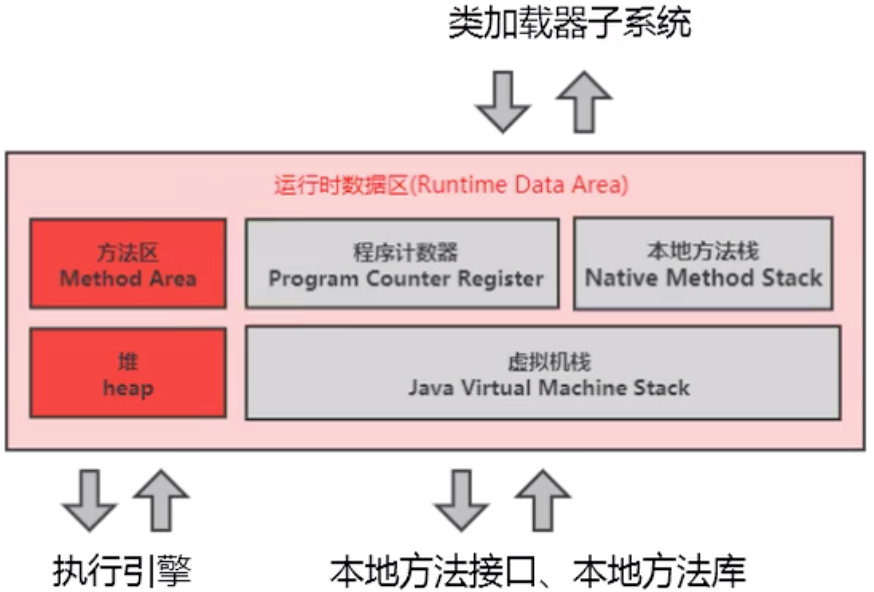
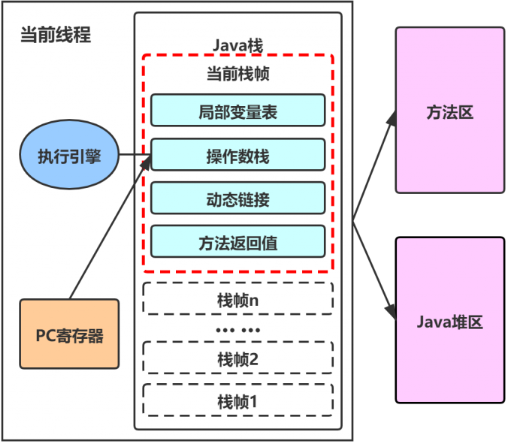
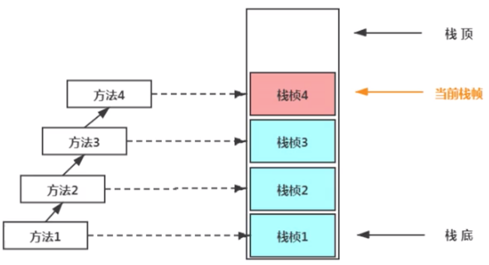
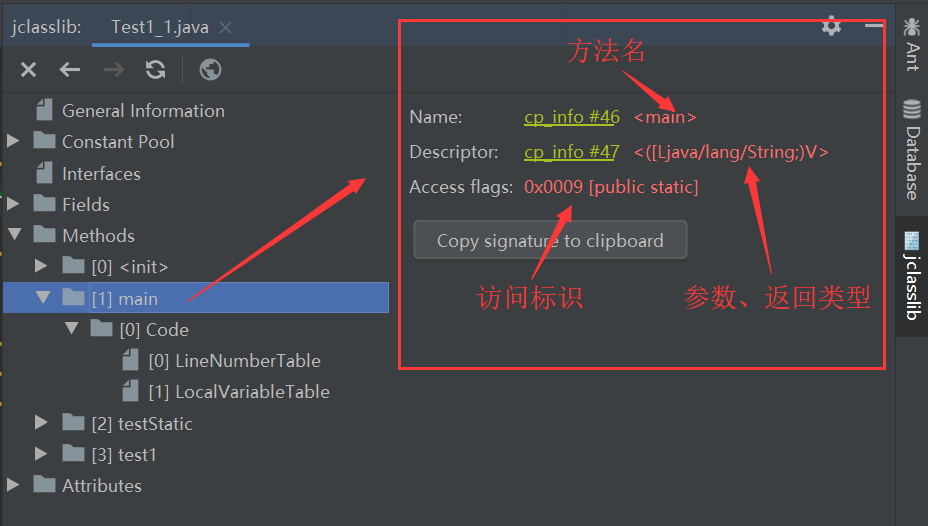
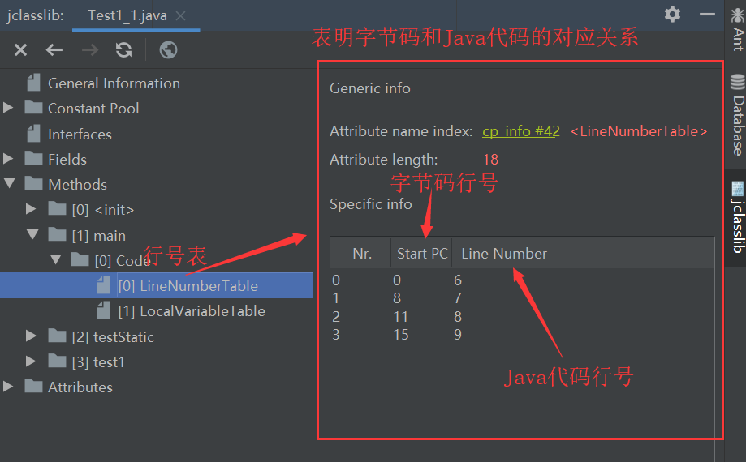
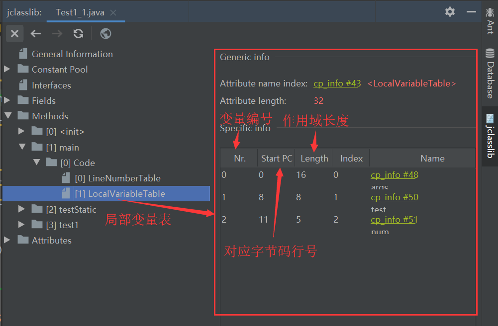

运行时数据区的简单了解，本笔记来自宋红康JVM课件，掘金上别人的[笔记](https://juejin.im/post/5e71d675f265da5711264f46)，[阿月的记事本](https://www.wjhandzhy.top/2020/03/26/jvm%e7%ac%94%e8%ae%b0%ef%bc%88%e4%ba%94%ef%bc%89/)

<!-- more -->

# 运行时数据区

## 内存 

内存是硬盘和cpu的中间仓库及桥梁，承载着操作系统和应用程序的实时运行。
JVM内存布局规定了JAVA在运行过程中内存申请、分配、管理的策略，保证了JVM的高效稳定运行。**不同的jvm对于内存的划分方式和管理机制存在着部分差异**（对于Hotspot主要指方法区）

运行时数据区图示


JDK8的**元数据区**+**JIT编译产物** 就是JDK8以前的方法区

## 分区介绍

Java虚拟机定了了若干种程序运行期间会使用到的运行时数据区。
其中有一些会随着虚拟机启动而创建，随着虚拟机退出而销毁。另外一些则是与线程一一对应的，这些与线程对应的数据区域会随着线程开始和结束而创建和销毁。

如图，**灰色的区域为单独线程私有的**，**红色的为多个线程共享的**，即

- 每个线程：独立包括程序计数器、栈、本地栈
- 线程间共享：堆、堆外内存（方法区、永久代或元空间、代码缓存）




**一般来说，jvm优化95%是优化堆区，5%优化的是方法区**

## 线程的简单回顾

- 线程是一个程序里的运行单元，JVM允许一个程序有多个线程并行的执行
- 在HotSpot JVM，每个线程都与操作系统的本地线程直接映射。
  - 当一个java线程准备好执行以后，此时一个操作系统的本地线程也同时创建。
  - java线程执行终止后。本地线程也会回收。
- 操作系统负责所有线程的安排调度到任何一个可用的CPU上。一旦本地线程初始化成功，它就会调用java线程中的run()方法.

### JVM系统线程

- 如果你使用**jconsole**或者任何一个调试工具，都能看到在后台有许多线程在运行。这些后台线程不包括调用main方法的main线程以及所有这个main线程自己创建的线程；
- 这些主要的后台系统线程在HotSpot JVM里主要是以下几个：
  - **虚拟机线程**：这种线程的操作时需要JVM达到安全点才会出现。这些操作必须在不同的线程中发生的原因是他们都需要JVM达到安全点，这样堆才不会变化。这种线程的执行包括“stop-the-world”的垃圾收集，线程栈收集，线程挂起以及偏向锁撤销
  - **周期任务线程**：这种线程是时间周期事件的提现（比如中断），他们一般用于周期性操作的调度执行。
  - **GC线程**：这种线程对于JVM里不同种类的垃圾收集行为提供了支持
  - **编译线程**：这种线程在运行时会将字节码编译成本地代码
  - **信号调度线程**：这种线程接收信号并发送给JVM,在它内部通过调用适当的方法进行处理。

## 程序计数器(PC寄存器)

JVM中的PC寄存器是对物理PC寄存器的一种抽象模拟。**PC寄存器用来储存指向下一条指令的地址**，也就是指向即将要执行的指令代码，**由执行引擎读取下一条指令**。



### 作用

- 它是一块很小的内存空间，几乎可以忽略不计。也是运行速度最快的存储区域
- 在jvm规范中，每个线程都有它自己的程序计数器，是线程私有的，生命周期与线程的生命周期保持一致
- 任何时间一个线程都只有一个方法在执行，也就是所谓的**当前方法**。程序计数器会存储当前线程正在执行的java方法的JVM指令地址；或者，如果实在执行native方法，则是未指定值（undefined）。
- 它是程序控制流的指示器，分支、循环、跳转、异常处理、线程恢复等基础功能都需要依赖这个计数器来完成
- 字节码解释器工作时就是通过改变这个计数器的值来选取下一条需要执行的字节码指令
- 它是唯一一个在java虚拟机规范中没有规定任何OOM情况的区域
- 不会发生垃圾回收

.问：**使用PC寄存器存储字节码指令地址有什么用呢？/为什么使用PC寄存器记录当前线程的执行地址呢？**
答：**因为CPU需要不停的切换各个线程，这时候切换回来以后，就得知道接着从哪开始继续执行JVM的字节码解释器就需要通过改变PC寄存器的值来明确下一条应该执行什么样的字节码指令**

问：**PC寄存器为什么会设定为线程私有**

答：**为了能够准确地记录各个线程正在执行的当前字节码指令地址，最好的办法自然是为每一个线程都分配一个PC寄存器**，这样一来各个线程之间便可以进行独立计算，从而不会出现相互干扰的情况。

## 虚拟机栈

### 背景

由于跨平台性的设计，java的指令都是根据栈来设计的。不同平台CPU架构不同，所以不能设计为基于寄存器的。
**优点是跨平台，指令集小，编译器容易实现，缺点是性能下降，实现同样的功能需要更多的指令。**

### 内存中的堆与栈

- **栈是运行时的单位，而堆是存储的单位**
  即：栈解决程序的运行问题，即程序如何执行，或者说如何处理数据。堆解决的是数据存储的问题，即数据怎么放、放在哪儿。
- 一般来讲，对象主要都是放在堆空间的，是运行时数据区比较大的一块
- **栈空间存放基本数据类型的局部变量，以及引用数据类型的对象的引用**

### 虚拟机栈是什么

- java虚拟机栈（Java Virtual Machine Stack），早期也叫Java栈。**每个线程在创建时都会创建一个虚拟机栈，其内部保存一个个的栈帧（Stack Frame）**，对应这个一次次的java方法调用。它是**线程私有**的
- 生命周期和线程是一致的
- 作用：主管java程序的运行，它保存方法的局部变量（8种基本数据类型、对象的引用地址）、部分结果，并参与方法的调用和返回。
  - 局部变量：相对于成员变量（或属性）
  - 基本数据变量： 相对于引用类型变量（类，数组，接口）

### 栈的特点

- 栈是一种快速有效的分配存储方式，访问速度仅次于PC寄存器（程序计数器）
- JVM直接对java栈的操作只有两个
  - 每个方法执行，伴随着**进栈**（入栈，压栈）
  - 执行结束后的**出栈**工作
- **对于栈来说不存在垃圾回收问题**，但可能会发生OOM

### 栈中可能出现的异常

java虚拟机规范允许**Java栈的大小是动态的或者是固定不变的**

- 如果采用固定大小的Java虚拟机栈，那每一个线程的Java虚拟机栈容量可以在线程创建的时候独立选定。如果线程请求分配的栈容量超过java虚拟机栈允许的最大容量，java虚拟机将会抛出一个 **StackOverFlowError**异常

```java
/**
 * 演示栈中的异常
 */
public class StackErrorTest {
    public static void main(String[] args) {
        main(args);
    }
}
```

- 如果Java虚拟机栈可以动态拓展，并且在尝试拓展的时候无法申请到足够的内存，或者在创建新的线程时没有足够的内存去创建对应的虚拟机栈，那java虚拟机将会抛出一个 **OutOfMemoryError**异常

### 设置栈的内存大小

我们可以使用参数`-Xss`选项来设置线程的最大栈空间，**栈的大小直接决定了函数调用的最大可达深度**。（IDEA设置方法：**Run-EditConfigurations-VM options 填入指定栈的大小**，例`-Xss256k`）

```
/**
 * 演示栈中的异常
 *
 * 默认情况下：count 11403
 * 设置栈的大小： -Xss256k count 2475
 */
public class StackErrorTest {
    private static int count = 1;
    public static void main(String[] args) {
        System.out.println(count);
        count++;
        main(args);
    }
}
```

### 栈的存储结构和运行原理

- 每个线程都有自己的栈，栈中的数据都是以**栈帧(Stack Frame)**的格式存在
- 在这个线程上正在执行的**每个方法都对应各自的一个栈帧**
- 栈帧是一个内存区块，是一个数据集，维系着方法执行过程中的各种数据信息
- JVM直接对java栈的操作只有两个，就是对栈帧的**压栈**和**出栈**，遵循**先进后出/后进先出**的原则
- 在一条活动线程中，一个时间点上，只会有一个活动的栈帧。即只有当前正在执行的方法的栈帧（栈顶栈帧）是有效的，这个栈帧被称为**当前栈帧(Current Frame)**,与当前栈帧对应的方法就是**当前方法（Current Frame）**
- 执行引擎运行的所有字节码指令只针对当前栈帧进行操作
- 如果在该方法中调用了其他方法，对应的新的栈帧会被创建出来，放在栈的顶端，成为新的当前栈帧。
- 不同线程中所包含的栈帧是不允许相互引用的，即不可能在另一个栈帧中引用另外一个线程的栈帧
- 如果当前方法调用了其他方法，方法返回之际，当前栈帧会传回此方法的执行结果给前一个栈帧，接着，虚拟机会丢弃当前栈帧，使得前一个栈帧重新成为当前栈帧
- Java方法有两种返回函数的方式，**一种是正常的函数返回，使用return指令；另外一种是抛出异常。不管使用哪种方式，都会导致栈帧被弹出。**



### 栈帧的内部结构

每个栈帧中存储着：

- **局部变量表**（Local Variables）
- **操作数栈**（Operand Stack）(或表达式栈)
- 动态链接（Dynamic Linking）(或执行运行时常量池的方法引用)
- 方法返回地址（Return Adress）（或方法正常退出或者异常退出的定义）
- 一些附加信息


### 局部变量表（Local Variables）

#### 概述

- 局部变量表也被称之为**局部变量数组**或本地变量表
- **定义为一个数字数组，主要用于存储方法参数和定义在方法体内的局部变量**。这些数据类型包括各类基本数据类型、对象引用（reference），以及returnAddress类型
- 由于**局部变量表**是建立在线程的栈上，**是线程私有的数据**，因此不存在数据安全问题
- **局部变量表所需的容量大小是在编译期确定下来的**,并保存在方法的Code属性的maximum local variables数据项中。在方法运行期间是不会改变局部变量表的大小的
- **方法嵌套调用的次数由栈的大小决定。一般来说，栈越大，方法嵌套调用次数越多。**对一个函数而言，他的参数和局部变量越多，使得局部变量表膨胀，它的栈帧就越大，以满足方法调用所需传递的信息增大的需求。进而函数调用就会占用更多的栈空间，导致其嵌套调用次数就会减少。
- **局部变量表中的变量只在当前方法调用中有效。**在方法执行时，虚拟机通过使用局部变量表完成参数值到参数变量列表的传递过程。**当方法调用结束后，随着方法栈帧的销毁，局部变量表也会随之销毁。**

利用javap命令对字节码文件进行解析查看局部变量表，如图：



“`[L`”中L表示引用类型，`[`表示数组，是对参数的解释






**Start PC**和**Length**合起来可以表示变量的作用域范围

#### Slot(变量槽)


