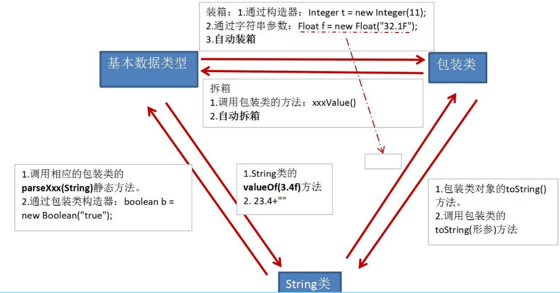

简述几种常用JavaAPI的用法

<!-- more -->

# Java常用API

## 0. java.lang.Object


### 0.0. 简单叙述

它是所有类型的根父类。一个类如果没有显式声明它的父类，那这个类的直接父类就是Object

### 0.1. 特点

- Object类的所有方法，在所有对象中都有，包括数组对象
- Object类的变量或形参可以接受任意类型的对象
- Object[] 类型的数组可以接受任意类型的对象作为它的元素
- 所有对象创建时，都会调用**Object的无参构造**

### 0.2. 常用方法

#### 0.2.0. protected Object clone()

要想使用该方法，Objectd的子类需要实现**Cloneable接口**，否则会报CloneNotSupportedException

#### 0.2.1. public boolean equals (Object obj)

用来指示某个对象obj是否与此对象的this相等。
Object类中的equals方法，等价于“==”，比较的是对象的地址
如果Object的子类要比较的是属性的内容，需要**重写equals方法**

##### 重写equals的示例

```java
class Person extends Object {
    private String name;
    private int age;
    // 有参构造方法
    public Person(String name,int age) {
        this.name = name;
        this.age = age;
    }
    //
    public boolean equals(Object obj) {
        // 类型判断。如果传入的obj不是Person类型，则返回false
        if (!(obj instanceof Person)) {
            return false;
        }
        // 如果传入的obj为空，则返回false
        if (obj == null) {
            return false;
        }
        // 如果传入的obj和当前对象的内存地址相同，则返回true
        if (this == obj) {
            return true;
        }
        // 向下转型，Object 转为 Person
        Person per = (Person) obj;
        // 当前对象和传入的obj进行各项值的比较
        return this.name.equals(per.name) && this.age == per.age;
    }
}

public class JavaDemo {
    public static void main(String[] args) {
        Person perA = new Person("李三", 20);
        Person perB = new Person("李三", 20);
        System.out.println(perA.equals(perB));
    }
}
```

#### 0.2.2. public int hashCode()

Object类中的这个方法返回的是和“地址”相关的值
**如果重写了equals方法，那么必须重写hashCode方法，而且参与equals比较的属性，一定要参与hahCode的计算**

##### 与equals的关系

- 两个对象的equals()返回true，两个对象的hashCode值**一定相等**
- 两个对象的hashCode值不相等，两个对象equals方法结果**一定不相等**
- 两个对象的hashCode值相等，两个对象equals方法结果**不一定相等**

#### 0.2.3. public final Class<?> getClass()

返回某个对象的运行时类，而不是编译时类型

```java
package com.xxx.object;

public class GetClass {
    public static void main(String[] args) {
        // 获得类名 + 包名 （完整路径  全限定类名）
        System.out.println(stu.getClass().getName());
        // 只是获得类名
        System.out.println(stu.getClass().getSimpleName());
        // 获得首行的代码，即获得包名
        System.out.println(stu.getClass().getPackage());
        // 类对象的运行时类的Class对象
        System.out.println(stu.getClass());
    }
}
```

#### 0.2.4. public String toString()

在Object中默认返回的是这个对象的**运行时类型@这个对象的hash值的十六进制表现形式**
**子类完全可以重写toString方法**

#### 0.2.5. protected void finalize()

当这个对象被垃圾回收机制回收之前调用，而且**只会调用一次**。

## 1. 包装类

> 包装类是针对八种基本数据类型定义的相应类
> **包装类对象可直接参与数值计算**

分为两种类型：

- 对象型包装类：Boolean、Character。它们是Object的直接子类
- 数值型包装类：Byte、Short、Integer、Long、Float、Double。它们是Number的直接子类

### 1.0. 装箱与拆箱

#### 1.0.0. 手动装箱与拆箱

##### 示例

```java
public class JavaDemo {
    public static void main(String[] args) {
        // 手动装箱。基本数据类型--->包装类，调用包装类的构造器
        Integer obj = new Integer(10);
        System.out.println(obj.toString());// 10
        // 手动拆箱。包装类--->基本数据类型，调用的是包装类的xxxValue()
        int num = obj.intValue();
        System.out.println(num);// 10
    }
}
```

#### 1.0.1. 自动装箱与拆箱

##### 示例

```java
public class JavaDemo {
    public static void main(String[] args) {
        // 自动装箱。int 类型在赋值到 Integer 类时，会自动封装，调用 Integer 的 valueOf(int i) 方法。不需关心构造方法
        Integer obj = 10;
        
        // 自动拆箱。等价于调用intValue()
        int num = obj;
        
        // 包装类对象可以直接参与数值计算
        obj ++;
        System.out.println(num * obj);// 110
    }
}
```

### 1.1. 包装类的缓存问题

Byte、Short、Integer、Long内有缓存结构，缓存范围：-128\~127
Float、Double没有缓存
Character有缓存，缓存范围：0\~127

#### 示例

```java
public class JavaDemo {
    public static void main(String[] args) {
        Integer numA1 = 100;// 在-128～127之间
        Integer numA2 = 100;// 在-128～127之间
        System.out.println(numA1 == numA2);// true
        Integer numB1 = 130;// 不在-128～127之间,相当于new了一个Integer对象
        Integer numB2 = 130;// 不在-128～127之间，相当于又new了一个Integer对象
        System.out.println(numB1 == numB2);// false
        System.out.println(numB1.equals(numB2));// true
    }
}
```

上述numB1 == numB2 为false的原因： Integer内部定义了I**ntegerCache结构**，IntegerCache中定义了Integer[],保存了**-128～127范围**的整数。如果自动装箱时，给Integer赋值的范围在-128~127之间，可直接使用数组中的元素，不用再new了。

## 2. String与基本数据类型的相互转换

### 2.0. String转为基本数据类型

可以用以下几种方法进行转换

- 调用**public static int parseInt(String s)**：如果入参包含非数字字符，会报错
- 调用**public static parseInt(String s, int radix)**：可以包含字母，但要在基数范围内。例如基数radix是20，可以包含的范围是0~9，a,b,c,d,e,f,g,h,i,j
- 调用**public static Integer valueOf(String s)**
- 调用**public static Integer valueOf(String s, int radix)**

### 2.1. 基本数据类型转为String

- 用加号“+”连接空字符串“”进行转换。需单独声明字符串常量，但会有垃圾产生

- 调用**String**的**valueOf(xxx)**方法。转换中不会产生垃圾

- 其他方法：

  以Integer为例，可以调用其中的静态方法转换为各种进制

  - **public static String toBinaryString(int i)**：转为二进制的形式
  - **public static String toOctalString(int i)**：转为八进制的形式
  - **public static String toHexString(int i)**：转为十六进制的形式

### 2.2. Character的几个方法

- **public static char toLowerCase(char c)**：转小写
- **public static char toUpperCase(char c)**：转大写
- **public static boolean isDigit(char c)**：判断是否为数字字符
- **public static boolean isLetter(char c)**：判断是否为字母字符
- **public static boolean isWhitespace(char c)**：判断是否为空格字符

## 3. 基本类型、包装类、String三者之间的转换图示



## 4. java.lang.String

### 4.0. 字符串类型的特点

- String不能被继承，因为String是**final修饰**的类
- String对象是常量对象，一旦创建就不能修改，**一旦修改就是新对象**
- String常量对象在**常量池**中，常量池在方法区(JDK1.6)，堆(JDK1.7)，元空间(JDK1.8)中
- 用`直接赋值实例化`的方式，**只会开启一块内存空间**；用`构造方法实例化`的方式，**会开启两块内存空间**
- 字符串字面量是String的**匿名对象**
- String底层使用字符数组(JDK1.9前，用private final修饰)，字节数组(JDK1.9后)

### 4.1. String常用方法

#### 4.1.0. String的构造方法

##### 无参构造

```java
public class ConstructorTest02 {
    // 默认没有任何指向，为null
    private static String str2;
    public static void main(String[] args) {
        
        String str1 = new  String();
        System.out.println(str1);// 打印了一个空字符串""
        System.out.println(str2);// null
    }
}
```

##### 参数为byte[]的构造方法

```java
public class ConstructorTest02 {
    private static String str2;
    public static void main(String[] args) {
        byte [] bytes = new byte [] {15,64,51,3,25,15};
        String str2 = new String(bytes);
        System.out.println(str2);// @3

        String str3 = new String(bytes, 1, 2);
        System.out.println(str3);// @3
    }
}
```

##### 参数为char[]的构造方法

```java
public class ConstructorTest02 {
    private static String str2;
    public static void main(String[] args) {
        char [] chars = new char [] {'3','5','g','6','u'};
        String str3 = new String(chars);
        System.out.println(str3);// 35g6u
    }
}
```

##### 参数为字符串的构造方法

```java
public class ConstructorTest02 {
    public static void main(String[] args) {
        String str4 = new String("uuuuy");
        System.out.println(str4);// uuuuy
    }
}
```

#### 4.1.1. 基本方法

##### 字符串的长度

**public int length()**

返回此字符串的长度，即字符的个数

##### 字符串的比较

**public boolean equals (Object anObject)**

将此字符串与指定对象进行比较
String的equals方法进行了重写
该方法**严格区分大小写**

**public boolean equalsIgnoreCase (String anotherString)**

将此字符串与其他字符串进行比较
**忽略大小写**

**public int compareTo (String anotherString)**

自然排序
按字典顺序比较两个字符串。根据字符串中每个字符的Unicode值进行比较

```java
public class StringDemo_2 {
    public static void main(String[] args) {
        String str = "mldn";
        System.out.println("MLDN".equals(str));// false 区分大小写的内容比较
        System.out.println("MLDN".equalsIgnoreCase(str));// true 忽略大小写的内容比较
    }
}
public class StringDemo_3 {
    public static void main(String[] args) {
        String str1 = "mldn";
        String str2 = "mldN";
        System.out.println(str1.compareTo(str2));// 32，正数表示大于
        System.out.println(str2.compareTo(str1));// -32，负数表示小于
        System.out.println("Hello".compareTo("Hello"));// 0，表示相等
        System.out.println(str1.compareToIgnoreCase(str2));// 0 忽略大小写的比较
    }
}
```


##### 去字符串的前后空格

**public String trim()**

去掉此字符串的前后空格，不包括中间的空格，并将修改后的字符串返回

```java
public class String_Demo {
    public static void main(String[] args) {
        String str = "  MLDN Java  ";
        // 长度计算（包括空格）
        System.out.println(str.length());// 13
        // 去掉前后空格（保留中间空格）
        String trimStr = str.trim();
        // 原始字符串
        System.out.println(str);//   MLDN Java  
        // trim()处理后的字符串
        System.out.println(trimStr);// MLDN Java
        // trim()处理后的字符串长度
        System.out.println(trimStr.length());// 9
        
    }
}
```


##### 字符串转大小写

**public String toUpperCase ()**

**public String toLowerCase ()**

```java
public class String_Demo {
    public static void main(String[] args) {
        String str = "www.MLDNJava.cn";
        // 转大写
        System.out.println(str.toUpperCase());// WWW.MLDNJAVA.CN
        // 转小写
        System.out.println(str.toLowerCase());// www.mldnjava.cn
    }
}
```


##### 是否是空字符串

方式一

"".equals(字符串)

方式二

**public boolean isEmpty ()**

```java
public class String_Demo {
    public static void main(String[] args) {
        String str = "";
        System.out.println(str.isEmpty());// true
        System.out.println("mldn".isEmpty());// false
    }
}
```


##### 和字节相关

###### 编码：把字符串转成字节数组

**public byte[] getBytes ()**：使用平台默认的编码方式进行编码

**public byte[] getBytes (Charset charset)**：按指定的编码方式进行编码

……

###### 解码：把字节数组转成字符串

**public String (byte[] bytes)**

**public String (byte[] bytes, int offset, int length)**

**public String (byte[] bytes, Charset charset)**

……


##### 和字符相关

**public char charAt (int index)**：返回指定索引处的字符

```java
public class StringTest {
    public static void main(String[] args) {
        String str = "www.mldn.cn";// 字符串对象
        char c = str.charAt(6);// 获取索引为6的字符内容
        System.out.println(c);// 打印字符信息
    }
}
```

###### 把字符串转为字符数组

**public char[] toCharArray ()**

```java
public class StringTest {
    public static void main(String[] args) {
        // 定义字符串
        String str = "mldnjava";
        // 将字符串转为字符数组
        char[] result = str.toCharArray();
        for (int i = 0;i < result.length;i ++) {// 循环字符数组
            // 编码减少32（大小写字母之间差32个编码）
            result[i] -= 32;
        }
       
        // 处理后的字符数组变为字符串
        String newStr = new String(result);
        // 输出新的字符数组（MLDNJAVA）
        System.out.println(newStr);
        // 部分字符数组变为字符串
        System.out.println(new String(result,0,4));
        
    }
}
```

###### 把字符数组转字符串

**public String (char[])**

**public String (char[], int offset, int count)**：**offset**表示第一个被截取的字符在数组value[]中的下标，**count**表示从此字符开始向后截取的字符的数量

……


##### 是否以xx开头和结尾

**public boolean startsWith (String prefix)**：测试此字符串是否以指定前缀开头

**public boolean startsWith (String prefix, int toffset)**：测试在指定索引处开始的此字符串的子字符串是否以指定的前缀开头。 

**public boolean endsWith (String suffix)**：测试此字符串是否以指定后缀结尾

```java
public class String_Demo {
    public static void main(String[] args) {
        String str = "**@@www.mldn.cn##";
        // 从索引0开始判断是否以“**”开头
        System.out.println(str.startsWith("**"));// true
        // 从索引2开始判断是否以“@@”开头
        System.out.println(str.startsWith("@@",2));// true
        // 从结尾向前判断是否以“##”结尾
        System.out.println(str.endsWith("##"));// true
        
    }
}
```


##### 字符串的截取

**public String subString (int beginIndex)**：从**指定索引**截到最后

**public String subString (int beginIndex, int endIndex)**：从开始索引截到结束索引，截取区间是**闭区间**

```java
public class String_Demo {
    public static void main(String[] args) {
        String str = "www.mldn.cn";
        // 指定位置截取到结尾，mldn
        System.out.println(str.substring(4));
        // 截取指定索引范围内的字符串，mldn
        System.out.println(str.substring(4,8));
    }
}
```


##### 字符串的拆分

**public String[] split (String regex)**

**public String[] split (String regex, int limit)**

###### 字符串全拆分

```java
public class String_Demo {
    public static void main(String[] args) {
        String str = "mldn java yootk jikxianit";
        // 利用空格拆分
        String result[] = str.split(" ");
        // 循环输出
        for (int i = 0;i < result.length;i ++) {
            // 拆分结果：mldn、java、yootk、jixianit、
            System.out.print(result[i] + "、");
        }
    }
}
```

###### 用空字符串拆分每一个字符

```java
public class String_Demo {
    public static void main(String[] args) {
        String str = "mldn java ";
        // 利用空字符串拆分
        String result[] = str.split("");
        // 循环输出
        for (int i = 0;i < result.length;i ++) {
            // 拆分结果：m、l、d、n、 、j、a、v、a、 、
            System.out.print(result[i] + "、");
        }
    }
}
```

###### 拆分指定长度的数组

```java
public class String_Demo {
    public static void main(String[] args) {
        String str = "mldn java  yootk jixianit";
        String result[] = str.split(" ",2);
        // 循环输出
        for (int i = 0;i < result.length;i ++) {
            // 拆分结果：mldn、java yootk jixianit、
            System.out.print(result[i] + "、");
        }
    }
}
```

###### 复杂拆分

```java
public class String_Demo {
    public static void main(String[] args) {
        String str = "张三:20|李四:21|王五:22 ";
        // 第一次拆分
        String result[] = str.split("\\|");
        // 循环输出
        for (int i = 0;i < result.length;i ++) {
            // 第二次拆分
            String temp[] = result[i].split(":");
            // 拆分结果： 姓名：张三，年龄20 
            //         姓名：李四，年龄21 
            //         姓名：王五，年龄22 
            System.out.println("姓名：" + temp[0] + "，年龄" + temp[1] + " ");
        }
    }
}
```


##### 字符串的查找

###### 是否包含

**public boolean contains (CharSequence s)**

```java
public class String_Demo {
    public static void main(String[] args) {
        String str = "www.mldn.cn";
        // 判断字符串是否存在
        System.out.println(str.contains("mldn"));// 存在，返回true
        System.out.println(str.contains("hello"));// 不存在，返回false
        
    }
}
```

###### 查找索引位置

**public int indexOf (String str)**：返回指定子字符串第一次出现的索引，如不存在返回-1

**public int indexOf (int ch)**：返回指定字符第一次出现的索引，如不存在返回-1

**public int lastIndexOf (int ch)**：返回指定字符最后一次出现的索引，如不存在返回-1

**public int lastIndexOf (String str)**：：返回指定子字符串最后一次出现的索引，如不存在返回-1

```java
public class String_Demo {
    public static void main(String[] args) {
        String str = "www.mldn.cn";
        System.out.println(str.indexOf("mldn"));// 4
        // -1，表示没有查询到
        System.out.println(str.indexOf("hello"));
        System.out.println(str.lastIndexOf("."));// 8
        
    }
}
```


##### 字符串的替换

**public String replace (CharSequence target, CharSequence replacement)**

**public String replaceAll (String regex, String replacement)**

**public String replaceFirst (String regex, String replacement)**

替换并不会改变原字符串

```java
public class String_Demo {
    public static void main(String[] args) {
        String str = "www.mldn.cn";
        System.out.println(str.replaceAll("w","_"));// 全部替换
        System.out.println(str.replaceFirst("w","_"));// 替换首个
        
    }
}
```


##### 字符串的拼接

###### 方式一

用“+”拼接

###### 方式二

**public String concat (String str)**

将指定字符拼接到字符串后面，**返回新的String对象**

```java
public class String_Demo {
    public static void main(String[] args) {
        String str1 = "www.mldn.cn";
        // 字符串连接
        String str2 = "www.".concat("mldn").concat(".cn");
        System.out.println(str2);// www.mldn.cn
        System.out.println(str1 == str2);// false
    }
}
```

## 5. java.lang.StringBuffer和java.lang.StringBuilder

### 5.0. String、StringBuffer和StringBuilder的区别

- StringBuffer是JDK1.0就有，线程安全；StringBuilder是JDK1.5引入的，线程不安全
- StringBuilder速度稍快
- String对象是常量对象，**长度不变**，StringBuffer和StringBuilder有字符串缓冲区，**长度可变**
- String每次拼接会产生新对象，StringBuffer和StringBuilder的append方法拼接不会产生新对象

### 5.1. 常用方法

#### 5.1.0. 增

以StringBuffer为例，**public StringBuffer append (Xxx xxx)**

```java
public class StringBufferTest {
    public static void main(String[] args) {
        StringBuffer strbf = new StringBuffer("");
        strbf.append("a").append("b").append("c");
        System.out.println(strbf);// abc
    }
}
```

#### 5.1.1. 删

**public StringBuffer delete (int start, int end)**：**删除区间是前开后闭的**

##### 5.1.2. 改

**public void setCharAt(int index, char ch)**：Index是指定的索引，ch是需要替换的字符

**public StringBuffer replace (int start, int end, String str)**：start是开始索引，end是结束索引，是前开后闭的区间。str是要替换的字符串

#### 5.1.3. 查

**public char charAt (int index)**：返回指定索引处的字符，Index为指定索引

#### 5.1.4. 插

**public StringBuffer insert (int offset, Xxx xxx)**：将xxx插入指定索引处

```java
public class StringBufferTest {
    public static void main(String[] args) {
        StringBuffer strbf = new StringBuffer("");
        strbf.append("a").append("b").append("c");
        // 将指定字符插入到指定索引处
        strbf.insert(1, "de");
        System.out.println(strbf);// adec
    }
}
```

#### 5.1.5. 反转

**public StringBuffer reverse ()**

```java
public class StringBufferTest {
    public static void main(String[] args) {
        StringBuffer strbf = new StringBuffer();
        strbf.append("abcde");
        // 字符串的反转
        System.out.println(strbf.reverse());// edcba
        
    }
}
```

#### 5.1.6. 长度

**public int length()**：返回字符串的长度

## 6. java.lang.Math

### 6.0. 常用方法

#### 6.0.0. public static round (double d)

返回参数中最接近的long，其中long四舍五入为正无穷大。

```java
public class Math_Test {
    public static void main(String[] args) {
        System.out.println(Math.round(-10.6));// -11
        System.out.println(Math.round(10.6));// 11
    }
}
```

#### 6.0.1. public static Xxx abs (Xxx d)

返回double的绝对值。如果参数不为负，则返回参数。如果参数为负数，则返回该参数的相反数

#### 6.0.2. public static double ceil (double d)

返回大于或等于参数的最小(最接近负无穷大)double值

```java
public class Math_Test {
    public static void main(String[] args) {
        System.out.println(Math.ceil(-10.6));// -10.0
        System.out.println(Math.ceil(10.6));// 11.0
    }
}
```

#### 6.0.3. public static double floor (double d )

返回小于或等于参数的最小(最接近负无穷大)double值

```java
public class Math_Test {
    public static void main(String[] args) {
        System.out.println(Math.floor(-10.6));// -11.0
        System.out.println(Math.floor(10.6));// 10.0
    }
}
```

#### 6.0.4. public static double random ()

返回一个(0, 1)之间的伪随机数

## 7. 日期和时间

### 7.0. JDK1.8之前的日期和时间

#### 7.0.0. java.util.Date

##### 构造器

**public Date ()**：获取当前系统时间

**public Date(long date)**：根据毫秒值获取日期时间对象

#### 7.0.1. java.lang.System

**public static long currentTimeMillis ()**：返回当前时间(以毫秒为单位)

#### 7.0.2. java.util.Calendar

- **public static Calendar getInstance ()**：获取默认时区和区域的日历
- **public static Calendar getInstance (TimeZone zone, Locale aLocale)**：获取指定时区和区域的日历
- **get(常量字段)**……

#### 7.0.3. java.text.DateFormat和java.text.SimpleDateFormat

##### 构造器

以DateFormat为例

**public SimpleDateFormat (String pattern)**

##### 日期转为字符串

**public final String format (Date date)**

**字符串转为日期**

**public Date parse (String source)**

### 7.1. JDK1.8之后的日期和时间

#### 7.1.0. 本地时期和时间

java.time.LocalDate和LocalTime和LocalDateTime

##### 常用方法

以LocalDate为例

```java
package java8;

import java.time.LocalDate;
import java.time.format.DateTimeFormatter;

public class LocalDateDemo {
    public static void main(String[] args) {
        // 1.调用静态now()方法获取当前日期
        LocalDate now = LocalDate.now();
        System.out.println(now);// 2019-11-28
        
        // 2.指定年月日获得日期
        LocalDate of = LocalDate.of(2019, 9, 9);
        System.out.println(of);// 2019-09-09
        
        // 3.指定某年的某一天获取日期
        LocalDate ofYearDay = LocalDate.ofYearDay(2019, 87);
        System.out.println(ofYearDay);// 2019-03-28
        
        // 4.通过时间戳获取日期
        LocalDate ofEpochDay = LocalDate.ofEpochDay(System.currentTimeMillis()/1000/60/60/24);
        System.out.println(ofEpochDay);// 2019-11-28
        
        // 5.通过格式化的字符串获日期,默认格式yyyy-MM-dd
        LocalDate parse = LocalDate.parse("2019-09-09");
        System.out.println(parse);// 2019-09-09
        
        // 6.自定义格式化字符串 获取 日期
        LocalDate parse2 = LocalDate.parse("2019@@09**09", DateTimeFormatter.ofPattern("yyyy@@MM**dd"));
        System.out.println(parse2);// 2019-09-09
        
        
    }
}
```

```java
package java8;

import java.time.DayOfWeek;
import java.time.LocalDate;

public class LocalDateDemo02 {
    public static void main(String[] args) {
        LocalDate now = LocalDate.now();
        System.out.println(now);// 2019-11-28
        
        // 1.plusYears(),原有日期上加年数，返回新对象
        LocalDate plusYears = now.plusYears(10);
        System.out.println(plusYears);// 2029-11-28
        
        // 2.plusMonths(),原有日期上加月数，返回新对象
        LocalDate plusMonths = now.plusMonths(10);
        System.out.println(plusMonths);// 2020-09-28
        
        // 3.plusWeeks(),原有日期上加周数，返回新对象
        LocalDate plusWeeks = now.plusWeeks(3);
        System.out.println(plusWeeks);// 2019-12-19
        
        System.out.println("**********************");
        // 4.minusYears(),原有日期上减年数，返回新对象
        LocalDate minusYears = now.minusYears(10);
        System.out.println(minusYears);// 2009-11-28
        
        // 5.minusMonths(),原有日期上减月数，返回新对象
        LocalDate minusMonths = now.minusMonths(10);
        System.out.println(minusMonths);// 2019-01-28
        
        // 6.minusWeeks(),原有日期上减周数，返回新对象
        LocalDate minusWeeks = now.minusWeeks(3);
        System.out.println(minusWeeks);// 2019-11-07
        
        // // 7.minusDays(),原有日期上减天数，返回新对象
        LocalDate minusDays = now.minusDays(3);
        System.out.println(minusDays);// 2019-11-25
        
        
        // 获取具体年月日
        int year = now.getYear();
        int monthValue = now.getMonthValue();
        int dayOfMonth = now.getDayOfMonth();
        DayOfWeek dayOfWeek = now.getDayOfWeek();
        int value = dayOfWeek.getValue();
        
        System.out.println(year + "年" + monthValue + "月" + dayOfMonth + "日，" 
        + "是本周第" + value + "天。");
    }
}
```

#### 7.1.1. 日期时间格式化

DateTimeFormatter无构造方法,通过静态常量获得各种格式的日期

```java
package java8;

import java.time.LocalDate;
import java.time.LocalTime;
import java.time.format.DateTimeFormatter;
import java.time.temporal.ChronoField;
import java.time.temporal.TemporalAccessor;

public class DateTimeFormatterDemo {
    public static void main(String[] args) {
        
        DateTimeFormatter isoLocalDate = DateTimeFormatter.ISO_LOCAL_DATE;
        String format = isoLocalDate.format(LocalDate.now());
        System.out.println(format);// 2019-11-28
        
        DateTimeFormatter isoLocalTime = DateTimeFormatter.ISO_LOCAL_TIME;
        System.out.println(isoLocalTime.now());// 22:07:38.189
        
        // 自定义日期的格式化
        DateTimeFormatter ofPattern = DateTimeFormatter.ofPattern("yyyy**MM&&dd");
        // 日期格式-->字符串格式
        String format2 = ofPattern.format(LocalDate.now());
        System.out.println(format2);// 2019==11==28
        
        // 字符串格式-->日期格式
        String str = "2019**09&&16";
        TemporalAccessor parse = ofPattern.parse(str);
        
        int year = parse.get(ChronoField.YEAR);
        int month = parse.get(ChronoField.MONTH_OF_YEAR);
        int day = parse.get(ChronoField.DAY_OF_MONTH);
        // 2019年9月16日
        System.out.println(year + "年" + month + "月" + day + "日");
    }
}
```

### 7.2. Instant

```java
package java8;

import java.time.Instant;
import java.util.Date;

public class InstantDemo {
    public static void main(String[] args) { 
        // 获取当前时间戳，为毫秒值
        long currentTimeMillis = System.currentTimeMillis();
        long time = new Date().getTime();
        
        System.out.println(currentTimeMillis);// 1574949236168
        System.out.println(time);// 1574949236168
        
        // 获取当前时间戳，为秒值
        Instant now = Instant.now();
        long epochSecond = now.getEpochSecond();
        System.out.println(epochSecond);// 1574949348    
    }
}
```

### 7.3. 日期的间隔

计算两个日期之间的距离的，所用方法 between()

```java
package java8;

import java.time.LocalDate;
import java.time.Period;

public class PeriodDemo {
    public static void main(String[] args) {
        // Period 计算两个日期之间的距离的，所用方法 between()
        LocalDate now = LocalDate.now();
        LocalDate of = LocalDate.of(2017, 9, 8);
        
        Period p = Period.between(of, now);
        int years = p.getYears();
        int months = p.getMonths();
        int days = p.getDays();
        
        System.out.println("相差" + years + "年" + months + "月" + days + "日");
    }
    
}
```

### 7.4. 时间的间隔

```java
package java8;

import java.time.Duration;
import java.time.Instant;

public class DurationDemo {
    public static void main(String[] args) {
        // Duration 计算两个Instant时间戳的距离的，所用方法between()
        // 计算时间间隔
        Instant now1 = Instant.now();
        
        for (int i = 0;i < 1000000;i ++) {
            System.out.println(i);
        }
        
        Instant now2 = Instant.now();
        
        Duration between = Duration.between(now1, now2);
        // 获取时间间隔，单位为秒
        long seconds = between.getSeconds();
        System.out.println(seconds);// 5
        
    }
}
```

