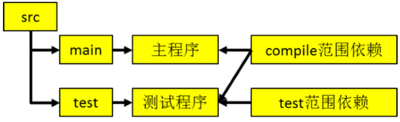
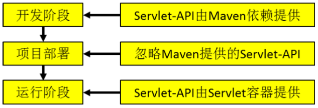
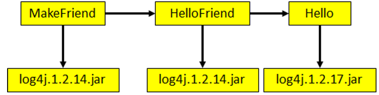

Maven的介绍及使用

<!-- more -->

# Maven

## 0. Maven简述

Maven,是一个基于Java平台的自动化构建工具。

## 1. Maven构建的几个主要环节：

①**清理**：删除以前的编译结果，为重新编译做好准备。 
②**编译**：将 Java 源程序编译为字节码文件。
③**测试**：针对项目中的关键点进行测试，确保项目在迭代开发过程中关键点的正确性。 ④**报告**：在每一次测试后以标准的格式记录和展示测试结果。
⑤**打包**：将一个包含诸多文件的工程封装为一个压缩文件用于安装或部署。Java 工程对应 jar 包，Web 工程对应 war 包。 
⑥**安装**：在 Maven 环境下特指将打包的结果——jar 包或 war 包安装到本地仓库中。 
⑦**部署**：将打包的结果部署到远程仓库或将 war 包部署到服务器上运行

## 2. Maven仓库

### 2.0. 本地仓库

- 默认地址为**~\\.m2\\repository**


- 可在Maven的settings.xml中的添加标签，来修改本地仓库的位置

  ```xml
  <localRepository>本地仓库路径</localRepository>
  ```

### 2.1. 远程仓库(私服)

### 2.2. 中央仓库

#### 中央仓库的镜像

架设在各个大洲，为中央仓库分担流量。减轻中央仓库的压力，同时更快的响应用户请求。

## 3. Maven下的项目标准目录

### 3.0. Java项目目录

- src/main/java：核心代码部分
- src/main/resources：配置文件部分
- src/test/java：测试代码部分
- src/test/resources：测试配置文件部分

### 3.1.  Java-Web项目目录

- src/main/java：核心代码部分
- src/main/resources：配置文件部分
- src/test/java：测试代码部分
- src/test/resources：测试配置文件部分\
- src/main/webapp：页面资源部分

## 4. POM

Project Object Model：项目对象模型。将 Java 工程的相关信息封装为对象作为便于操作和管理的模型。 Maven 工程的核心配置。可以说学习 Maven 就是学习 pom.xml 文件中的配置。

## 5. Maven坐标

使用如下三个向量在 Maven 的仓库中唯一的确定一个 Maven 工程。

- **groupId**：公司或组织的域名倒序+当前项目名称 
- **artifactId**：当前项目的模块名称 
- **version**：当前模块的版本

例：

```xml
<groupId>com.xxx.maven</groupId>  
<artifactId>Hello</artifactId>
<version>0.0.1-SNAPSHOT</version> 
```

### 如何通过坐标到仓库中查找 jar 包?

#### 1. 将 gav 三个向量连起来

```xml
com.xxx.maven+Hello+0.0.1-SNAPSHOT
```

#### 2. 将连起来的字符串作为目录结构到仓库中查找

```xml
com/xxx/maven/Hello/0.0.1-SNAPSHOT/Hello-0.0.1-SNAPSHOT.jar
```

## 6. 依赖

当 A jar 包用到了 B jar 包中的某些类时，A 就对 B 产生了依赖。

### 6.0. 引入方式

```xml
<dependency>
	<groupId>com.atguigu.maven</groupId>
    <artifactId>Hello</artifactId>
    <version>0.0.1-SNAPSHOT</version>
    <scope>compile</scope>
</dependency>
```

### 6.1. 依赖范围

依赖信息中的 scope 设置，就是依赖的范围。

常用的有：complie、test、provided

complie和test的简单区别图示：



complie和provided的简单区别图示：



总结：

|          | complie | test | provided |
| :------: | :-----: | :--: | :------: |
|  主程序  |    √    |  ×   |    √     |
| 测试程序 |    √    |  √   |    √     |
| 参与部署 |    √    |  ×   |    ×     |

### 6.2. 依赖的传递性

A 依赖 B，B 依赖 C，A和C的依赖关系如下表：

|          | complie  | provided | runtime  | test |
| :------: | :------: | :------: | :------: | :--: |
| complie  | complie  |    ×     | runtime  |  ×   |
| provided | provided | provided | provided |  ×   |
| runtime  | runtime  |    ×     | runtime  |  ×   |
|   test   |   test   |    ×     |   test   |  ×   |

**最左一列为直接依赖**，理解为 A 依赖 B 的范围。**最顶层一行为为传递依赖**，理解为 B
依赖 C 的范围，行与列的交叉即为 A传递依赖 C的范围。

**解释**：

比如 A 对 B 有 compile 依赖，B 对 C 有 runtime 依赖，那么根据表格所示 A 对 C 有runtime 依赖。 

### 6.3. 依赖的排除

在当前工程中引入了一个依赖是A，而 A 又依赖了 B，那么 Maven 会自动将 A 依赖的 B 引入当前工程，但是个别情况下 B 有可能是一个不稳定版，或对当前工程有不良影响。这时我们可以在引入 A 的时 候将 B 排除。

注：如果X.jar 依赖于Y.jar，但是在引入X.jar之前  已经存在了Y.jar，则maven不会再在 引入X.jar时 引入Y.jar

例：

```xml
<dependency>      
	<groupId>com.atguigu.maven</groupId>
    <artifactId>HelloFriend</artifactId>
    <version>0.0.1-SNAPSHOT</version>
    <type>jar</type>
    <scope>compile</scope>
    
    <exclusions>
        <exclusion>
            <groupId>commons-logging</groupId>
            <artifactId>commons-logging</artifactId>
        </exclusion>
    </exclusions>
    
</dependency> 
```

### 6.4. 统一管理所依赖 jar 包的版本

对同一个框架的一组 jar 包最好使用相同的版本。为了方便升级框架，可以将 jar 包的版本信息统一提取出来

#### 统一声明版本号

```xml
<properties>
    <xxx.spring.version>4.1.1.RELEASE</xxx.spring.version>
</properties>
```

#### 引用前面声明的版本号

```xml
<dependencies>
    <dependency>
        <groupId>org.springframework</groupId>
        <artifactId>spring-core</artifactId>
        <version>${xxx.spring.version}</version>
    </dependency> …… 
</dependencies> 
```

### 6.5. 依赖原则

#### 路径最短者优先



#### 路径长度相同时

- 在同一个pom.xml文件中有2个相同的依赖（覆盖）：后面声明的依赖 会覆盖前面声明的依赖 （**严禁使用本情况，严禁在同一个pom中声明2个版本不同的依赖**）
- 如果是不同的 pom.xml中有2个相同的依赖（优先）：则先声明的依赖 ，会覆盖后声明的依赖

##### 路径相同时先声明者优先

这里“**声明**”的先后顺序指的是 dependency 标签配置的先后顺序。 


### 6.6. 多个maven项目（模块）之间如何依赖

p项目 依赖于 q项目

- **先**p项目 install 到本地仓库

- **再**在q项目的pom.xml文件中添加Maven坐标

  ```xml
  <!-- 本项目  依赖于HelloWorld2项目 -->
  <dependency>
  	<groupId>org.xxx.maven</groupId>
  	<artifactId>HelloWorld2</artifactId>
  	<version>0.0.1-SNAPSHOT</version>
  </dependency>
  ```

## 7. Maven生命周期

- Maven 生命周期定义了各个构建环节的执行顺序，有了这个清单，Maven 就可以自动化的执行构建命令了。

- Maven 有三套相互独立的生命周期，分别是：  

  - ①Clean Lifecycle 在进行真正的构建之前进行一些清理工作。 
  - ②Default Lifecycle 构建的核心部分，编译，测试，打包，安装，部署等等。 
  - ③Site Lifecycle 生成项目报告，站点，发布站点

  每套生命周期都由一组**阶段**(Phase)组成，我们平时在命令行输入的命令总会对应于一个特定的阶段。比 如，运行 mvn clean，这个 clean 是 Clean 生命周期的一个阶段。有 Clean 生命周期，也有 clean 阶段。

### 7.1. Clean 生命周期 

**Clean 生命周期**一共包含了三个阶段：

- ①**pre-clean** 执行一些需要在 clean 之前完成的工作  
- ②**clean** 移除所有上一次构建生成的文件  
- ③**post-clean** 执行一些需要在 clean 之后立刻完成的工作

### 7.2. Site 生命周期

- ①pre-site 执行一些需要在生成站点文档之前完成的工作 

- ②site 生成项目的站点文档 

- ③post-site 执行一些需要在生成站点文档之后完成的工作，并且为部署做准备 

- ④site-deploy 将生成的站点文档部署到特定的服务器上

  经常用到的是 **site** 阶段和 **site-deploy** 阶段，用以生成和发布 Maven 站点。是 Maven 相当强大 的功能，Manager 比较喜欢，文档及统计数据自动生成，很好看。 

### 7.3. Default 生命周期 

Default 生命周期是 Maven 生命周期中最重要的一个，绝大部分工作都发生在这个生命周期中。只解释一些比较重要和常用的阶段。

validate 
generate-sources 
process-sources 
generate-resources 
process-resources 复制并处理资源文件，至目标目录，准备打包。 
**compile** 编译项目的源代码。 
process-classes 
generate-test-sources 
process-test-sources 
generate-test-resources 
process-test-resources 复制并处理资源文件，至目标测试目录。 
test-compile 编译测试源代码。 
process-test-classes 
**test** 使用合适的单元测试框架运行测试。这些测试代码不会被打包或部署。 
prepare-package package 接受编译好的代码，打包成可发布的格式，如 JAR。 
pre-integration-test 
integration-test 
post-integration-test 
verify 
**install** 将包安装至本地仓库，以让其它项目依赖。
**deploy** 将最终的包复制到远程的仓库，以让其它开发人员与项目共享或部署到服务器上运行。 

#### 7.4. 生命周期与自动化构建 

运行任何一个阶段的时候，它前面的所有阶段都会被运行。

## 8. 继承

非 compile 范围的依赖信息是不能在“依赖链”中传递的。
要想项目的**各个模块版本能够统一**，使用继承机制就可以将依赖信息**统一提取**到父工程模块中进行统一管理。 

**通常继承和聚合同时使用**。

### 8.0. 设置步骤

#### 8.0.0. 创建父工程 

创建父工程和创建一般的 Java 工程操作一致，唯一需要注意的是：打包方式处要设置为 **pom**。 

### 8.0.1.  在子工程的pom.xml文件中引用父工程 

```xml
<parent>
    <groupId>com.atguigu.maven</groupId>
    <artifactId>Parent</artifactId><version>0.0.1-SNAPSHOT</version>
    <!-- 指定从当前子工程的pom.xml文件出发，查找父工程的pom.xml的路径 -->
    <relativePath>../Parent/pom.xml</relativePath>
</parent> 
```

如果子工程的 **groupId** 和 **version** 和父工程重复则可以删除。 

### 8.0.2. 在父工程中管理依赖

父工程的pom文件中设置，将 Parent 项目中的 **dependencies** 标签，用 **dependencyManagement** 标签括起来。

```xml
<dependencyManagement>
    <dependencies>
        <dependency>
            <groupId>junit</groupId>
            <artifactId>junit</artifactId>
            <version>4.9</version>
            <scope>test</scope>
        </dependency>
    </dependencies>
</dependencyManagement>
```

### 8.0.3. 子项目中重新指定需要的依赖

子工程的pom.xml文件中设置，需要删除**范围**和**版本号**

```xml
<dependencies>
    <dependency>
        <groupId>junit</groupId>
        <artifactId>junit</artifactId>
    </dependency>
</dependencies> 
```

### 8.0.4. 注意

配置继承后，执行安装命令时要先安装父工程

## 9. 聚合

使用了聚合之后就可以**批量**进行 Maven工程的安装、清理工作。 

### 9.0. 配置聚合

在总的聚合工程中使用 modules/module 标签组合，指定模块工程的相对路径即可 

```xml
<modules>
    <module>../Hello</module>
    <module>../HelloFriend</module>
    <module>../MakeFriends</module>
</modules> 
```

使用方式：在聚合工程的pom.xml文件上右键-->run as-->maven install

## 10. 其他注意项

### 10.0. 修改Maven的JDK版本

在本地Maven的配置文件里修改

```xml
<profiles>
    <profile>  
        <id>jdk-18</id>  
        <activation>  
            <activeByDefault>true</activeByDefault>  
            <jdk>1.8</jdk>  
        </activation>  
        <properties>  
            <maven.compiler.source>1.8</maven.compiler.source>
            <maven.compiler.target>1.8</maven.compiler.target>
            <maven.compiler.compilerVersion>1.8</maven.compiler.compilerVersion>
        </properties>   
    </profile>  
</profiles>
```

