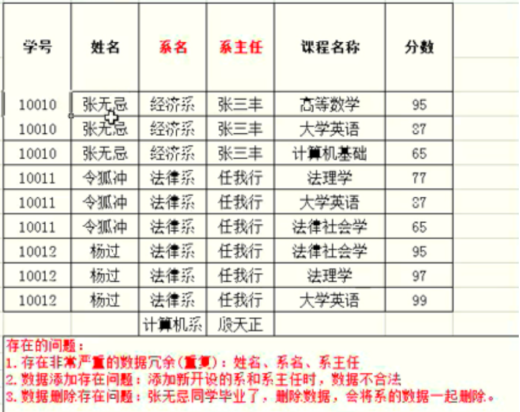

施工中

<!-- more -->

# MySQL

## 数据库概念及特点 

数据库，DataBase，简称DB，用于存储和管理数据的仓库

- 持久化存储数据
- 方便存储和管理数据
- 使用统一方式操作数据库(SQL)

## SQL简介

**SQL，Structured Query Language，结构化查询语言。**它定义了操作关系型数据库的规则。每一种DBMS操作方式都有不一样的地方，称为方言。SQL语句可以单行或多行书写，以分号结尾。MySQL的SQL语句不区分大小写，但**关键字建议使用大写**。

### SQL的注释

#### 单行注释

- **\# 注释文字**(MySQL特有的)
- **\-\-注释文字**

#### 多行注释

**/\*注释文字\*/**

## SQL分类

### DQL(Data Query Language)

数据查询语句

#### 简单查询

```sql
-- 查表的指定字段
select 字段1，字段2... from 表名;
```

```sql
-- 指定列的别名查询，显示的时候显示新名，不修改表的结构。[]括起来的表示可写可不写
select 字段1，字段2 [as] 别名2 from 表名;
```

```sql
-- 查询所有字段,不建议使用*，因为效率低
select * from 表名;
```

#### 条件查询

```sql
select 字段名 from 表名 where 条件;
```

##### where条件中的比较运算符

- **\>**、**<**、**<=**、**>=**、**=**、**<>**、**!=**。<>在sql中是不等于，MySQL中可用 !=，没有==
- **between...and...**  用在**数字方面，闭区间**；用在**字符方面，左闭右开**
- **in(集合)**；**not in(集合)**。等同于or。多个值用逗号隔开
- **is null**和**not is nul**l的前面跟字段名
- **like 'xxx%'**
  - 模糊查询符号，**%**表示占任意字符
  - 模糊查询符号，**_**表示占一个字符

##### where条件中的逻辑运算符

- **and** 或 **&&**。与的意思，在SQL中建议用and，&&并不通用
- **or** 或 **||**。或的意思
- **not** 或 **!**。非的意思

#### 排序查询

```sql
-- 默认升序，多个字段同时排序，越靠前主导作用越大
select  要查询的东西
from  表
where  条件
order by  排序的字段 | 表达式 | 函数 | 别名
[ asc(升序) | desc(降序)];
```

#### 分组查询

- **group by**，按照某些字段进行分组。通常和分组函数联合使用，且分组函数在group by后执行。严谨的语句环境中，SQL语句中有group by时，select后面只能有分组字段和分组函数
- having，对分组之后的某些数据进行再次过滤
- 执行顺序

```sql
select       5
from         1
where        2
group by     3
having       4
order by     6
limit        7
```

#### 连接查询

##### 相关语法

SQL92，较老的语法。

SQL99

```sql
select 字段，...
from 表1
【inner|left outer|right outer|cross】join 表2 on  连接条件
【inner|left outer|right outer|cross】join 表3 on  连接条件
【where 筛选条件】
【group by 分组字段】
【having 分组后的筛选条件】
【order by 排序的字段或表达式】
```

##### 内连接

###### 等值连接

```sql
select e.ename,d.dname 
from emp e,dept d; 
```

###### 非等值连接

```sql
select e.ename,d.dname 
from emp e 
join dept d
on e.deptno = d.deptno;(99语法)
```

###### 自连接

即一张表拆成多张，自己跟自己连

##### 外连接

特点：主表的数据必须全部查询

###### 左外连接

```sql
select a.ename,b.ename 
from emp a 
left join emp b
on a.mgr = b.empno;
```

###### 右外连接

还没写呢

##### 全连接

还没写呢

#### 子查询

##### 概念

一条查询语句中又嵌套了另一条完整的select语句，其中**被嵌套的select语句，称为子查询或内查询**。在外面的查询语句，称为主查询或外查询

##### 特点

- 子查询都放在小括号里
- 子查询可放在from、select、where、having后，但一般放在条件右侧
- 子查询优于主查询执行
- 单行子查询。结果集只有一行，搭配单行操作符使用(>、<、=、<>、>=、<=)
- 多行子查询，结果集有多行，搭配多行操作符使用(any、all、in、not in)

#### 分页查询

##### 特点

- 起始条目索引从0开始
-  limit子句放在查询语句的后面 

标准分页SQL：(pageNo-1) * pageSize，pageSize; 第pageNo页，每页显示pageSize条记录

```sql
select 字段|表达式,...
from 表
【where 条件】
【group by 分组字段】
【having 条件】
【order by 排序的字段】
limit startIndex, length;
-- startIndex, 起始条目索引，为0时可忽略
```

#### 联合查询

##### 特点

- 多条查询语句查询的列数必须一致
- 多条查询语句查询的列的类型必须相同
- union代表去重，union all代表不去重

```sql
select 字段|常量|表达式|函数 
【from 表】 
【where 条件】 union 【all】
select 字段|常量|表达式|函数 
【from 表】 
【where 条件】 union 【all】
  .....
select 字段|常量|表达式|函数 
【from 表】 
【where 条件】
```

#### 常见函数

##### 单行函数

###### 字符函数

- **concat()**，拼接
- **substr()**，截取子串
- **upper()**，转成大写
- **lower()**，转成小写
- **trim()**，去前后指定空格和字符
- **ltrim()**，去左边空格
- **rtrim()**，去右边空格
- **replace()**，替换
- **lpad()**，左填充
- **rpad()**，右填充
- **instr()**，返回子串第一次出现的索引
- **length()**，获取字节个数

###### 数学函数

- **round()** ，四舍五入
- **rand()**，随机数
- **floor()**，向下取整
- **ceil()**，向上取整
- **mod()**，取余
- **truncate()**，截断

###### 日期函数

- **now()**，当前系统日期+时间
- **curdate()**，当前系统日期
- **curtime()**，当前系统时间
- **str_to_date()**，将字符转为日期
- **date_format()**，将日期转为字符

###### 流程控制函数

- **if()**，处理双分支
- **case语句**  处理多分支，处理等值判断或处理条件判断

###### 其他函数

- **version()**, 版本
- **database()**，当前库
- **user()**，当前连接用户
- **ifnull**(可能为null的数据，被当作什么处理)

##### 分组函数

- **sum()**，求和
- **max()**，最大值
- **min()**，最小值
- **avg()**，平均值
- **count()**，计数

###### 特点

- **sum()**和**avg()**一般用于处理数值型；**max()**、**min()**、**count()**可处理任何数据类型
- 可搭配 distinct使用。distinct只能出现在所有字段最前面
- **count()**的参数可支持**字段**、\*、**常量值**(一般放1)。建议用count(*)
- **分组函数不可直接用在where子句中**
- 以上5个函数忽略Null值，除了count(*)

### DML(Data Manipulation Language)

数据操作语句

#### 增

```sql
insert into 表名(列名1，列名2...) values(值1，值2...);
```

- 列与值的类型、数量需一一对应
- 字符和日期型数据要在单引号里，MySQL允许用双引号
- 省略写法(插入所有的值)，省略了所有的列名

```sql
insert into 表名 values(所有的值);
```

###### 蠕虫复制

复制全部的表

```sql
insert into 表名1 [as] select * from 表名2;
```

###### 只复制部分的列

```sql
insert into 表名1(列1，列2...) [as] select 列1，列2... from 表2;
```

##### 改

###### 单表修改

```sql
update 表名 set 字段=新值，字段=新值 [where 筛选条件];
```

###### 多表修改

```sql
update 表1 别名1，表2 别名2
set 字段=新值，字段=新值
where 连接条件
and 筛选条件;
```

##### 删

###### 单表删除

```sql
delete from 表名 [where 筛选条件];
```

###### 多表删除

```sql
delete 别名1，别名2
from 表1 别名1，表2 别名2
where 连接条件
and 筛选条件;
```

###### truncate删除

```sql
truncate table 表名;
```

###### delete 和 truncate 的区别

- **truncate不能加where条件**，而delete可以加
- truncate效率高一丢丢
- truncate 删除带自增的列的表后，再插入数据，数据从1开始；delete 删除带自增的列的表后，再插入数据，数据从上次的断点处开始
- **truncate 删除不能回滚**，delete删除能回滚；**truncate相当于删除表的结构**，再创建一张表

### DCL(Data Control Language)

数据控制语句

#### MySQL开启权限

```sql
1. use mysql;
2. grant all privileges on *.*  to  '用户名'  @'%' identified by '密码';
3. flush privileges;
```

#### 初始化数据

```sql
source  表的路径
```

#### 终止一条语句 

```sql
\c;
```

#### 导出数据库

```sql
mysql 数据库名字>导出路径 -u用户名 -p密码
```

##### 导出数据库中指定的表

```sql
mysql 数据库名字 表名>导出路径 -u用户名 -p密码
```

### DDL(Data Definition Language)

数据定义语句

#### 操作库结构

- 创建数据库

   ```sql
   create database 数据库名;
   ```

- 判断数据库是否以存在，不存在创建

   ```sql
   create database if not exists 数据库名;
   ```

- 创建数据库，并指定字符集

   ```sql
   create database 数据库名 character set 字符集;
   ```

- 查看所有数据库

   ```sql
   show databases;
   ```

- 查看某个数据库定义信息

   ```sql
   show create database db2;
   ```

- 查看数据库状态

   ```sql
   status;
   ```

- 修改数据库默认字符集

   ```sql
   alter database 数据库名 default character set 字符集;
   ```

- 删除数据库

   ```sql
   drop database 数据库名;
   ```

- 查看正在使用的数据库

   ```sql
   select database();
   ```

- 使用/切换数据库

   ```sql
   use 数据库名;
   ```


#### 操作表结构

- 建表格式

  ```sql
  create 表名 (
  字段名1  字段类型1，
  字段名2  字段类型2 
  );
  ```
- 查看某个数据库中的所有表
	```sql
	show tables;
	```
- 查看建表SQL语句
	```sql
	show create table 表名;
	```
- 查看表结构
	```sql
	desc 表名;
	```
- 快速创建相同表结构的新表
	```sql
	create table 新表名 like 旧表名;
	```
- 直接删除表
	```sql
	drop table 表名;
	```
- 判断表是否存在 ，存在删除表
	```sql
	drop table if exists 表名;
	```
- 添加表列ADD
	```sql
	alter table 表名 add 列名 类型;
	```
- 修改列类型modify
	```sql
	alter table 表名 modify 列名 新类型;
	```
- 修改列名 change
	```sql
	alter table 表名 change 旧列名 新列名 类型;
	```
- 修改表名
	```sql
	alter table 原表名 rename to 新表名;
	rename table 表名 to 新表名;
	```
- 修改字符集
	```sql
	alter table 表名 character  set 字符集;
	```
- 删除列
	```sql
	alter table 表名 drop 列名;
	```


### TCL(Transaction Control Language)

事务控制语句。见MySQL事务部分

## MySQL数据类型

### 整型

- **tinyInt**：微整型，很小的整数(占 8 位二进制)  
- **smallInt**：小整型，小的整数(占 16 位二进制) 
- **mediumInt**：中整型：中等长度的整数(占 24 位二进制) 
- **Int(Integer)**：整型：整数类型(占 32 位二进制) 

### 浮点型

- float：单精度浮点数，占 4 个字节
  float有很多潜在因素，能不用就不用，默认存6位？？？，float(m,d)，m最大24整数位为m-d，小数位为d

  详情可见[MySQL 数据类型（float）的注意事项](https://www.cnblogs.com/zhoujinyi/archive/2013/04/26/3043160.html)


- double：双精度浮点数，占 8 个字节。double(5,2)表示最多存5位，其中必须为2位小数，即最大值为999.99

### 日期类型
- time(时间类型)
- date(日期类型)
- datetime(同时可以表示日期和时间类型)

### 字符串类型
- char(M)，固定长度的字符串，无论使用几个字符都占满全部，M 为 0~255 之间的整数
- varchar(M)：可变长度的字符串，使用几个字符就占用几个，M 为 0~65535 之间的整数

### 大二进制
- tinyblob(Big Large Object)，允许长度0~255字节
- blob：允许长度0~65535字节
- mediumblob：允许长度0~167772150字节
- longblob：允许长度0~4294967295字节
### 大文本
- tinytext：允许长度0~255字节
- text：允许长度0~65535字节
- mediumtext：允许长度0~167772150字节
- longtext：允许长度0~4294967295字节

## MySQL约束

### 非空约束

not null(只有列级约束)

### 唯一约束

unique

#### 特点

- 可多字段联合添加unique约束(表级约束)

```sql
unique(字段1，字段2)
```

- 可单字段添加unique约束(列级约束)，unique修饰的字段不能重复，但可以为null

### 主键约束

primary key

#### 特点

- 主键约束的字段不能为null？？？，不能重复
- 主键约束有列级约束和表级约束
- 一张表只能有一个主键
- **primary key** 通常和 **auto_increment**(自增)搭配

#### 外键约束

foreign key

#### 语法格式

```sql
foreign key(列名1) references 列名2(值2)
```
#### 特点

- 添数据时/建表时，先父表，后子表
- 删数据时/删表时，先子表，后父表
- 外键约束的字段可以不是主键，但需要有unique约束

### 检查约束

check

## 事务

### 概念

一个包含多个步骤的业务操作，被事务管理，这些操作要么同时成功，要么同时失败

### 操作

开启事务

```sql
start  transaction;
begin;
```
回滚
```sql
rollback;
```
提交
```sql
commit;
```

### 事务提交方式

#### 自动提交

**MySQL中事务是自动提交的**；一条DML（增删改）语句会自动提交一次事务

#### 手动提交

先开启事务，再提交事务；**Oracle是默认手动提交事务的**

#### 查询事务提交方式

```sql
-- 1 代表自动提交；0  代表手动提交
select @@autocommit;
```
#### 修改事务提交方式

```sql
set @@autocommit = 0或1;
```

#### 四大特征

- 原子性：是不可分割的最小操作单元，要么同时成功，要么同时失败
- 持久性：当事务提交或回滚后，数据库会持久化的保存数据
- 隔离性：多个事务之间，相互独立
- 一致性：事务操作前后，数据总量不变

#### 隔离级别

##### 概念

多个事务之间隔离，相互独立。如果多个事务操作同一批数据，则会引发问题，可通过设置隔离级别解决。

##### 存在的问题

- 脏读：一个事务读取到另一个事务中没有提交的数据
- 不是重复读（虚读）：在同一个事务中，两次读取到的数据不一样
- 幻读：一个事务操作(DML)数据表中所有记录，另一个事务添加了一条数据，第一个事务查询不到自己的修改

##### 分类

```sql
-- 隔离级别从小到大安全性越来越高，效率越来越低
-- 会产生脏读、幻读、不可重复读
read uncommited（读未提交）
-- 会产生不可重复读、幻读
read commited（读已提交）（Oracle）
-- 	会产生幻读
repeatable read（可重复读）（MySQL默认）
-- 可解决所有问题
serializable（串行化）
```
##### 数据库查询隔离语句

```sql
select @@tx_isolation;
```
##### 数据库设置隔离级别语句

```sql
set global transaction isolation level  级别字符串;
```

## MySQL的登录与退出

### 登录

```sql
mysql -uroot -p密码
mysq [-h主机名 -p端口号] -u用户名 -p密码
```

### 退出

```sql
exit;
quit;
```

## 数据库三范式

- 任何一张表都应有主键，且每一个字段原子性不可再分
- 所有非主键字段完全依赖主键，不能产生部分依赖
- 所有非主键字段完全依赖主键，不能产生传递依赖

### 口诀

- 多对多，三张表，关系表两个外键
- 一对多，两张表，多的表加外键

### 相关概念解释


#### 函数依赖
A- - >B，通过A属性的值，可以确定唯一B属性的值，则称B依赖于A。
例如：学号- - >姓名

#### 完全函数依赖
A- - >B，A是一个属性组，B属性值的确定必须依赖A属性组中所有的属性值
例如：（学号，课程名称）- - >分数

#### 部分函数依赖
A- - >B，A是一个属性组，B属性值的确定只需要依赖A属性组中某些属性值即可


#### 传递函数依赖
A- - >B，B- ->C，通过A属性（属性组）的值，可以确定唯一B属性的值，再通过B属性的值，可以确定唯一C属性的值，则称C传递依赖于A


#### 码
在一张表中，一个属性或属性组，被其他所有属性完全依赖，则称这个属性（属性组）为该表的码
例如：该表中码为（学号，课程名称）