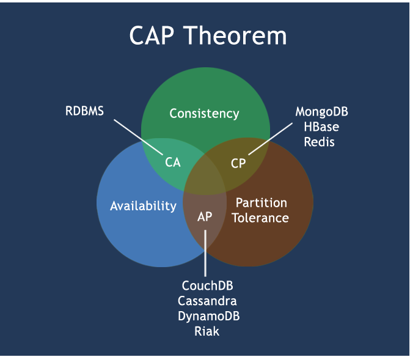

NoSQL和Redis的基础了解

<!-- more -->

# NoSQL

> not only SQL,泛指非关系型的数据库。NoSQL数据库都具有非常高的读写性能。无需事先为要存储的数据建立字段，随时可以存储自定义的数据格式。

## 0. NoSQL数据库的四大分类

> KV键值；
>
> 文档型数据库(bson格式)(CouchDB、MongoDB)；
>
> 列存储数据库(Cassandra, HBase)；
>
> 图关系数据库(Neo4J, InfoGrid)

## 1. CAP

> Consistency(强一致性)，Availability(可用性)Partition tolerance(分区容错性)

> CAP理论：一个分布式系统不可能同时很好的满足一致性，可用性和分区容错性这三个需求，最多只能同时较好的**满足两个**。
>
> CA 传统Oracle数据库
>
> AP 大多数网站架构的选择
>
> CP Redis、Mongodb

图示



## 2. BASE

> 为了解决关系数据库强一致性引起的问题而引起的可用性降低而提出的解决方案
>
> 基本可用（Basically Available）
> 软状态（Soft state）
> 最终一致（Eventually consistent）

## 3. 分布式与集群

>简单来讲：
>
>分布式：不同的多台服务器上面**部署不同的服务模块**（工程），他们之间通过Rpc/Rmi之间通信和调用，对外提供服务和组内协作。
>
>集群：不同的多台服务器上面**部署相同的服务模块**，通过分布式调度软件进行统一的调度，对外提供服务和访问。

# Redis

## 1. 概述

> REmote DIctionary Server(远程字典服务器)。用C语言编写的一个高性能的(key/value)分布式内存数据库，基于内存运行，并支持持久化。

## 2. 特点

- 支持数据的持久化，可以将内存中的数据保持在磁盘中，重启的时候可以再次加载进行使用
- 不仅仅支持简单的key-value类型的数据，同时还提供list，set，zset，hash等数据结构的存储
- 支持数据的备份，即master-slave模式的数据备份

## 3. Redis的杂项基础知识

- Redis是单线程的
- 默认16个数据库，类似数组下标从零开始，初始默认使用零号库
- 统一密码管理，16个库都是同样密码，要么都OK要么一个也连接不上
- Redis索引都是从零开始
- **select命令**切换数据库
- **Dbsize命令**查看当前数据库的key的数量
- **Flushdb命令**清空当前库
- **Flushall命令**通杀全部库
- Redis默认端口6379

## 4. Redis的数据类型

###4.0. 常用的`key`命令

- **KEYS \***：查看所有的`key`
- **EXISTS key**：判断指定的`key`是否存在
- **MOVE key db** ：从当前的库中移除指定的`key`，将它移到指定的库(db)中
- **EXPIRE key seconds**：为给定的key设置一个过期时间(秒)
- **TTL key**：查看指定的`key`还有多少秒过期。-1表示永不过期，-2表示已过期
- **TYPE key**： 查看指定的`key`是什么类型

###4.1. 其他的`key`命令

- **DEL key**：指定的`key`存在时，删除指定的`key`
- **DUMP key**：序列化指定的`key`，并返回被序列化的值
- **PERSIST key**：移除`key`的过期时间
- **EXPIREAT key timestamp**：为指定`key`设置过期时间的时间辍
- **PEXPIRE key milliseconds**：为指定`key`设置过期时间(毫秒)
- **EXPIREAT key milliseconds-timestamp**：为指定`key`设置过期时间的时间辍(以毫秒计)
- **PTTL key**：返回指定`key`的剩余过期时间(以毫秒计)
- **RANDOM key**：从当前数据库中随机返回一个`key`
- **RENAME key newkey**：修改`key`的名称
- **RANAMENX key newkey**：仅当newkey不存在时，将`key`改名为newkey

### 4.2. String(字符串)

> string是redis最基本的类型，**单key单value**。
> string类型是二进制安全的。可以包含任何数据。比如jpg图片或者序列化的对象 。
> Redis中字符串value最多可以是512M

- **SET key value**：设置指定`key`的值
- **GET key**：获取指定`key`的值
- **STRLEN key**：返回`key`所存储的字符串的长度
- **APPEND key value**：如果`key`已经存在，该命令会在末尾追加value


- **INCR key**：将`key`中存储的**数字值**增1
- **INCRBY key increment**：将`key`所存储的值加上给定的增量值(increment)
- **INCRBYFLOAT key increment**：将`key`所存储的值加上给定的浮点增量值(increment)
- **DECR key**：将`key`中存储的数字值减1
- **DECRBY key decrement**：将`key`所存储的值减去给定的减量值(decrement)
- **SETRANGE key offset value**：将offset处的值覆写为value
- **GETRANGE key start end**：获取指定区间(start~end)的值
- **SETEX(set with expire) key seconds value**：将value关联到`key`上，并设置`key`的过期时间为seconds(以秒为单位)
- **SETNX(set if not exist) key value**：`key`不存在时才设置`key`的值
- **MSET key value [key value...]**：同时设置一个或多个key-value对
- **MSETNX key value [key value...]**：同时设置一个或多个key-value对，当且仅当所有给定的`key`都不存在
- **MGET key1[key2...]**：获取所有(一个或多个)给定的`key`的值
- **GETSET key value**：将指定的`key`的值设为value，并返回`key`的旧值(old value)
- ......

### 4.3. List(列表)

> Redis的列表是简单的字符串列表，按照插入顺序排序。
> 可以添加一个元素到列表的**头部**（左边）或者**尾部**（右边）。
> 底层实际是个链表。
> **单key多value**

- **LPUSH key value1[value2]**：将一个值和多个值插入到列表头部

- **LPUSHX key value**：将一个或多个值插入到已存在的列表头部

- **RPUSH key value1[value2]**：在列表中添加一个或多个值

- **RPUSHX key value**：为已存在的列表添加值

- **LRANGE key start stop**：获取列表中指定范围的元素

  - ```shell
    # 0 -1表示获取列表所有的元素
    LRANGE list01 0 -1
    ```

- **LPOP key**：移除并获取列表**头部**的第一个元素

- **RPOP key**：移除并获取列表**尾部**的第一个元素

- **LINDEX key index**：通过**索引**获取列表中的元素

- **LLEN key**：获取列表长度

- **LREM key count value**：移除列表元素，即删除n个value

  - ```shell
    # 从左向右删除2个值等于v1的元素，返回的值为实际删除的数量
    LREM list01 2 v1
    # LREM list3 0 值，表示删除全部给定的值。零个就是全部值
    LREM list3 0
    ```

- **LTRIM key start stop**：对列表进行修剪，只保留指定索引间(闭区间)的元素，其余的删除

- **RPOPLPUSH source destination**：移除列表的最后一个元素，并将该元素添加到另一个列表的**头部**

- **LSET key index value**：通过索引设置列表元素的值

- **LINSERT key BEFORE|AFTER pivot value**：在列表元素**pivot**的前后插入元素**value**

- **BLPOP key1 [key2] timeout**：移除并获取列表**头部**的一个元素，如果列表没有该元素会阻塞列表直到**超时**或发现可弹出的元素为止

- **BRPOP key1 [key2] timeout**：移除并获取列表**尾部**的一个元素，如果列表没有该元素会阻塞列表直到**超时**或发现可弹出的元素为止

- **BRPOPLPUSH source destination timeout**：移除并获取列表**尾部**的一个元素，并将该元素插入到另一个列表的**头部**，如果列表没有该元素会阻塞列表直到**超时**或发现可弹出的元素为止

###4.4. Set

> Redis的Set是string类型的无序集合。它是通过HashTable实现实现的。
> 单值多value

- **SADD key value1 [value2]**：向`key`中添加一个或多个value
- **SMEMBERS key**：返回所有的`key`
- **SISMEMBER key value**：判断某个value是否是指定`key`的值
- **SCARD key**：获取Set集合中`key`的个数
- **SREM key value1 [value2]**：删除指定`key`中的指定几个value
- **SRANDMEMBER key [count]**：**随机**返回指定`key`中一个或多个value。count超过最大数量就全部取出，count为负照样取，但可能会有重复的值。
- **SPOP key**：移除并返回指定`key`中随机一个value
- **SMOVE key1 key2 value1**：将`key1`里的value1放到`key2`中
- **SDIFF key1 [key2]**：返回`key1`和`key2`的差集，以`key1`为准
- **SINTER key1 [key2]**：返回`key1`和`key2`的交集
- **SUNION key1 [key2]**：返回`key1`和`key2`的并集
- ……

### 4.5. Hash(哈希)

> KV模式，但V是一个或多个键值对。

- **HSET key field value**：将`key`中的字段field的值设为value
- **HGET key field**：获取指定`key`中的指定字段field的值
- **HGETALL key**：获取指定`key`中所有字段和他们的值
- **HMSET key field1 value1 [field2 value2]**：在指定`key`中设置多个field-value
- **HMGET key field1 [field2]**：在指定`key`中获取所有**指定字段**的值
- **HDEL key field1 [field2]**：在指定`key`中删除一个或多个字段
- **HLEN key**：获取指定`key`的字段的数量
- **HEXISTS key field**：查看指定`key`中的**指定字段**是否存在
- **HKEYS key**：获取指定`key`中的所有字段field
- **HVALS key**：获取指定`key`中的所有字段的**值**
- **HINCRBY key field increment**：为指定`key`中的**指定字段**field的**整数值**加上增量increment
- **HINCRBYFLOAT key field increment**：为指定`key`中的**指定字段**field的**浮点数值**加上增量increment
- **HSETNX key field value**：在指定key中，如果**指定字段**field不存在，才会设置该字段的值

###4.6. ZSet(Sorted Set，有序集合)

> Redis中的**ZSet** 和 Set 一样也是string类型元素的集合，且不允许成员望重复。
> 不同的是每个元素都会关联一个**double类型的值**。
> Redis正是通过分数来为集合中的成员进行从小到大的排序。
> ZSet的成员是唯一的,但值**score**却可以重复。

- **ZADD key score1 value1 [score2 value2]**：向指定`key`中添加一个或多个value，或更新已存在的成员的值

- **ZRANGE key start stop [WITHSCORES]**：在指定`key`中，返回指定**索引区间**(start~stop)内的**value**或**scores和value**

- **ZRERANGE key stop start [WITHSCORES]**：在指定`key`中，**逆序**返回指定**索引区间**(start~stop)内的**value**或**scores和value**

- **ZRANGEBYSCORE key min max [WITHSCORES]\[LIMIT]**

  - ```shell
    # 从key(ZSet)中，获取scores[60,90]闭区间内的value和score
    ZRANGEBYSCORE ZSet 60 90 WITHSCORES
    ```

  - ```shell
    # 从key(ZSet)中，获取scores(60,90)开区间内的value和score
    ZRANGEBYSCORE ZSet (60 (90 WITHSCORES
    ```

  - ```shell
    # 在之前的基础上，再加限制条件。LIMIT后有两个值，第一个值是从索引几开始，第二个值是选几个
    ZRANGEBYSCORE ZSet (60 (90 WITHSCORES LIMIT 0 2
    ```

- **ZRERANGEBYSCORE key max min [WITHSCORES]\[LIMIT]**：**逆序**获取

- **ZREM key value1 [value2]**：删除指定`key`中的**指定score**下的value值

- **ZCARD key**：获取指定`key`中的value或score的数量

- **ZCOUNT key min max**：计算指定`key`中指定score区间内value的数量

- **ZRANK key value**：获取指定`key`中的**指定value** 的**索引**或下标

- **ZSCORE key value**：获取指定`key`中的**指定value** 的**score**

- **ZRERANK key value**：**逆序**获取指定`key`中的**指定value** 的**score**

## 5. 配置文件redis.conf的简单介绍

待整理

## 6. Redis的持久化

### 6.0. RDB(Redis DataBase)

####6.0.0. 简单介绍

>在指定的时间间隔内将内存中的数据集快照写入磁盘，
>恢复时是将快照**文件**直接读到**内存**里

>Redis会单独创建（fork）一个子进程来进行持久化，会先将数据写入到一个临时文件中，待持久化过程都结束了，再用这个临时文件替换上次持久化好的文件。

#### 6.0.1. 默认配置文件

> 配置文件默认名为**dump.rdb**

#### 6.0.2. 如何触发RDB快照

##### 方式一

> 冷拷贝后重新使用(cp dump.rdb dump_new.rdb)

##### 方式二

> 用**命令**save和bgsave

**save**：save只管保存，其余不管

**bgsave**：Redis会在后台**异步**进行快照操作，快照同时还可以响应客户端请求。可以通过lastsave命令获取最后一次成功执行快照的时间。

##### 方式三

> 执行flushall**命令**，也会产生dump.rdb文件，但里面是空的，无意义

#### 6.0.3. 如何恢复

> 将备份文件 (dump.rdb) **移动**到 redis 安装目录并**重启**服务即可

可使用命令`CONFIG GET dir`来获取目录

#### 6.0.4. RDB的优劣势

##### 优势

> 适合大规模的数据恢复；对数据完整性和一致性要求不高

#####劣势

> 在一定间隔时间做一次备份，所以如果redis意外断掉的话，就会丢失最后一次快照后的所有修改；
>
> Fork的时候，内存中的数据被克隆了一份，大致2倍的膨胀性需要考虑

#### 6.0.5. 动态停止RDB并保存的方法

> 使用命令`redis-cli config set save ""`

### 6.1. AOF(Append only File)

#### 6.1.0. 简单叙述

>以日志的形式来记录每个**写操作**，将Redis执行过的所有写指令记录下来(读操作不记录)
>**只许追加文件**但不可以改写文件，redis启动之初会读取该文件重新构建数据

#### 6.1.1. AOF配置文件

> AOF的配置文件的默认名称为appendonly.aof

#### 6.1.2. AOF的正常恢复

- 启动：修改Redis配置文件，默认的appendonly no，改为yes
- 将有数据的aof文件复制一份保存到对应目录(config get dir)
- 恢复：重启redis然后重新加载

#### 6.1.3. AOF的异常恢复

- 启动：修改Redis配置文件，默认的appendonly no，改为yes
- 备份损坏的AOF文件
- 修复：用命令`Redis-check-aof --fix 文件名`进行修复
- 恢复：重启redis然后重新加载

#### 6.1.4. Rewrite

>AOF采用文件追加方式，文件会越来越大。为避免出现此种情况，新增了重写机制，当AOF文件的大小超过所设定的阈值时，Redis就会启动AOF文件的内容压缩。
>只保留可以恢复数据的最小指令集，可以使用命令`bgrewriteaof`

##### 重写原理

>AOF文件持续增长而过大时，会fork出一条新进程来将文件重写(也是先写临时文件最后再rename)，遍历新进程的内存中数据，每条记录有一条的Set语句。重写aof文件的操作，并没有读取旧的aof文件，而是将整个内存中的数据库内容用命令的方式重写了一个新的aof文件，这点和快照有点类似

##### 触发机制

> Redis会记录上次重写时的AOF文件大小，默认配置是当AOF文件大小是上次rewrite后大小的2倍且文件大于64M时触发

#### 6.1.5. AOF的优劣势

##### 优势

- 每修改同步：**appendfsync always**   同步持久化 每次发生数据变更会被立即记录到磁盘  性能较差但数据完整性比较好
- 每秒同步：**appendfsync everysec**    异步操作，每秒记录   如果一秒内宕机，会有数据丢失
- 不同步：**appendfsync no**   从不同步

#####劣势

- 对于相同数据集的数据而言，aof文件要远大于rdb文件，恢复速度慢于rdb
- aof运行效率要慢于rdb，每秒同步策略效率较好，不同步效率和rdb相同

### 6.3. RDB和AOF的小总结

> RDB持久化方式能够在指定的时间间隔能对你的数据进行快照存储

>AOF持久化方式记录每次对服务器写的操作，当服务器重启的时候会重新执行这些命令来恢复原始的数据。AOF命令以redis协议追加保存每次写的操作到文件末尾。
>Redis还能对AOF文件进行后台重写,使得AOF文件的体积不至于过大

#### 同时开启两种持久化方式

> 当redis重启的时候会优先载入AOF文件来恢复原始的数据，因为在通常情况下AOF文件保存的数据集要比RDB文件保存的数据集要完整。

>RDB的数据不实时，同时使用两者时服务器重启也只会找AOF文件。那要不要只使用AOF呢？
>作者建议不要，因为RDB更适合用于备份数据库(AOF在不断变化不好备份)，快速重启，而且不会有AOF可能潜在的bug，留着作为一个万一的手段。

## 7. 事务

###7.0. 简单叙述  

> 可以**一次执行**多个命令。
> 一个事务中的所有命令都会序列化，按顺序地串行化执行而不会被其它命令插入。

### 7.1. 常用命令

- **MULTI**：标记一个事务块的开始
- **DISCARD**：取消事务，放弃执行事务块内的所有命令
- **EXEC**：执行所有事务块的命令。一旦执行了EXEC，之前加的监控锁都会被取消掉
- **WATCH key1 [key2...]**：监视一个或多个`key`，如果在事务执行前这些`key`被其他命令改动，事务将会打断。
- **UNWATCH**：取消`WACTH`命令对**所有**`key`的监视。

### 7.2. Redis事务的几个特性

- **单独的隔离操作**：事务块中的所有命令都会序列化、按顺序地执行。事务在执行的过程中，不会被其他客户端发送来的命令请求所打断。
- **没有隔离级别的概念**：**队列**中的命令没有提交之前都不会实际的被执行，因为事务提交前任何指令都不会被实际执行，也就不存在“事务内的查询要看到事务里的更新，在事务外查询不能看到”这个让人万分头痛的问题。
- **不保证原子性**：redis同一个事务块中如果有一条命令执行失败，其后的命令仍然会被执行，没有回滚

## 8. Redis的发布订阅

> 进程间的一种消息通信模式：发送者(pub)发送消息，订阅者(sub)接收消息。

### 8.0. 发布订阅命令

- **SUBSCRIBE channel1 [channel2...]**：**订阅**一个或多个频道
- **PSUBSCRIBE pattern1 [pattern2...]**：**订阅**一个或多个给定模式的频道
- **UNSUBSCRIBE [channel1 [channel2...]]**：**退订**一个或多个频道
- **PUNSUBSCRIBE [pattern1 [pattern2...]]**：**退订**所有给定模式的频道
- **PUBLISH channel message**：将消息**发送**到指定的频道
- **PUBSUB subcommand [argument1 [argument2...]]**：查看订阅与发布系统状态

## 9. 主从复制

###9.0. 简单叙述

>主机数据更新后根据配置和策略，自动同步到备机的**master/slaver**机制，Master以写为主，Slave以读为主

### 9.1. 特点

- 读写分离
- 容灾恢复

### 9.2. 配置命令

- **SLAVEOF 主库IP 主库端口**：使用该命令后，每次与master断开之后，都需要重新连接。除非你配置进redis.conf文件
- **INFO replication**：查看主从复制的信息
- **SLAVEOF no one**：使当前数据库停止与其他数据库的同步，转成主数据库

### 9.3. 复制原理

- Slave启动成功连接到master后会发送一个sync命令
- Master接到命令启动后台的存盘进程，同时收集所有接收到的用于修改数据集命令，在后台进程执行完毕之后，master将传送整个数据文件到slave,以完成一次完全同步
- **全量复制**：而slave服务在接收到数据库文件数据后，将其存盘并加载到内存中。
- **增量复制**：Master继续将新的所有收集到的修改命令依次传给slave,完成同步
- 只要是重新连接master,一次完全同步（全量复制)将被自动执行

### 9.4. 哨兵模式

> 反客为主的自动版，能够后台监控主机是否故障，如果故障了根据投票数**自动将从库转换为主库**

> 如果之前的master重启回来，不会出现双master冲突，而是会成为从机slave
> 一组sentinel能同时监控多个Master

#### 9.4.0. 配置哨兵

1. 在自定义的/myredis目录下新建**sentinel.conf**文件，名字绝不能错
2. 使用命令配置哨兵模式： `sentinel monitor 被监控的主库的名字(自己起名字) 127.0.0.1 6379 1`，数字1表示主机挂掉后salve投票看让谁接替成为主机
3. 使用命令开启哨兵模式：`Redis-sentinel /myredis/sentinel.conf `

### 9.5. 主从复制的缺点 

> 复制延时。
> 由于所有的写操作都是先在Master上操作，然后同步更新到Slave上，所以从Master同步到Slave机器有一定的延迟，当系统很繁忙的时候，延迟问题会更加严重，Slave机器数量的增加也会使这个问题更加严重。


