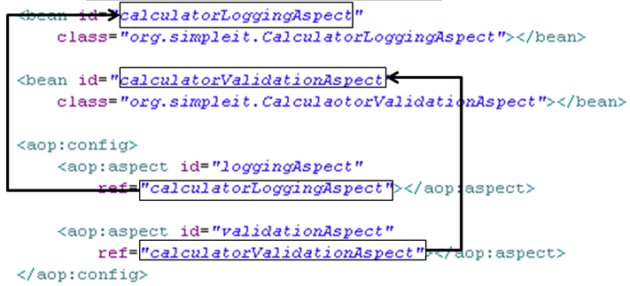

施工中，该篇笔记绝大多数拷贝自尚硅谷雷丰阳课件。

<!-- more -->

# Spring

## 概述

Spring是一个开源框架。简化了企业级开发。Spring是一个**IOC**(**DI**)和**AOP**容器框架。

## Spring特点

- **非侵入式**：基于Spring开发的应用中的对象可以不依赖于Spring的API
- **依赖注入**：DI——**Dependency Injection**，反转控制(IOC)最经典的实现。
- **面向切面编程**：AspectOriented Programming——AOP
- **容器**：**Spring是一个容器**，因为它包含并且管理应用对象的生命周期
- **组件化**：Spring实现了使用简单的组件配置组合成一个复杂的应用。在 Spring 中可以使用XML和Java注解组合这些对象。
- **一站式**：在IOC和AOP的基础上可以整合各种企业应用的开源框架和优秀的第三方类库（实际上Spring自身也提供了表述层的SpringMVC和持久层的SpringJDBC）

## HelloWorld示例

### 导包
- **spring-beans.jar**：处理Bean的jar \<Bean>
- **spring-context.jar**：处理spring上下文的jar  \<context>
- **spring-core.jar**：spring核心jar（必需）
- **spring-expression.jar**：spring表达式 
- **spring-aop.jar**：开发AOP特性时需要的JAR
- **commons-logging.jar**：第三方提供的日志jar包

### 创建实体类

```java
public class User {
    private Integer uId;
    private String uName;
    private Integer uAge;
    private String desc;
	// getter、setter和toString方法略
}
```

### 编写Spring配置文件

```xml
<beans xmlns="http://www.springframework.org/schema/beans"
       xmlns:xsi="http://www.w3.org/2001/XMLSchema-instance"
       xmlns:p="http://www.springframework.org/schema/p"
       default-autowire="byName"
       xmlns:context="http://www.springframework.org/schema/context"
       xsi:schemaLocation="http://www.springframework.org/schema/beans http://www.springframework.org/schema/beans/spring-beans.xsd
		http://www.springframework.org/schema/context http://www.springframework.org/schema/context/spring-context-4.3.xsd">

    <!-- 使用bean元素定义一个由IOC容器创建的对象 -->
    <!-- class属性指定用于创建bean的全类名 -->
    <!-- id属性指定用于引用bean实例的标识 -->
    <bean id="user" class="com.xxx.cn.entity.User">
        <!-- 使用property子元素为bean的属性赋值 -->
        <property name="uId" value="002"/>
        <property name="uName" value="王二"/>
        <property name="uAge" value="20"/>
        <property name="desc" value="是个傻子"/>
    </bean>
</beans>
```

之后要在IDEA的**Project Structure**的**Modules**里配置一下Spring应用上下文，如下图


### 编写测试类测试

注：**Spring在创建IOC容器对象时，就已经完成了bean的创建和属性的赋值**。

```java
public class DemoTest {

    public static void main(String[] args) {
        //1.创建IOC容器对象
        ApplicationContext iocContainer =
                new ClassPathXmlApplicationContext("applicationcontext.xml");
        //2.根据ID值获取bean实例对象
        User user = (User) iocContainer.getBean("user");
        //3.打印bean
        System.out.println(user);
    }
}
```

## IOC和DI          

### IOC(Inversion of Control)

反转控制。Spring反转了资源的获取方向，改**由容器主动的将资源推送给需要的组件**，开发人员不需要知道容器是如何创建资源对象的，只需要提供接收资源的方式即可。

### DI(Dependency Injection)

依赖注入。IOC的另一种表述方式：即组件以一些预先定义好的方式(例如：setter 方法)接受来自于容器的资源注入。将属性值注入给了属性，将属性注入给了bean，将bean注入给了ioc容器。

### IOC容器在Spring中的实现

在通过IOC容器读取Bean的实例之前，需要先将IOC容器本身实例化。**Spring提供了IOC容器的两种实现方式**

- **BeanFactory**：IOC容器的基本实现，是Spring内部的基础设施，是**面向Spring本身**的，不是提供给开发人员使用的
- **ApplicationContext**：BeanFactory的子接口，提供了更多高级特性。面向Spring的使用者，几乎所有场合都使用ApplicationContext，而不是底层的BeanFactory
  - 在**初始化时就创建单例的bean**，也可以通过配置的方式指定创建的Bean是多实例的
  - **ClassPathXmlApplicationContext**，对应**类路径下**的XML格式的配置文件
  - **FileSystemXmlApplicationContext**，对应**文件系统中**的XML格式的配置文件
- **ConfigurableApplicationContext**，是ApplicationContext的子接口，包含一些扩展方法。**refresh()**和**close()**让ApplicationContext具有启动、关闭和刷新上下文的能力。
- **WebApplicationContext**，专门为WEB应用而准备的，它允许从相对于WEB根目录的路径中完成初始化工作

## 获取Bean的两种方式

- 通过Bean的**ID值**从IOC容器中获取

```java
User user = (User) iocContainer.getBean("user");
```

- 通过Bean的类型从IOC容器中获取，但如果同一个类型的bean在XML文件中配置了多个，则获取时会抛出异常，所以同一个类型的bean在容器中必须是唯一的。

```java
User user = (User) iocContainer.getBean(User.class);
```

## Bean的赋值方式

### 通过Bean的**setXxx()**方法赋值

下面的property标签除了name、value属性外，还可以用ref属性引用外部的Bean。

```xml
<bean id="user" class="com.xxx.cn.entity.User">
    <!-- 使用property子元素为bean的属性赋值 -->
    <property name="uId" value="002"/>
    <property name="uName" value="王二"/>
    <property name="uAge" value="20"/>
    <property name="desc" value="是个傻子"/>
</bean>
```

注：**property标签里的name属性的值，必须要和对应的实体类的setXxx方法的Xxx一致**。

方式赋值.png)

### 通过Bean的构造器赋值

#### 基本写法

这种基本的写法，在bean标签里使用了**constructor-arg**标签，其属性有name，有value

```xml
<bean id="book" class="com.xxx.spring.bean.Book">
    <constructor-arg name="id" value= "10010"/>
    <constructor-arg name="bookName" value= "Book01"/>
    <constructor-arg name="authorName" value= "Author01"/>
    <constructor-arg name="number" value= "20.2"/>
</bean >
```

#### 省略name属性的写法

**这种写法需严格按照参数顺序**

```xml
<bean id="book" class="com.xxx.spring.bean.Book">
    <constructor-arg value= "10010"/>
    <constructor-arg value= "Book01"/>
    <constructor-arg value= "Author01"/>
    <constructor-arg value= "20.2"/>
</bean >
```

#### 通过索引值指定参数位置

只要index属性对的上了，便可以省略name属性

```xml
<bean id="book" class="com.xxx.spring.bean.Book">
    <constructor-arg value= "10010" index ="0"/>
    <constructor-arg value= "Book01" index ="1"/>
    <constructor-arg value= "20.2" index ="3"/>
    <constructor-arg value= "Author01" index ="2"/>
</bean >
```

#### 通过类型不同区分重载的构造器

只要index属性对的上了，便可以省略name属性

```xml
<bean id="book" class="com.xxx.spring.bean.Book">
    <constructor-arg value= "10010" index ="0" type="java.lang.Integer" />
    <constructor-arg value= "Book01" index ="1" type="java.lang.String" />
    <constructor-arg value= "Author01" index ="2" type="java.lang.String" />
    <constructor-arg value= "20.2" index ="3" type="java.lang.Double" />
</bean >
```

### Bean的级联属性赋值

```xml
<bean id="action" class="com.xxx.spring.ref.Action">
    <property name="service" ref="service"/>
    <!-- 设置级联属性(了解) -->
    <property name="service.dao.dataSource" value="DBCP"/>
</bean>
```

### p名称空间赋值

为了简化XML文件的配置，越来越多的XML文件采用属性而非子元素配置信息。Spring从2.5版本开始引入了一个新的**p命名空间**，可以通过\<bean>元素属性的方式配置Bean的属性。使用p命名空间后，基于XML的配置方式将进一步简化。
**p名称空间赋值的方式也依赖于实体类里的setter方法**。

```xml
<bean 
	id="studentSuper" 
	class="com.xxx.helloworld.bean.Student"
	p:studentId="2002" p:stuName="Jerry2016" p:age="18" />
```

## bean标签内可以用的值

### 字面值

- 可以使用字符串表示的值，可以通过value属性或value子节点的方式指定
- 基本数据类型及其封装类、String等类型都可以采取字面值注入的方式
- 若字面值中包含特殊字符，可以使用<![CDATA[]]>把字面值包裹起来

### 赋Null值

```xml
<bean class="com.xxx.spring.bean.Book" id="bookNull" >
    <property name= "bookId" value ="2000"/>
    <property name= "bookName">
        <null/>
    </property>
    <property name= "author" value ="nullAuthor"/>
    <property name= "price" value ="50"/>
</bean >
```

### 引用外部声明的bean

```xml
<bean id="shop" class="com.xxx.spring.bean.Shop" >
    <property name= "book" ref ="book"/>
</bean >
```

### 使用内部bean

当bean实例**仅仅给一个特定的属性使用**时，可以将其声明为内部bean。
内部bean声明直接包含在\<property>或\<constructor-arg>元素里，不需要设置任何id或name属性。
**内部bean不能使用在任何其他地方**。

```xml
<bean id="shop" class="com.xxx.spring.bean.Shop" >
    <property name= "book">
        <bean class= "com.xxx.spring.bean.Book" >
           <property name= "bookId" value ="1000"/>
           <property name= "bookName" value="innerBook"/>
           <property name= "author" value="innerAuthor" />
           <property name= "price" value ="50"/>
        </bean>
    </property>
</bean >
```

## 集合的赋值

### List

Set的赋值方式跟Llist差不多。

#### 通过\<value>指定简单的常量值

```xml
<bean id="shop" class="com.xxx.spring.bean.Shop" >
    <property name= "categoryList">
        <!-- 以字面量为值的List集合 -->
        <list>
            <value>历史</value >
            <value>军事</value >
        </list>
    </property>
</bean >
```

#### 通过\<ref>指定对其他Bean的引用

```xml
<bean id="shop" class="com.xxx.spring.bean.Shop" >
    <property name= "bookList">
        <!-- 以bean的引用为值的List集合 -->
        <list>
            <ref bean= "book01"/>
            <ref bean= "book02"/>
        </list>
    </property>
</bean >
```

#### 通过\<bean>指定内置bean定义

```xml
<bean id="shop" class="com.atguigu.spring.bean.Shop" >
    <property name= "bookList">
        <!-- 内置bean的List集合 -->
        <list>
            <bean class="com.atguigu.spring.bean.Book" p:bookName="西游记"/>
        </list>
    </property>
</bean >
```

#### 通过\<null/>指定空元素。甚至可以内嵌其他集合

这个就不举例了，自己想象吧

### Map

\<map>标签里可以使用多个\<entry>作为子标签。一个\<entry>标签代表一个键值对 。

#### 套娃写法一

```xml
<bean id="cup" class="com.xxx.spring.bean.Cup">
    <property name="maps">
        <map>
            <entry key="name" value="张三"/>
            <entry key="age" value="17"/>
            <entry key="key03" value-ref="张三"/>
            <entry key="key04">
                <bean class="com.xxx.bean.Car">
                    <property name="carName" value="xxx"/>
                </bean>
            </entry>
        </map>  
    </property>
</bean>
```

#### 套娃写法二

```xml
<bean id="cup" class="com.xxx.spring.bean.Cup">
    <property name="bookMap">
        <map>
            <entry>
                <key>
                    <value>bookKey01</value>
                </key>
                <ref bean="book01"/>
            </entry>
            <entry>
                <key>
                    <value>bookKey02</value>
                </key>
                <ref bean="book02"/>
            </entry>
        </map>
    </property>
</bean>
```

### Properties

使用\<props>定义java.util.Properties，该标签使用多个\<prop>作为子标签。每个\<prop>标签必须定义key属性

```xml
<bean class="com.xxx.spring.bean.DataSource" id="dataSource">
	<property name="properties">
		<props>
			<prop key="userName">root</prop>
			<prop key="password">root</prop>
			<prop key="url">jdbc:mysql:///test</prop>
			<prop key="driverClass">com.mysql.jdbc.Driver</prop>
		</props>
	</property>
</bean>
```

### 集合属性的Bean

如果集合对象配置在某个bean内部，则这个集合的配置将不能重用。要想重用需要将集合bean的配置拿到外面，供其他bean引用。**配置集合类型的bean需要引入util名称空间**

```xml
<util:list id="bookList">
	<ref bean="book01"/>
	<ref bean="book02"/>
	<ref bean="book03"/>
	<ref bean="book04"/>
	<ref bean="book05"/>
</util:list>

<util:list id="categoryList">
	<value>编程</value>
	<value>极客</value>
	<value>相声</value>
	<value>评书</value>
</util:list>
```

## 工厂创建Bean

### 静态工厂创建Bean

静态工厂本身并不需要创建对象，通过静态方法来调用获取Bean。`对象 = 工厂类.工厂方法名(); `

#### 编写静态工厂类

```java
public class StaticFactory {
    public static UserService getUserService () {
        return new UserServiceImpl();
    }
}
```

#### Spring配置文件中配置静态工厂

```xml
<bean id="userService" 
      class="com.xxx.cn.factory.StaticFactory"
      factory-method="getUserService"/>
```

### 实例工厂创建Bean

**必须先有工厂实例对象，通过实例对象创建对象**。提供所有的方法都是“非静态”的。

#### 编写实例工厂

```java
public class InstatnceFactory {
    public UserService getUserService () {
        return new UserServiceImpl();
    }
}
```

#### Spring配置文件中配置实例工厂

**需要在要获取的Bean的标签里配置相应的factory-bean和factory-method属性**。

```xml
<!-- 配置实例工厂的bean标签 -->
<bean id="instatnceFactory" class="com.xxx.cn.factory.InstatnceFactory"/>
<bean id="userService" 
      class="com.xxx.cn.service.UserServiceImpl"
      factory-bean="instatnceFactory" 
      factory-method="getUserService"/>
```

### 实现FactoryBean的方式创建Bean

除去配置静态工厂和实例工厂的方式创建Bean外，我们还可以区实现FactoryBean接口，用这种方式去创建Bean。实现了FactoryBean接口的类是Spring认识的工厂类，Spring会自动调用工厂方法创建实例。

#### 实现FactoryBean

实现了FactoryBean的类，不管返回的是单例还是多实例，**都是在获取Bean的时候创建对象**。

```java
public class MyFactory implements FactoryBean<User> {
    /**
     * 工厂方法，返回创建的实例
     */
    @Override
    public User getObject() throws Exception {
        User user = new User();
        user.setuName("王四");
        return user;
    }

    /**
     * 返回创建对象的类型，Spring会自动调用这个方法来确认创建的对象是什么类型
     */
    @Override
    public Class<?> getObjectType() {
        return User.class;
    }

    /**
     * 返回false是单例，返回true表示不是单例
     */
    @Override
    public boolean isSingleton() {
        return false;
    }
}
```

#### 配置工厂Bean

```xml
<bean id="myFactory" class="com.xxx.cn.factory.MyFactory"/>
```

## Bean的高级配置

### 配置信息的继承

Spring允许继承bean的配置，被继承的bean称为父bean，继承这个父bean的bean称为子bean。
子bean从父bean中继承配置，包括bean的属性配置。子bean也可以覆盖从父bean继承过来的配置。

```xml
<bean id="dept" class="com.xxx.parent.bean.Department">
	<property name="deptId" value="100"/>
	<property name="deptName" value="IT"/>
</bean>

<bean id="emp01" class="com.xxx.parent.bean.Employee">
	<property name="empId" value="1001"/>
	<property name="empName" value="Tom"/>
	<property name="age" value="20"/>

	<!-- 会被继承的属性值 -->	
	<property name="detp" ref="dept"/>
</bean>
<!-- 以emp01作为父bean，继承后可以省略公共属性值的配置 -->
<bean id="emp02" parent="emp01">
	<property name="empId" value="1002"/>
	<property name="empName" value="Jerry"/>
	<property name="age" value="25"/>
</bean>
```

#### 需要注意的点

- 父bean可以作为配置模板，也可以作为bean实例。若只想把父bean作为模板，可以设置\<bean>**abstract**属性为true，这样Spring将不会实例化这个bean。
- 如果一个bean的**class属性没有指定，则必须是抽象bean**
- 并不是\<bean>元素里的所有属性都会被继承。比如：autowire，abstract等。
- 也可以忽略父bean的class属性，让子bean指定自己的类，而共享相同的属性配置。但此时abstract必须设为true。

### bean之间的依赖         

**有的时候创建一个bean的时候需要保证另外一个bean也被创建**，这时我们称前面的bean对后面的bean有依赖。例如：要求创建Employee对象的时候必须创建Department。这里需要注意的是**依赖关系不等于引用关系**，Employee即使依赖Department也可以不引用它。

```xml
<bean id="emp03" class="com.xxx.parent.bean.Employee" depends-on="dept">
	<property name="empId" value="1003"/>
	<property name="empName" value="Kate"/>
	<property name="age" value="21"/>
</bean>
```

### bean的作用域         

Spring中，可以在\<bean>元素的**scope属性里设置bean的作用域**，以决定这个bean是单实例的还是多实例的。

默认情况下，Spring只为每个在IOC容器里声明的bean创建唯一一个实例，整个IOC容器范围内都能共享该实例。所有后续的getBean()调用和bean引用都将返回这个唯一的bean实例。该作用域被称为**singleton**，它是所有bean的默认作用域。


### bean的生命周期         

**Spring IOC容器可以管理bean的生命周期**，Spring允许在bean生命周期内特定的时间点执行指定的任务。

#### 单实例Bean的生命周期

- 通过构造器或工厂方法创建bean实例
- 为bean的属性设置值和对其他bean的引用
- 调用bean的**初始化方法**
- bean可以使用了
- 当容器关闭时，调用**bean的销毁方法**

(容器启动)**构造器**---->**初始化方法**---->(容器关闭)**销毁方法**

#### 多实例Bean的生命周期

**获取Bean(构造器---->初始化方法) ----> 初始化方法 ----> 容器关闭不会调用Bean的销毁方法**

#### 配置后置处理器后Bean的生命周期

Spring有个接口BeanPostProcessor，该接口可以在Bean的初始化前后调用方法

##### 自定义后置处理器

```java
public class MyBeanPostProcessor implements BeanPostProcessor {

    /**
     * 初始化之前调用
     */
    @Override
    public Object postProcessBeforeInitialization(Object bean, String beanName) throws BeansException {
        System.out.println(beanName + "将要调用初始化方法了。该Bean为--->" + bean);
        return bean;
    }

    /**
     * 初始化之后调用，该方法返回null的时候，经测试，仍会将传入的bean方法到IOC容器中，
     * 假如不返回null，返回别的对象，就会将该对象作为替换，放到IOC容器中
     */
    @Override
    public Object postProcessAfterInitialization(Object bean, String beanName) throws BeansException {
        System.out.println(beanName + "的初始化方法调用完了。该Bean为--->" + bean);
        return 12;
    }
}
```

##### 将后置处理器注册在Spring配置文件中

```xml
<bean id="beanPostProcessor" class="com.xxx.cn.bean.MyBeanPostProcessor"/>
```

**（容器启动）构造器-->后置处理器的before方法...-->初始化方法-->后置处理器的after方法**，如果相关Bean没有配置初始化方法，自定义的后置处理器仍会工作。

- 通过构造器或工厂方法**创建bean实例**
- 为bean的**属性设置值**和对其他bean的引用
- 将bean实例传递给bean后置处理器的**postProcessBeforeInitialization()**方法
- 调用bean的**初始化**方法
- 将bean实例传递给bean后置处理器的**postProcessAfterInitialization()**方法
- bean可以使用了
- 当容器关闭时调用bean的**销毁方法**

#### Bean的后置处理器

**此处待回忆**

- bean后置处理器允许在调用**初始化方法前后**对bean进行额外的处理
- **bean后置处理器对IOC容器里的所有bean实例逐一处理，而非单一实例**。其典型应用是：检查bean属性的正确性或根据特定的标准更改bean的属性。
- bean后置处理器时**需要实现接口**：org.springframework.beans.factory.config.BeanPostProcessor。在初始化方法被调用前后，Spring将把每个bean实例分别传递给上述接口的以下两个方法
  - postProcessBeforeInitialization(Object,String)
  - postProcessAfterInitialization(Object,String)


### 引用外部属性配置文件

当bean的配置信息逐渐增多时，查找和修改一些bean的配置信息就变得愈加困难。这时可以将一部分信息提取到bean配置文件的外部，以properties格式的属性文件保存起来，同时在bean的配置文件中引用properties属性文件中的内容，从而实现一部分属性值在发生变化时仅修改properties属性文件即可。这种技术多用于连接数据库的基本信息的配置。

#### 方式一 使用\<context:property-placeholder>标签引入

##### 1、创建properties属性文件

```properties
prop.userName=root
prop.password=root
prop.url=jdbc:mysql:///test
prop.driverClass=com.mysql.jdbc.Driver
```

##### 2、引入context名称空间

步骤略

##### 3、在Spring配置文件中指定properties属性文件的位置

```xml
<!-- 指定properties属性文件的位置 -->
<!-- classpath:xxx 表示属性文件位于类路径下 -->
<context:property-placeholder location="classpath:jdbc.properties"/>
```

##### 4、从properties属性文件中引入属性值

```xml
<!-- 从properties属性文件中引入属性值 -->
<bean id="dataSource" 
      class="com.mchange.v2.c3p0.ComboPooledDataSource">
	<property name="user" value="${prop.userName}"/>
	<property name="password" value="${prop.password}"/>
	<property name="jdbcUrl" value="${prop.url}"/>
	<property name="driverClass" value="${prop.driverClass}"/>
</bean>
```

#### 方式二 使用专门配置类

##### 在Spring配置文件中配置专门的Bean

通过配置该Bean，注入相关属性，从而引入外部配置文件

```xml
<bean class="org.springframework.beans.factory.config.PropertyPlaceholderConfigurer">
	<property name="location" value="xxx.properties"/>
    <property name="locations" value=""/>
</bean>
```

#### 方式三 使用**@PropertySource**注解

该注解标注在类上，和组件标识注解搭配使用，没有组件标识注解的话会抛异常。之后引入的配置文件中的属性可用**@Value**取出

```java
@Component
@propertySource(value={"classpath:xxx.properties"})
public class User {
    @Value("${user.username}")
    private String username;
    
    @Value("${user.age}")
    private Integer age;
    ……
}
```

### 自动装配

### 概念

- 手动装配：以value或ref的方式**明确指定属性值**都是手动装配。
- 自动装配：根据指定的装配规则，**不需要明确指定getter、setter方法**，Spring**自动**将匹配的属性值**注入**bean中。

### 装配模式

- 根据**类型**自动装配：将类型匹配的bean作为属性注入到另一个bean中。若IOC容器中有多个与目标bean类型一致的bean，Spring将无法判定哪个bean最合适该属性，所以不能执行自动装配
- 根据**名称**自动装配：必须将目标bean的名称和属性名设置的完全相同
- 通过构造器自动装配：当bean中存在多个构造器时，此种自动装配方式将会很复杂。不推荐使用。

### 选用建议

相对于使用注解的方式实现的自动装配，在XML文档中进行的自动装配略显笨拙，**在项目中更多的使用注解的方式实现自动装配**。

## Bean标签的相关属性

- **class**：要注册的组件的全类名。若class属性没有指定，相应的bean得是抽象类
- **id**：唯一标识，不可以有特殊字符
- **name**：唯一标识，可以有特殊字符
- **parent**：引用其他bean的配置信息，填其他bean的ID
  - 子bean从父bean中继承配置，包括bean的属性配置
  - 子bean也可以覆盖从父bean继承过来的配置
  - 父bean里的**autowire**，**abstract**等属性不会被继承。
- **abstract**：**abstract为true**的话，则Spring不会实例化这个bean
- **depens-on**：用于bean之间的依赖，可以改变bean的加载顺序

```xml
<!-- a依赖于c和b，先加载c，再是b，最后是a -->
<bean id="a" class="xx.xxx.xx" depends-on="c，b">
```

- **scope**：规定bean的作用域
  - **singleton**：scope的值为**singleton**时，bean为单实例。singleton为scope的默认值
  - **prototype**：scope的值为**prototype**时，bean为多实例。
    - 容器启动默认不会创建多实例bean
    - 获取的时候才会创建多实例bean
    - 每次获取都会创建一个新的bean实例
  - **request**：web环境下，同一请求创建一个bean实例。
  - **session**：web环境下，同一会话创建一个bean实例
- **factory-method**：指定静态工厂或实例工厂的哪个方法是工厂方法。是静态工厂的话，就在静态工厂的Bean配置；是实例工厂的话，不在实例工厂的Bean里配置，在要获取的实例Bean的标签里配置。
- **factory-bean**：指定用哪个工厂Bean，填工厂的全类名
- **destroy-method**：销毁方法的名称
- **init-method**：初始化方法的名称
- **lazy-int**：**lazy-int的值为true时，实现懒加载，初始化容器时不创建对象**
- **autowire**：自动装配
  - 自动装配仅限于 自定义类型
  - autowire的值为**default或no**时，不自动装配，默认值
  - autowire的值为**byName**时，Spring会将属性名作为bean的ID去容器中寻找相应的bean。未找到会装配null
  - autowire的值为**byType**时，Spring会以属性类型作为查找依据去容器中找相应的bean，容器中若有多个相同类型的组件会报错。未找到会装配null
  - autowire的值为**constructor**时，Spring会按按构造器装配
    - 先按照有参构造器参数类型进行装配（成功就赋值），没有就直接为组件装配null
    - 若按照参数类型找到了多个bean，会将参数名作为bean的id继续查找。找到就装配，没有就装配null

## 注解配置Bean

相对于XML方式而言，**通过注解的方式配置bean更加简洁和优雅**，而且和MVC组件化开发的理念十分契合，是开发中常用的使用方式。

**XML配置Bean的方式更适合配置引入外部jar包里的Bean；而通过包扫描加注解配置Bean的方式，更适合配置我们自己写的Bean。**

### 使用注解标识组件

- 普通组件：**@Component**，标识一个受SpringIOC容器管理的组件
- 持久化层组件：**@Respository**，标识一个受SpringIOC容器管理的持久化层组件
- 业务逻辑层组件：**@Service**，标识一个受SpringIOC容器管理的业务逻辑层组件
- 表述层控制器组件：**@Controller**，标识一个受SpringIOC容器管理的表述层控制器组件

#### 组件命名规则

1. **默认情况：使用组件的简单类名首字母小写后得到的字符串作为bean的id**
2. **使用组件注解的value属性指定bean的id**

注：@Respository、@Service、@Controller这几个注解仅仅是为了让开发人员自己明确当前的组件扮演的角色。

### 扫描组件

组件被上述注解标识后还需要通过Spring进行扫描才能够侦测到。**需要在基础的5个包上添加aop的包**

#### 指定被扫描的包

```xml
<context:component-scan base-package="com.xxx.component"/>
```

#### 相关属性说明

- **base-package**属性指定一个需要扫描的基类包，Spring容器将会扫描这个基类包及其子包中的所有类。当需要扫描多个包时可以使用逗号分隔
- 仅希望扫描特定的类而非基包下的所有类，可使用**resource-pattern属性过滤特定的类**

```xml
<context:component-scan 
	base-package="com.xxx.component" 
	resource-pattern="autowire/*.class"/>
```

#### 包含与排除

- component-scan下可以拥有若干个**include-filter**和**exclude-filter**子标签


- \<context:include-filter>子标签表示要**包含的目标类**

  注：**通常需要与use-default-filters属性配合**使用才能够达到“仅包含某些组件”这样的效果。即：通过将use-default-filters属性设置为false，禁用默认过滤器，然后扫描的就只是include-filter中的规则指定的组件了。

```xml
<context:component-scan base-package="com.xxx.component" 
                        use-default-filters="false">
      <context:inlude-filter type="annoation" expression=""/>
</context:component-scan> 
```

- \<context:exclude-filter>子标签表示要**排除在外的目标类**

```xml
<context:component-scan base-package="com.xxx.component">
      <context:exclude-filter type="annoation" expression=""/>
</context:component-scan> 
```

###### 过滤表达式

|    类别    |         示例          | 说明                                                         |
| :--------: | :-------------------: | :----------------------------------------------------------- |
| annotation | com.xxx.XxxAnnotation | 过滤所有标注了XxxAnnotation的类。这个规则根据目标组件是否标注了指定类型的注解进行过滤。 |
| assignable |    com.xxx.BaseXxx    | 过滤所有BaseXxx类的子类。这个规则根据目标组件是否是指定类型的子类的方式进行过滤。 |
|  aspectj   |   com.xxx.*Service+   | 所有类名是以Service结束的，或这样的类的子类。这个规则根据AspectJ表达式进行过滤。 |
|   regex    |   com\.xxx\.anno\.*   | 所有com.atguigu.anno包下的类。这个规则根据正则表达式匹配到的类名进行过滤。 |
|   custom   | com.xxx.XxxTypeFilter | 使用XxxTypeFilter类通过编码的方式自定义过滤规则。该类必须实现org.springframework.core.type.filter.TypeFilter接口 |

### 组件装配

Controller组件中往往需要用到Service组件的实例，Service组件中往往需要用到Repository组件的实例。Spring可以通过注解的方式帮我们实现属性的装配。

在指定要扫描的包时，**\<context:component-scan>** 标签会自动注册一个bean的后置处理器：AutowiredAnnotationBeanPostProcessor的实例。该后置处理器可以自动装配标记了**@Autowired**、@Resource或@Inject注解的属性。

#### @Autowired注解

- **@Autowired**注解根据类型实现自动装配的，是Spring这个框架自带的注解。
- 构造器、普通字段(即使是非public)、一切具有参数的方法都可以应用@Autowired注解。
  - 方法上标有**@Autowired**的话，这个方法在Bean创建的时候也会自动运行；方法的每个参数都会自动注入值
- **默认情况下，所有使用@Autowired注解的属性都需要被设置**。当Spring找不到匹配的bean装配属性时，会抛出异常。
- **若某一属性允许不被设置，可以设置@Autowired注解的required属性为false**。找到就装配，找不到就会装个null
- 默认情况下，当IOC容器里存在多个类型兼容的bean时，Spring会尝试匹配bean的id值是否与变量名相同，如果相同则进行装配。如果bean的id值不相同，通过类型的自动装配将无法工作。此时可以在@Qualifier注解里提供bean的名称。Spring甚至允许在方法的形参上标注@Qualifiter注解以指定注入bean的名称。
- @Autowired注解也可以应用在数组类型的属性上，此时Spring将会把所有匹配的bean进行自动装配。@Autowired注解也可以应用在集合属性上，此时Spring读取该集合的类型信息，然后自动装配所有与之兼容的bean。
- @Autowired注解用在java.util.Map上时，若该Map的键值为String，那么Spring将自动装配与值类型兼容的bean作为值，并以bean的id值作为键。

##### 流程简述

- 先按照类型去容器中找到相应的组件。例：bookService = ioc.getBean("BookService.class");
  - 只找到一个，找到就赋值，没找到抛异常
  - 找到多个后，先按照变量名作为id查找，BookService（bookService），BookServiceExt（bookServiceExt）未匹配到时报错

## Spring单元测试

- 导包，Spring的单元测试包spring-test-x.x.x.RELEASE.jar
- 使用@ContextConfiguration(locations="")指定Spring的配置文件存放位置
- 用@RunWith指定使用哪种驱动进行单元测试，如果不指定默认就是junit
  - 以下两种方式是使用**Spring的单元测试模块来执行**标注了@Test注解的测试方法
  - @RunWith(SpringJUnit4ClassRunner.class)
  - @RunWith(SpringRunner.class)

使用Spring的单元测试，不用ioc.getBean()获取组件了，直接在组件上添加@Autowired注解，让Spring为我们自动装配

```java
@ContextConfiguration(locations = {"classpath:applicationcontext.xml"})
@RunWith(SpringRunner.class)
public class DemoTest {

    @Autowired
    private User user;
    @Test
    public void testDemo () {
        /*
            省略了ApplicationContext ioc =
                new ClassPathXmlApplicationContext("applicationcontext.xml");
         */
        System.out.println(user);
    }
}
```

## Spring其他注解

### @Value

@Value，需和注入组件的注解(@Component、@Respository、@Service、@Controller)搭配使用。

#### 不通过外部文件注入属性

##### 注入普通字符串

```java
@Value("normal")
private String normal;
```

##### 注入操作系统属性

```java
@Value("#{systemProperties['os.name']}")
private String systemPropertiesName;
```

##### 注入表达式结果

```java
@Value("#{ T(java.lang.Math).random() * 100.0 }")
private double randomNumber;
```

##### 注入其他Bean的属性

```java
@Value("#{beanInject.another}")
private String fromAnotherBean;
```

##### 注入文件资源

```java
@Value("classpath:com/hry/spring/configinject/config.txt")
private Resource resourceFile;
```

##### 注入URL资源

```java
@Value("http://www.baidu.com")
 private Resource testUrl;
```

#### 通过配置文件注入属性

```java
@Component
// 引入外部配置文件组：${app.configinject}的值来自config.properties。
// 如果相同
@PropertySource({"classpath:com/hry/spring/configinject/config.properties",
    "classpath:com/hry/spring/configinject/config_${anotherfile.configinject}.properties"})
public class ConfigurationFileInject{
    @Value("${app.name}")
    private String appName; // 这里的值来自application.properties，spring boot启动时默认加载此文件

    @Value("${book.name}")
    private String bookName; // 注入第一个配置外部文件属性

    @Value("${book.name.placeholder}")
    private String bookNamePlaceholder; // 注入第二个配置外部文件属性

    @Autowired
    private Environment env;  // 注入环境变量对象，存储注入的属性值

    public String toString(){
        StringBuilder sb = new StringBuilder();
        sb.append("bookName=").append(bookName).append("\r\n")
        .append("bookNamePlaceholder=").append(bookNamePlaceholder).append("\r\n")
        .append("appName=").append(appName).append("\r\n")
        .append("env=").append(env).append("\r\n")
        // 从eniroment中获取属性值
        .append("env=").append(env.getProperty("book.name.placeholder")).append("\r\n");
        return sb.toString();
    }   
}
```

### @Resource

用法跟@Autowired类似，是J2EE的标准，扩展性更强。

## Spring AOP

### 概述

AOP(Aspect-OrientedProgramming，**面向切面编程**)是一种新的方法论，是对传统OOP(Object-Oriented Programming，面向对象编程)的补充。AOP编程操作的主要对象是切面(aspect)。

### 术语

#### 横切关注点

从每个方法中抽取出来的同一类非核心业务。

#### 切面(Aspect)

封装横切关注点信息的类，每个关注点体现为一个通知方法。

#### 通知(Advice)

切面必须要完成的各个具体工作

#### 目标(Target)         

被通知的对象

#### 代理(Proxy)

向目标对象应用通知之后创建的代理对象

#### 连接点(Joinpoint)

横切关注点在程序代码中的具体体现，对应程序执行的某个特定位置。例如：类某个方法调用前、调用后、方法捕获到异常后等。在应用程序中可以使用横纵两个坐标来定位一个具体的连接点。

#### 切入点(pointcut)

**定位连接点的方式**。每个类的方法中都包含多个连接点，所以连接点是类中客观存在的事物。如果把连接点看作数据库中的记录，那么切入点就是查询条件，AOP可以通过切入点定位到特定的连接点。切点通过org.springframework.aop.Pointcut接口进行描述，它使用类和方法作为连接点的查询条件。

### AspectJ

AspectJ，Java社区里最完整最流行的AOP框架。Spring2.0以上版本中，可以使用基于AspectJ注解或基于XML配置的AOP。

#### 在Spring中启用AspectJ注解支持

##### 导入JAR包

aopalliance.jar和aspectj.weaver.jar合spring-aspects.jar

##### 引入aop名称空间       

##### 配置

当SpringIOC容器侦测到bean配置文件中的**\<aop:aspectj-autoproxy>**标签时，会自动为与AspectJ切面匹配的bean创建代理。

##### 用AspectJ注解声明切面

- 要在Spring中声明AspectJ切面，只需要在IOC容器中将切面声明为bean实例。
- 当在SpringIOC容器中初始化AspectJ切面之后，SpringIOC容器就会为那些与AspectJ切面相匹配的bean创建代理。
- **切面只是一个带有@Aspect注解的Java类**，它往往要包含很多通知。
- 通知是标注有某种注解的简单的Java方法。
- AspectJ支持5种类型的通知注解：
  - **@Before**：前置通知，在方法执行之前执行
  - **@After**：后置通知，在方法执行之后执行
  - **@AfterRunning**：返回通知，在方法返回结果之后执行
  - **@AfterThrowing**：异常通知，在方法抛出异常之后执行
  - **@Around**：环绕通知，围绕着方法执行

### 切入点表达式

#### 作用

通过**表达式的方式**定位**一个或多个**具体的连接点。

#### 语法格式

**execution(\[权限修饰符]\[返回值类型]\[简单类名/全类名]\[方法名]([参数列表]))**

#### 示例

| 表达式 | execution(* com.xxx.spring.ArithmeticCalculator.*(..))       |
| :----: | ------------------------------------------------------------ |
|  含义  | ArithmeticCalculator接口中声明的所有方法。第一个“\*”代表任意修饰符及任意返回值。第二个“*”代表任意方法。“..”匹配任意数量、任意类型的参数。若目标类、接口与该切面类在同一个包中可以省略包名。 |

| 表达式 | execution(public * ArithmeticCalculator.*(..)) |
| :----: | ---------------------------------------------- |
|  含义  | ArithmeticCalculator接口的所有公有方法         |

| 表达式 | execution (* \*.add(int,..)) \|\| execution(* *.sub(int,..)) |
| :----: | ------------------------------------------------------------ |
|  含义  | 任意类中第一个参数为int类型的add方法**或**sub方法            |

| 表达式 | execution (* \*.add(int,..)) && execution(* *.sub(int,..)) |
| :----: | ---------------------------------------------------------- |
|  含义  | 任意类中第一个参数为int类型的add方法**和**sub方法          |

#### 切入点表达式的实际应用

如下图


### 当前连接点细节

切入点表达式和具体某个通知的注解结合起来就能够确定对应的连接点。而连接点的具体信息都封装在JoinPoint接口的实例对象中。


### 通知

通知是在具体的连接点上要执行的操作。 一个切面可以包括一个或者多个通知。**通知所使用的注解的值往往是切入点表达式。**

#### 前置通知

前置通知在方法执行之前执行的通知。**使用@Before注解**

#### 后置通知

后置通知是在连接点完成之后执行的，即连接点返回结果或者抛出异常的时候。**使用@After注解**

#### 返回通知

无论连接点是正常返回还是抛出异常，后置通知都会执行。如果只想在连接点返回的时候记录日志，应使用返回通知代替后置通知。**返回通知使用@AfterReturning注解**

##### 在返回通知中访问连接点的返回值

- 在返回通知中，只要将returning属性添加到@AfterReturning注解中，就可以访问连接点的返回值。该属性的值即为用来传入返回值的参数名称
- 必须在通知方法的签名中添加一个同名参数。在运行时SpringAOP会通过这个参数传递返回值
- 原始的切点表达式需要出现在pointcut属性中

```java
@AfterReturning(pointcut="execution(* *.*(..))", returning="result")
public void logAfterReturning (JointPoint joinPoint, Object result) {
    log.info ("The method" + joinPoint.getSignature().getName()
             + "() ends with " + result);
}
```

#### 异常通知

- 异常通知只在连接点抛出异常时才执行异常通知
- 将**throwing属性添加到@AfterThrowing注解中**，也可以访问连接点抛出的异常。Throwable是所有错误和异常类的顶级父类，所以在异常通知方法可以捕获到任何错误和异常。
- 如果只对某种特殊的异常类型感兴趣，可以将参数声明为其他异常的参数类型。然后通知就只在抛出这个类型及其子类的异常时才被执行

```java
@AfterThrowing(pointcut="execution(* *.*(..))", throwing="e")
public void logAfterThrowing (JointPoint joinPoint, ArithmeticExeption e) {
    log.info ("An Exception" + e + "has been throwing in " + joinPoint.getSignature().getName()
             + "() ");
}
```

#### 环绕通知

- 环绕通知是所有通知类型中功能最为强大的，能够全面地控制连接点，甚至可以控制是否执行连接点。

- 对于环绕通知来说，连接点的参数类型必须是**ProceedingJoinPoint**。它是JoinPoint的子接口，允许控制何时执行，是否执行连接点。

- 在环绕通知中需要明确调用ProceedingJoinPoint的proceed()方法来执行被代理的方法。如果忘记这样做就会导致通知被执行了，但目标方法没有被执行。

- 注意：环绕通知的方法需要返回目标方法执行之后的结果，即调用**joinPoint.proceed()**的返回值，否则会出现空指针异常。**此处待回忆**

```java
@Around(pointcut="execution(* *.*(..))")
public void logAround (ProceedingJoinPoin joinPoint) throws Throwable{
    log.info ("The method " + jointPoint.gtSignature().getName() + "() begins with " + Arrays.toString(joinPoint.getArgs());
    try {
        joinPoint.proceed();
        log.into("The method" + joinPoint.getSignatrue().getName() + "() ends");
    } catch (Throwable e) {
        log.info("An exception" + e + "has been throwing in" + joinPoint.getSignature().getName() + "()");
        throw e;
    }
}
```

### 重用切入点定义

- 写AspectJ切面时，可以直接在通知注解中书写切入点表达式。但同一个切点表达式可能会在多个通知中重复出现。
- AspectJ切面中，可以**通过@Pointcut注解将一个切入点声明成简单的方法**。**切入点的方法体通常是空的**，因为将切入点定义与应用程序逻辑混在一起是不合理的。
- 方法的访问控制符同时也控制着这个切入点的可见性。如果切入点要在多个切面中共用，最好将它们集中在一个公共的类中。在这种情况下，它们必须被声明为public。在引入这个切入点时，必须将类名也包括在内。如果类没有与这个切面放在同一个包中，还必须包含包名。
- **通知可以通过方法名称引入该切入点**。


### 指定切面的优先级

- 一个连接点上应用不止一个切面时，除非明确指定，否则它们的优先级是不确定的。
- 切面的优先级**可以通过实现Ordered接口**或**利用@Order注解指定**。
- 实现Ordered接口，getOrder()方法的**返回值越小，优先级越高**。
- 若使用@Order注解，序号出现在注解中

```java
@Aspect
@Order(0)
public class A_Aspect {}

@Aspect
@Order(1)
public class B_Aspect {}
```

### 通知顺序

**环绕前置-->普通前置-->目标方法执行-->环绕正常返回/出现异常-->环绕后置-->普通后置-->普通返回和异常**

## XML方式配置切面

除了使用AspectJ注解声明切面，Spring也支持在bean配置文件中声明切面。这种声明是通过aop名称空间中的XML元素完成的。正常情况下，基于注解的声明要优先于基于XML的声明。

### 方式一

该方式可在通过切入点表达式，**在目标方法的指定位置单独配置不同的通知**，相比方式二使用通知的方式更加灵活。

#### 1、编写切面类

```java
public class MyAspect3 {
    public void before(JoinPoint joinPoint) {
    	System.out.println("前置通知" + joinPoint.getSignature().getName());
    }
    public void afterReturning(JoinPoint joinPoint) {
    	System.out.println("后置通知" + joinPoint.getSignature().getName());
    }
    public void around(ProceedingJoinPoint proceedingJoinPoint) {
    	System.out.println("方法执行前");
        try {
        	proceedingJoinPoint.proceed();
        } catch (Throwable throwable) {
        	throwable.printStackTrace();
        }
        System.out.println("方法执行后");
    }
    public void afterThrowing() {
    	System.out.println("异常通知");
    }
    public void after(JoinPoint joinPoint) {
    	System.out.println("最终通知");
    }
}
```

#### 2、配置\<aop:aspect>标签

在Spring配置文件中，所有的Spring AOP配置都必须定义在**\<aop:config>**元素内部。创建一个**\<aop:aspect>**标签引入切面类的Bean。

切面类必须有一个标识符(即ID元素)，供**\<aop:aspect>**标签引用




#### 2、声明切入点

- 切入点使用**\<aop:pointcut>**标签声明。
- **\<aop:pointcut>**标签定义在**\<aop:aspect>**标签下：只对当前切面有效
- **\<aop:pointcut>**标签定义在**\<aop:config>**标签下：对所有切面都有效
- 基于XML的AOP配置不允许在切入点表达式中用名称引用其他切入点。


#### 3、声明通知

- 在aop名称空间中，每种通知类型都对应一个特定的XML标签。
- 通知标签需要使用**pointcut-ref**来引用切入点，或用\<pointcut>直接嵌入切入点表达式。
- method属性指定切面类中通知方法的名称


### 方式二

该种方式对目标统一设置了通知，不能针对特点连接点进行特定的通知设置，不灵活。

#### 1、创建切面类

```java
/**
* 切面类 实现方法拦截器
*/
public class MyAspect implements MethodInterceptor {
    @Override
    public Object invoke(MethodInvocation methodInvocation) throws Throwable {
        System.out.println("执行之前打印的");
        Object proceed = methodInvocation.proceed();
        System.out.println("执行之后打印的");
        return proceed;
    }
}
```

#### 2、编写Spring的配置文件

```xml
<!-- 配置目标类 -->
<bean id="userDAO" class="com.xxx.cn.dao.UserDAOImpl"/>
<!-- 配置切面类 -->
<bean id="myAspect" class="com.xxx.cn.Aspect.MyAspect"/>

<!-- 配置AOP -->
<aop:config>
	<aop:advisor advice-ref="myAspect"
                 pointcut="execution(* com.xxx.cn.dao.UserDAO.addUser())"/>
</aop:config>
```

## Spring事务

### 编程式事务管理

使用原生的JDBC API进行事务管理

- 获取数据库连接Connection对象
- 取消事务的自动提交
- 执行操作
- 正常完成操作时手动提交事务
- 执行失败时回滚事务
- 关闭相关资源

编程式事务管理需要将事务管理代码**嵌入到业务方法中**来控制事务的提交和回滚，会造成较大程度的**代码冗余**。        

### 声明式事务管理

声明式事务将事务管理代码从业务方法中分离出来，以声明的方式来实现事务管理。

### 事务管理器

Spring从不同的事务管理API中抽象出了一整套事务管理机制，让事务管理代码从特定的事务技术中独立出来。开发人员通过配置的方式进行事务管理，而不必了解其底层是如何实现的。

Spring的核心事务管理抽象是PlatformTransactionManager。它为事务管理封装了一组独立于技术的方法。无论使用Spring的哪种事务管理策略(编程式或声明式)，事务管理器都是必须的。

事务管理器可以以普通的bean的形式声明在Spring IOC容器中。

### 事务管理器的主要实现

- **DataSourceTransactionManager**：在应用程序中只需要处理一个数据源，而且通过JDBC存取。
- **JtaTransactionManager**：在JavaEE应用服务器上用JTA(JavaTransaction API)进行事务管理
- **HibernateTransactionManager**：用Hibernate框架存取数据库

### 基于XML的声明式事务

#### 1、Spring配置文件的相关配置

```xml
<!-- 配置事务管理器 -->
<bean id="transactionManager"
      class="org.springframework.jdbc.datasource.DataSourceTransactionManager">
    <property name="dataSource" ref="dataSource"/>	  
</bean>

<!-- 配置事务切面 -->
<aop:config>
    <aop:pointcut 
                  expression="execution(* com.atguigu.tx.component.service.BookShopServiceImpl.purchase(..))" 
                  id="txPointCut"/>
    <!-- 将切入点表达式和事务属性配置关联到一起 -->
    <aop:advisor advice-ref="myTx" pointcut-ref="txPointCut"/>
</aop:config>

<!-- 配置基于XML的声明式事务  -->
<tx:advice id="myTx" transaction-manager="transactionManager">
    <tx:attributes>
        <!-- 设置具体方法的事务属性 -->
        <tx:method name="find*" read-only="true"/>
        <tx:method name="get*" read-only="true"/>
        <tx:method name="purchase" 
                   isolation="READ_COMMITTED" 
                   no-rollback-for="java.lang.ArithmeticException,java.lang.NullPointerException"
                   propagation="REQUIRES_NEW"
                   read-only="false"
                   timeout="10"/>
    </tx:attributes>
</tx:advice>
```


### 基于注解的声明式事务

#### 1、Spring配置文件的相关配置

```xml
<!-- 配置事务管理器 -->
<bean id="transactionManager"
      class="org.springframework.jdbc.datasource.DataSourceTransactionManager">
    <property name="dataSource" ref="dataSource"/>	  
</bean>
<!-- 启用事务注解 transaction-manager属性的值为transactionManager时可忽略 -->
<tx:annotation-driven transaction-manager="transactionManager"/>
```

#### 2、在需要进行事务控制的类或方法上加注解

加@Transactional注解

### @Transactional

在需要进行事务控制的方法和类上加注解。默认**发生运行时异常回滚**，发生编译时异常不回滚。

#### 相关属性

##### isolation-Isolation

事务的隔离级别

- 读未提交：READ UNCOMMITTED。  允许事务1 读取 事务2 未提交的修改
- 读已提交：READ COMMITTED。 要求事务1  只能读取 事务2 已提交的修改
- 可重复读：REPEATABLE READ。确保事务1  可以多次从一个字段读取到相同的值，即事务1 执行期间禁止其他事务对这个字段进行更新
- 串行化：SERIALIZABLE。  确保事务1 可以多次从一个表中读取相同的行。即在事务1执行期间，禁止其他事务对这个表进行增删改查操作。可避免任何并发问题，但性能十分低下。

##### noRollbackFor

哪些异常事务可以不回滚。示例：noRollbackFor={a.class,b.class}，指定a,b异常  不回滚

##### noRollbackForClassName

哪些异常事务可以不回滚

##### rollbackFor

哪些异常事务可以回滚。示例：rollbackFor={a.class,b.class}，指定a,b异常  都回滚

##### rollbackForClassName

哪些异常事务可以回滚

##### readOnly-boolean

设置事务为只读事务,默认为false

##### timeout-int

超时。事务超出指定时长后自动终止并回滚。以秒为单位

##### propagation-Propagation

事务的传播行为。默认值REQUIRED，事务的属性继承于外部的大事务


 