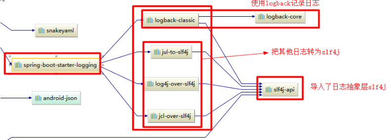
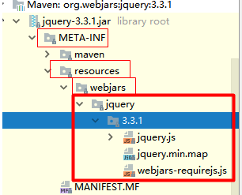
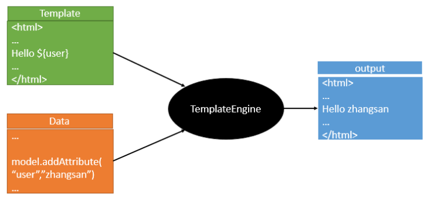

了解SpringBoot如何使用

<!-- more -->

# SpringBoot

## 0. SpringBoot简述

> SpringBoot 是Spring开源组织下的子项目，提供了Spring组件一站式解决方案，简化了Spring的使用难度，简省了繁琐的配置，提供了各种**启动器**，使开发者能快速上手。

## 1. SpringBoot优点

- **独立运行**：内嵌各种Servlet容器(Tomcat、Jetty等)，不需要打成war包部署到容器中，只打一个可执行的jar包就能独立运行。
- **简化配置**：spring-boot-starter-xxx**启动器**自动依赖其他组件，减少了Maven的配置
- **自动配置**：能根据当前类路径下的类、Jar包来自动配置bean。如添加一个spring-boot-starter-web启动器就能拥有web的功能，无需其他配置。
- **无代码生成和XML配置**：SpringBoot配置过程中无代码生成，无需XML配置就能完成所有配置工作，这些借助于条件注解来完成。
- **应用监控**：SpringBoot提供了一系列端点可以监控服务及应用。

## 2. HelloWorld示例

### 2.0. Maven设置

> 如果本地Maven配置未配好，需要在本地Maven的setting.xml文件里配一下。

```xml
<profile>
  <id>jdk-1.8</id>
  <activation>
    <activeByDefault>true</activeByDefault>
    <jdk>1.8</jdk>
  </activation>
  <properties>
    <maven.compiler.source>1.8</maven.compiler.source>
    <maven.compiler.target>1.8</maven.compiler.target>
    <maven.compiler.compilerVersion>1.8</maven.compiler.compilerVersion>
  </properties>
</profile>
```

### 2.1. 导入SpringBoot相关的依赖

在创建好Maven工程后，需要在pom文件里引入相关的依赖

```xml
    <parent>
        <groupId>org.springframework.boot</groupId>
        <artifactId>spring-boot-starter-parent</artifactId>
        <version>2.2.1.RELEASE</version>
    </parent>

    <dependencies>
        <dependency>
            <groupId>org.springframework.boot</groupId>
            <artifactId>spring-boot-starter-web</artifactId>
        </dependency>
    </dependencies>
```

### 2.2. 编写程序启动SpringBoot应用

#### 2.2.0. 主程序代码

```java
/**
 * @springBootApplication：标注一个主程序类，表示这个是一个Springboot应用
 */

@SpringBootApplication
public class HelloWorldMainApplication {

    public static void main(String[] args) {
        //启动
        SpringApplication.run(HelloWorldMainApplication.class, args);
    }
}
```

#### 2.2.1. Controller层代码

```java
/**
 * RestController：是spring4里的新注解，是@ResponseBody和@Controller的缩写。
 */

@RestController
public class HelloController {

    @RequestMapping("/hello")
    public String hello(){
        return "hello SpringBoot,this is my first Application";
    }
}
```

之后启动，浏览器访问`localhost:8080/hello`进行测试即可

### 2.3. 简化部署

#### 2.3.0 添加Maven插件

在Maven的pom.xml文件中配置插件，代码如下：

```xml
 <!-- 该插件可以将应用打包成一个可执行的jar包；-->
    <build>
        <plugins>
            <plugin>
                <groupId>org.springframework.boot</groupId>
                <artifactId>spring-boot-maven-plugin</artifactId>
            </plugin>
        </plugins>
    </build>
```

#### 2.3.1. 打jar包

使用`mvn package`命令打包

#### 2.3.2. 运行

在打包好的jar包的目录下，运行`java -jar jar包名称`进行测试

## 3. HelloWorld示例探究

### 3.0. 依赖

```xml
    <!--HelloWorld项目的父工程是 org.springframework.boot-->
    <parent>
        <groupId>org.springframework.boot</groupId>
        <artifactId>spring-boot-starter-parent</artifactId>
        <version>2.2.1.RELEASE</version>
    </parent>

    <!--
        而org.springframework.boot的父工程是spring-boot-dependencies
        它来管理Spring Boot应用里面的所有依赖版本；
        所以以后我们导入依赖默认是不需要写版本；（但没有在dependencies里面管理的依赖还是需要声明版本号的）
    -->
  <parent>
    <groupId>org.springframework.boot</groupId>
    <artifactId>spring-boot-dependencies</artifactId>
    <version>2.2.1.RELEASE</version>
  </parent>
```

### 3.1. 启动器

```xml
<dependency>
	<groupId>org.springframework.boot</groupId>
	<artifactId>spring-boot-starter-web</artifactId>
</dependency>
```

以`spring-boot-starter-web`为例，该启动器为我们导入了web模块正常运行所依赖的组件。

SpringBoot将很多功能场景都抽取出来，做成了**starters**(启动器)，以后只要在项目中导入了这些相关场景的**启动器**，便会自动导入该场景的**相关依赖**。

### 3.2. 主程序

```java
@SpringBootApplication
public class HelloWorldMainApplication {
    public static void main(String[] args) {
        //启动
        SpringApplication.run(HelloWorldMainApplication.class, args);
    }
}
```

`@SpringBootApplication`: 该注解标注在SpringBoot的主配置类上，通过运行该类的main方法来启动SpringBoot应用。

`@SpringBootApplication`注解的源码如下

```java
@Target({ElementType.TYPE})    //可以给一个类型进行注解，比如类、接口、枚举
@Retention(RetentionPolicy.RUNTIME)    //可以保留到程序运行的时候，它会被加载进入到 JVM 中
@Documented    //将注解中的元素包含到 Javadoc 中去。
@Inherited    //继承，比如A类上有该注解，B类继承A类，B类就也拥有该注解

@SpringBootConfiguration

@EnableAutoConfiguration

/*
*创建一个配置类，在配置类上添加 @ComponentScan 注解。
*该注解默认会扫描该类所在的包下所有的配置类，相当于之前的 <context:component-scan>。
*/
@ComponentScan(
    excludeFilters = {@Filter(
    type = FilterType.CUSTOM,
    classes = {TypeExcludeFilter.class}
), @Filter(
    type = FilterType.CUSTOM,
    classes = {AutoConfigurationExcludeFilter.class}
)}
)
public @interface SpringBootApplication
```

#### 3.2.0. @SpringBootConfiguration 

>`@SpringBootConfiguration`注解标注在SpringBoot的配置类上，源码如下：

```java
 @Target({ElementType.TYPE})
 @Retention(RetentionPolicy.RUNTIME)
 @Documented

 @Configuration
 public @interface SpringBootConfiguration
```

##### @Configuration

> 该注解用在Spring的配置类上，而配置类也是容器的一个组件(Component)。源码如下：

```java
@Target({ElementType.TYPE})
@Retention(RetentionPolicy.RUNTIME)
@Documented
@Component
public @interface Configuration 
```

#### 3.2.1. @EnableAutoConfiguration

> 该注解用来开启**自动配置**的，源码如下：

```java
 @Target({ElementType.TYPE})
 @Retention(RetentionPolicy.RUNTIME)
 @Documented
 @Inherited

 @AutoConfigurationPackage
 @Import({AutoConfigurationImportSelector.class})

 public @interface EnableAutoConfiguration
```

#####  @AutoConfigurationPackage

> 字面意思，自动配置包，源码如下：

```java
@Target({ElementType.TYPE})
@Retention(RetentionPolicy.RUNTIME)
@Documented
@Inherited

@Import({Registrar.class})
public @interface AutoConfigurationPackage
```

###### @Import

>@Import是Spring的底层注解，是用来给容器导入组件的

`@Import({Registrar.class})`表示`org.springframework.boot.autoconfigure.AutoConfigurationPackages.Registrar`会将**主配置类（@SpringBootApplication标注的类）的所在包**及其下所有子包里面的所有组件注册到Spring容器中。

##### @Import({AutoConfigurationImportSelector.class})

​	同样的，`AutoConfigurationImportSelector.class`是将所有需要导入的组件**以全类名的方式返回**，之后这些组件就会被添加到容器中。这样便会给容器中导入非常多的自动配置类（**xxxAutoConfiguration**）

​	而Spring Boot在启动的时候从类路径下的`META-INF/spring.factories`中获取`@EnableAutoConfiguration`指定的值，将这些值作为自动配置类导入到容器中，帮我们进行自动配置工作。

## 4. 配置文件

SpringBoot使用全局配置文件，**用来修改SpringBoot自动配置的默认值**，配置文件名是固定的：

- application.properties
- application.yml

### 4.0. YAML

YAML(YAML Ain't Markup Language)，通用的数据串行化格式，方便人类的读写。

#### 4.0.0. 基本语法特点

- **大小写敏感**
- **使用缩进表示层级关系**
- **缩进时不允许使用Tab键，只允许使用空格**
- **缩进的空格数目不重要，只要相同层级的元素左侧对齐即可**
- **使用#表示注释**
- **字符串可以不用引号标注**
  - 如使用`""`双引号，则字符串里有转义符号的话**不会转义**
  - 如使用`''`单引号，则字符串里有转义符号的话**会转义**

#### 4.0.1. 数据结构

##### map -- 哈希表

键值对(`key : value`)，`:`冒号**后面**要有空格。同一缩进的所有键值对属于同一个map

```yaml
# YAML 表示法1
age : 25
name : Seven

# YAML 表示法2
{age : 25, name : Seven}

# JSON表示法
{'age' : 25, 'name' : 'Seven'}
```

##### list -- 列表

使用连字符`-`

```yaml
# YAML 表示法1
- a
- b
- 17

# YAML 表示法2
[a, b, 17]

# JSON 表示法
['a', 'b', 17]
```

##### scalar -- 纯量

数据最小单位，不可以再分割

##### map与list嵌套

map和list的元素可以是另一个map或者list或者scalar

###### 1. map in map

```yaml
# YAML 表示
websites:
  YAML : yaml.org
  Ruby : ruby-lang.org
  Python : python.org
  Perl: use.perl.org

# JSON 表示
{ websites:
  { YAML : 'yaml.org',
    Ruby : 'ruby-lang.org',
    Python : 'python.org',
    Perl: 'use.perl.org'}}
```

###### 2. list in map

```yaml
# YAML 表示
language：
  - YAML
  - Ruby
  - Python
  - Perl

# JSON 表示
{ language : ['YAML', 'Ruby', 'Python', 'Perl']}
```

###### 3. list in list

```yaml
# YAML 表示法1
- 
  - Ruby
  - Perl
  - Python
-
  - C
  - C++
  - Java

# YAML 表示法2
- - Ruby
  - Perl
  - Python
- - C
  - C++
  - Java

# YAML 表示法3
- [Ruby, Perl, Python]
- [C, C++, Java]
# JSON 表示法
[ [ 'Ruby',  'Perl',  'Python' ],  [ 'C',  'C++',  'java' ] ]
```

###### 4. map in list

```yaml
# YAML 表示
-
  id : 1
  name : a
-
  id : 2
  name : b

# JSON 表示
[ { id : 1,  name : 'a' },  { id : 2, name : 'b' } ]
```

### 4.1. 配置文件的值注入

#### 4.1.0. 值注入的两种方式及其区别

配置文件的值注入有两种方式，一是SpringBoot的`@ConfigurationProperties`注解，另一个是Spring原先的`@value`注解。

##### 二者的应用场景：

- 在某个业务逻辑中需要获取一下配置文件中的某项值，使用`@Value`
- 专门编写了一个JavaBean来和配置文件隐形映射，可直接使用`@ConfigurationProperties`

|                | @ConfigurationProperties |      @value      |
| :------------: | :----------------------: | :--------------: |
|      功能      | 批量注入配置文件中的属性 | 一个个指定再注入 |
|    松散绑定    |           支持           |      不支持      |
|      SpEL      |          不支持          |       支持       |
| JSR303数据校验 |           支持           |      不支持      |
|  复杂类型封装  |           支持           |      不支持      |

##### 松散绑定

​	例如 Person中有`lastname`属性，在配置文件中可以写成`lastName`或`lastname`或`last-name`或`last_name`等等

#### 4.1.1. @ConfigurationProperties的值注入示例

##### 1. YAML配置文件的编写

```yaml
person:
    lastName: hello
    age: 18
    boss: false
    birth: 2020/02/02
    maps: {k1: v1,k2: v2}
    lists:
        - lisi
        - zhaoliu
    dog: 
        name: 狗
        age: 12
```

##### 2. JavaBean的编写

```java
/**  
 * 将配置文件中配置的每一个属性的值，映射到这个组件中  
 * @ConfigurationProperties：告诉SpringBoot将本类中的所有属性和配置文件中相关的配置进行绑定；  
 * prefix = "person"：与配置文件中哪一个元素下面的所有属性进行一一映射  *  
 * 只有这个组件是容器中的组件，才能容器提供的@ConfigurationProperties功能；  
 *  
 */ 

@Component 
@ConfigurationProperties(prefix = "person") public class Person {       
    private String lastName;     
    private Integer age;     
    private Boolean boss;     
    private Date birth;       
    private Map<String,Object> maps;     private List<Object> lists;     
    private Dog dog;
```

##### 3. 在Maven的pom文件中导入处理器

```xml
<!--导入了这个配置文件处理器，配置文件进行绑定就会有提示-->
<dependency>
	<groupId>org.springframework.boot</groupId>
	<artifactId>spring-boot-configuration-processor</artifactId>
	<optional>true</optional>
</dependency>
```

##### 4. 测试

```java
@SpringBootTest
class HelloworldquickstartApplicationTests {
    @Autowired
    private Person person;

    @Test
    void contextLoads() {
        System.out.println(person);
    }

}
```

#### 4.1.2. 配置文件相关的注解

##### @PropertySource

> 该注解的作用是加载指定的配置文件，该注解的value是一个数组，所以可以加载多个配置文件

###### 示例

```java
@PropertySource(value = {"classpath:person.properties"})
@Component
@ConfigurationProperties(prefix = "person")
public class Person {
    private String lastName;
    private Integer age;
    private Boolean boss;
```

​	使用`@PropertySource`注解加载配置文件需要JavaBean使用`@Component`等注解而不是等待`@EnableConfigurationProperties`激活。

​	`@PropertySource`注解不支持YAML文件，只支持`.properties`格式的文件。

##### @ImportResource

> SpringBoot不能自动识别Spring的配置文件。而`@ImportResource`注解用于导入Spring的配置文件。

```java
@ImportResource(locations = {"classpath:beans.xml"})
导入Spring的配置文件让其生效
```

##### @Bean

可使用`@Bean`给容器添加组件

```java
/**
 * Configuration：指明当前类是一个配置类；就是来替代之前的Spring配置文件
 */

@Configuration
public class BeanConfiguration {

    /**
     *相当于在配置文件中用<bean><bean/>标签添加组件
     */
    @Bean
    public Pet myPet() {
        Pet pet = new Pet();
        pet.setName("嘟嘟");
        pet.setAge(3);
        return pet;
    }
}
```

#### 4.1.3. 配置文件的占位符

##### 使用占位符获取随机数

```xml
${random.value}
${random.int}
${random.long}
${random.int(10)}
${random.int[1024,65536]}
```

##### 使用占位符获取之前配置的值

如果没有会原样输出，或者使用`:`指定默认值

```xml
person.last-name=张三${random.uuid}
person.age=${random.int}
person.birth=2017/12/15
person.boss=false
person.maps.k1=v1
person.maps.k2=14
person.lists=a,b,c
person.dog.name=${person.hello:hello}_dog
person.dog.age=15
```

### 4.2. Profile

#### 4.2.0. 多Profile文件的命名格式

在编写主配置文件时，文件名可以是`application-{profile}.properties/yml`

#### 4.2.1. 激活指定profile

##### 方式一

用yml的多文档块方式

```yaml
server:
  port: 8081
spring:
  profiles:
    active: prod
---
server:
  port: 8083
spring:
  profiles: dev  #指定属于哪个环境
---
server:
  port: 8084
spring:
  profiles: prod  #指定属于哪个环境
```

##### 方式二

在主配置文件(application.properties/yml)中用`spring.profiles.active=xxx`指定要使用的**其他的配置文件**

```yaml
# 在主配置文件中配置如下参数 
spring.profiles.active=xxx
server: 
    port: 8181
```

##### 方式三

用命令行的方式激活

**--spring.profiles.active=xxx**

##### 方式四

用虚拟机的方式激活

**-Dspring.profiles.active=xxx**

### 4.3. 配置文件的优先级和加载顺序

在不指定被加载文件时，默认的加载顺序为：**由里向外加载**。(即优先级)
所以**最外层的配置文件会被最后加载，会覆盖里层文件里的属性**。

- `file:./config/`：位于与jar包同级目录下的config文件夹，优先级**最高**，**最后被加载**。
- `file:./`：位于与jar包同级目录下
- `classpath:/config/`：idea环境下，resource文件夹下的config文件夹
- `classpath:/`：idea环境下，resource文件夹，**优先级最低**，**最先被加载**。

还可通过`--spring.config.location`参数指定配置文件的新位置

```shell
java -jar spring-boot-02-config-02-0.0.1-SNAPSHOT.jar --spring.config.location=G:/application.properties
```

### 4.4. 外部配置加载顺序

**SpringBoot 也可以从以下位置加载配置。以下顺序优先级从高到低，高优先级配置会覆盖低优先级配置，所有配置会形成互补配置。**

#### 1.命令行参数

所有配置都可以在命令行上进行指定，多想配置用空格隔开。例如：

`java -jar spring-boot-02-config-02-0.0.1-SNAPSHOT.jar --server.port=8087 --server.context-path=/abc`

#### 2.来自java:comp/env的JNDI属性

#### 3.Java系统属性(System.getProperties())

#### 4.操作系统环境变量

#### 5.RandomValuePropertySource配置的random.*属性值


==**由jar包外向jar包内进行寻找；**==

==**优先加载带profile的**==

#### **6.jar包外部的application-{profile}.properties或application.yml(带spring.profile)配置文件**

#### **7.jar包内部的application-{profile}.properties或application.yml(带spring.profile)配置文件**


==**再加载不带profile的**==

#### **8.jar包外部的application.properties或application.yml(不带spring.profile)配置文件**

#### **9.jar包内部的application.properties或application.yml(不带spring.profile)配置文件**

#### 10.@Configuration注解类上的@PropertySource

#### 11.通过SpringApplication.setDefaultProperties指定的默认属性

……

## 5. Spring Boot和日志 

### 5.0. 市面上的日志框架

| 日志门面  （日志的抽象层）                                   | 日志实现                                                     |
| ------------------------------------------------------------ | ------------------------------------------------------------ |
| ~~JCL（Jakarta  Commons Logging）~~    <br />SLF4j（Simple  Logging Facade for Java）   <br /> ~~**jboss-logging**~~ | Log4j<br />JUL(java.util.logging)<br />Log4j2 <br />**Logback** |

Spring框架默认是用**JCL**，**而SpringBoot选用 SLF4j和logback**

### 5.1. SLF4j的使用

#### 5.1.0. 如何在系统中使用SLF4j

​	开发时调用日志记录方法的正确姿势：不直接调用日志的实现类，而是调用日志抽象层里面的方法。详情见[SLF4j官网](https://www.slf4j.org)

SLF4j的实现原理图示：


​	每一个日志实现框架都有属于自己的配置文件，使用SLF4j后，**配置文件还是要用日志实现类本身的配置文件**。

#### 5.1.1. 统一日志记录

如何让使用不同日志的框架**统一使用SLf4j日志记录**。

- 先将系统中其他日志框架排除出去

- 再用中间包来替换原有的日志框架

- 最后导入SLF4j的其他实现类

  **SLF4j日志适配图**


### 5.2. SpringBoot日志关系

SpringBoot是用`spring-boot-starter-logging`来记录日志的，用的时候只要引入相关依赖即可。

```xml
<dependency>
	<groupId>org.springframework.boot</groupId>
	<artifactId>spring-boot-starter-logging</artifactId>
</dependency>
```


- SpringBoot底层使用的是SLF4j+logback进行日志记录

- SpringBoot在底层把其他日志都替换成了SLF4j

  

- SpringBoot能自动适配所有的日志，**引入其他日志框架时，只需把这个框架依赖的日志框架排除掉即可**。

### 5.3. SpringBoot的日志配置

#### 5.3.0. SpringBoot日志的默认配置示例

```java
	//记录器
	Logger logger = LoggerFactory.getLogger(getClass());
	@Test
	public void contextLoads() {
		//日志的级别；
		//由低到高   trace<debug<info<warn<error
		//可以调整输出的日志级别；之后打印日志就只会在这个级别以后的高级别生效
		logger.trace("这是trace日志...");
		logger.debug("这是debug日志...");
		//SpringBoot默认给我们使用的是info级别的，没有指定级别的就用SpringBoot默认规定的级别；root级别
		logger.info("这是info日志...");
		logger.warn("这是warn日志...");
		logger.error("这是error日志...");
	}
```

#### 5.3.1. SpringBoot默认配置文件里的一些日志设置

```properties
# 该属性可以调整指定包下的SpringBoot的日志输出级别
logging.level.com.xxx=trace

#logging.file.name和logging.file.path待验证
# 不指定路径在当前项目下生成springboot.log日志
# 可以指定完整的路径；
#logging.file.name=G:/springboot.log

# 在当前磁盘的根路径下创建spring文件夹和里面的log文件夹；使用 spring.log 作为默认文件
logging.file.path=/spring/log


# 日志输出格式：
	# %d表示日期时间，
	# %thread表示线程名，
	# %-5level：级别从左显示5个字符宽度
	# %logger{50} 表示logger名字最长50个字符，否则按照句点分割。 
	# %msg：日志消息，
	# %n是换行符

    # %d{yyyy-MM-dd HH:mm:ss.SSS} [%thread] %-5level %logger{50} - %msg%n

# 设置在控制台输出的日志的格式
logging.pattern.console=%d{yyyy-MM-dd} [%thread] %-5level %logger{50} - %msg%n
# 指定文件中日志输出的格式
logging.pattern.file=%d{yyyy-MM-dd} === [%thread] === %-5level === %logger{50} ==== %msg%n
```

#### 5.3.2. 专门指定日志配置文件

在类路径下放每个日志框架的配置文件即可。每个日志框架对应的配置文件的名称如下：

| Logging System          | Customization                                                |
| ----------------------- | ------------------------------------------------------------ |
| Logback                 | `logback-spring.xml`, `logback-spring.groovy`, `logback.xml` or `logback.groovy` |
| Log4j2                  | `log4j2-spring.xml` or `log4j2.xml`                          |
| JDK (Java Util Logging) | `logging.properties`                                         |

​	以logback为例，当日志的配置文件的默认名称为`logback.xml`时，该配置文件会被日志框架识别。

​	当日志的配置文件是其他名称时，如`logback-spring.xml`，会由SpringBoot直接进行日志解析。这时可以使用SpringBoot的**高级Profile功能**，只需在对应的配置文件里加上相应的`springProfile`标签即可，示例如下：

```xml
<appender name="stdout" class="ch.qos.logback.core.ConsoleAppender">
        <!--
        日志输出格式：
			%d表示日期时间，
			%thread表示线程名，
			%-5level：级别从左显示5个字符宽度
			%logger{50} 表示logger名字最长50个字符，否则按照句点分割。 
			%msg：日志消息，
			%n是换行符
        -->
        <layout class="ch.qos.logback.classic.PatternLayout">
            <springProfile name="dev">
                <pattern>%d{yyyy-MM-dd HH:mm:ss.SSS} ----> [%thread] ---> %-5level %logger{50} - %msg%n</pattern>
            </springProfile>
            <springProfile name="!dev">
                <pattern>%d{yyyy-MM-dd HH:mm:ss.SSS} ==== [%thread] ==== %-5level %logger{50} - %msg%n</pattern>
            </springProfile>
        </layout>
    </appender>
```

#### 5.3.3. 切换日志框架

SpringBoot默认使用的日志框架是**SLF4j+logback**。要想切换成其他日志框架，需要在Maven的pom.xml文件中**修改依赖关系**。

以**SLF4j+logback**切换成**SLF4j+log4j**为例

##### 切换方式一

>首先要排除`logback-classic`和`log4j-over-slf4j`，通过之前的SLF4j日志适配图，可以看出，要想使用log4j，需要slf4j-log4j12这个包。具体的**日志适配图**和**添加修改的依赖关系**如下：

**SLF4j日志适配图**


```xml
<dependency>
  <groupId>org.springframework.boot</groupId>
  <artifactId>spring-boot-starter-web</artifactId>
  <exclusions>
    <exclusion>
      <artifactId>logback-classic</artifactId>
      <groupId>ch.qos.logback</groupId>
    </exclusion>
    <exclusion>
      <artifactId>log4j-over-slf4j</artifactId>
      <groupId>org.slf4j</groupId>
    </exclusion>
  </exclusions>
</dependency>

<dependency>
  <groupId>org.slf4j</groupId>
  <artifactId>slf4j-log4j12</artifactId>
</dependency>
```

##### 方式二

> 在Maven的pom.xml文件中直接去除`spring-boot-starter-logging`依赖，转而添加`spring-boot-starter-log4j2`依赖

```xml
<dependency>
    <groupId>org.springframework.boot</groupId>
    <artifactId>spring-boot-starter-web</artifactId>
    <exclusions>
        <exclusion>
            <artifactId>spring-boot-starter-logging</artifactId>
            <groupId>org.springframework.boot</groupId>
        </exclusion>
    </exclusions>
</dependency>

<dependency>
  <groupId>org.springframework.boot</groupId>
  <artifactId>spring-boot-starter-log4j2</artifactId>
</dependency>
```

## 6. Spring Boot的Web开发

### 6.0. SpringBoot对静态资源的映射规则

#### 6.0.0. 两种静态资源映射规则

SpringBoot对静态资源的存放位置有具体的规定。静态资源具体放在哪呢，这跟一个类有关，那就是**WebMvcAuotConfiguration**，它的部分源码如下：

```java
@Override // 添加资源映射的方法
public void addResourceHandlers(ResourceHandlerRegistry registry) {
    if (!this.resourceProperties.isAddMappings()) {
        logger.debug("Default resource handling disabled");
        return;
    }
    Duration cachePeriod = this.resourceProperties.getCache().getPeriod();
    CacheControl cacheControl = this.resourceProperties.getCache().getCachecontrol().toHttpCacheControl();
    
    if (!registry.hasMappingForPattern("/webjars/**")) {
        customizeResourceHandlerRegistration(registry.addResourceHandler("/webjars/**")
                                             .addResourceLocations("classpath:/META-INF/resources/webjars/")
                                             .setCachePeriod(getSeconds(cachePeriod)).setCacheControl(cacheControl));
    }
    
    String staticPathPattern = this.mvcProperties.getStaticPathPattern();
    //静态资源文件夹映射
    if (!registry.hasMappingForPattern(staticPathPattern)) {
        customizeResourceHandlerRegistration(registry.addResourceHandler(staticPathPattern)
                                             .addResourceLocations(getResourceLocations(this.resourceProperties.getStaticLocations()))
                                             .setCachePeriod(getSeconds(cachePeriod)).setCacheControl(cacheControl));
    }
}
```

​	上述源码中的`addResourceHandlers`方法，规定了两条映射规则：

- 其一，如果访问路径中是以`/webjars/**`结尾的话，SpringBoot会去`classpath:/META-INF/resources/webjars/`路径下找具体的静态资源。

  ​	例如，先在Maven的pom.xml文件中引入**webjar格式**的jQuery的Maven坐标，如下：

  ```xml
  <!--引入jquery-webjar-->
  <dependency>
      <groupId>org.webjars</groupId>
      <artifactId>jquery</artifactId>
      <version>3.3.1</version>
  </dependency>
  ```

  ​	引入之后，它在Maven里的目录层级如下图：

  

  ​	那么之后，我们以`localhost:8080/webjars/jquery/3.3.1/jquery.js`形式的URL访问，便可获取到对应的静态资源。而**webjar格式**的Maven坐标可以去[webjar官方网站](http://www.webjars.org/)寻找。

- 其二，如果访问路径是以`/**`结尾(**即访问任何路径**)，且SpringBoot没有用第一种规则进行处理，那么便会在以下几种路径里寻找具体的资源。另外这个`/**`是由**MvcProperties类**中的常量staticPathPattern定义的。

  例如，我们输入的URL为`localhost:8080/abc`时，便会去下面的路径里寻找abc资源。

  ```xml
  "classpath:/META-INF/resources/", 意思是在当前类路径下的META-INF文件夹的resources文件夹里寻找具体的静态资源
  "classpath:/resources/",意思是在当前类路径下的resources文件夹里寻找具体的静态资源
  "classpath:/static/", 意思是在当前类路径下的static文件夹里寻找具体的静态资源
  "classpath:/public/" ,意思是在当前类路径下的public文件夹里寻找具体的静态资源
  ```

  ​	为什么是这几个位置呢，这就跟**ResourceProperties类**的配置有关了，观察上方的**WebMvcAuotConfiguration**部分源码的第二条映射规则，可知它调用了**ResourceProperties类**的几个方法，而这几个静态资源的存放位置正是写在了**ResourceProperties类**里面，**ResourceProperties类**的部分源码如下：

  ```java
  //可以设置和静态资源有关的参数，缓存时间等
  @ConfigurationProperties(prefix = "spring.resources", ignoreUnknownFields = false)
  public class ResourceProperties {

  	private static final String[] CLASSPATH_RESOURCE_LOCATIONS = { "classpath:/META-INF/resources/",
  			"classpath:/resources/", "classpath:/static/", "classpath:/public/" };

  	/**
  	 * Locations of static resources. Defaults to classpath:[/META-INF/resources/,
  	 * /resources/, /static/, /public/].
  	 */
  	private String[] staticLocations = CLASSPATH_RESOURCE_LOCATIONS;

  	/**
  	 * Whether to enable default resource handling.
  	 */
  	private boolean addMappings = true;

  	private final Chain chain = new Chain();

  	private final Cache cache = new Cache();

  	public String[] getStaticLocations() {
  		return this.staticLocations;
  	}

  	public void setStaticLocations(String[] staticLocations) {
  		this.staticLocations = appendSlashIfNecessary(staticLocations);
  	}
      ......
  }
  ```

  ​	既然写在了**XxxProperties类中**，根据之前的SpringBoot自动配置原理可知，我们可以在SpringBoot的配置文件中手动指定静态资源的存放位置，例如，我们设置类路径下的hello文件夹和xxx文件夹为静态资源的存放位置，写法如下：

  ```properties
  spring.resources.static-location=classpath:/hello,classpath:/xxx
  ```

  ​

#### 6.0.1. 欢迎页映射规则

关于欢迎页配置相关的SpringBoot源码改了，有时间再探究。

**欢迎页设置在所有的静态资源文件夹下，名称为index.html。**

例如访问`localhost:8080/ `路径，找的便是index页面

​	~~除去上面说的两种映射规则之外，SpringBoot还提供了**欢迎页的映射规则**，这也跟**WebMvcAuotConfiguration**有关，部分源码如下：~~

```java
//配置欢迎页映射
@Bean
public WelcomePageHandlerMapping welcomePageHandlerMapping(ApplicationContext applicationContext, FormattingConversionService mvcConversionService, ResourceUrlProvider mvcResourceUrlProvider) {
    WelcomePageHandlerMapping welcomePageHandlerMapping = new WelcomePageHandlerMapping(
        new TemplateAvailabilityProviders(applicationContext), applicationContext, getWelcomePage(),
        this.mvcProperties.getStaticPathPattern());
    welcomePageHandlerMapping.setInterceptors(getInterceptors(mvcConversionService, mvcResourceUrlProvider));
    return welcomePageHandlerMapping;
}
```

#### 6.0.2. 图标映射规则 

跟欢迎页一样，`favicon.ico`都是放在所有的静态资源文件夹下。

映射路径为`/favicon.ico`，具体行不行还没试。

SpringBoot2.2.6源码改了，WebMvcAuotConfiguration下的**静态类FaviconConfiguration**没有了，有时间再去找相应源码理解。

### 6.1. 模板引擎

JSP、Velocity、Freemarker、Thymeleaf等等等等

SpringBoot推荐使用Thymeleaf

**模板引擎图示**



#### 6.1.0. 引入thymeleaf

在Maven的pom.xml文件里配置相关标签。没试验过，用的时候要试验下。

```xml
<dependency>
    <groupId>org.springframework.boot</groupId>
    <artifactId>spring-boot-starter-thymeleaf</artifactId>
</dependency>

<properties>
		<thymeleaf.version>3.0.9.RELEASE</thymeleaf.version>
		<!-- 布局功能的支持程序  thymeleaf3主程序  layout2以上版本 -->
		<!-- thymeleaf2适配layout1-->
		<thymeleaf-layout-dialect.version>2.2.2</thymeleaf-layout-dialect.version>
  </properties>
```

#### 6.1.1. thymeleaf的使用

```java
@ConfigurationProperties(prefix = "spring.thymeleaf")
public class ThymeleafProperties {

	private static final Charset DEFAULT_ENCODING = StandardCharsets.UTF_8;

	public static final String DEFAULT_PREFIX = "classpath:/templates/";

	public static final String DEFAULT_SUFFIX = ".html";
```

将HTML页面放在类路径下的templates文件夹里，thymeleaf就能自动渲染。

##### 步骤

- 导入thymeleaf的名称空间

  ```html
  <html lang="en" xmlns:th="http://www.thymeleaf.org">
  ```

- 使用thymeleaf语法编写，例如：

  ```html
  <!DOCTYPE html>
  <html lang="en" xmlns:th="http://www.thymeleaf.org">
  <head>
      <meta charset="UTF-8">
      <title>Title</title>
  </head>
  <body>
      <h1>成功！</h1>
      <!--th:text 将div里面的文本内容设置为 -->
      <div th:text="${hello}">这是显示欢迎信息</div>
  </body>
  </html>
  ```

至于thymeleaf的语法规则见thymeleaf常用语法一文。

