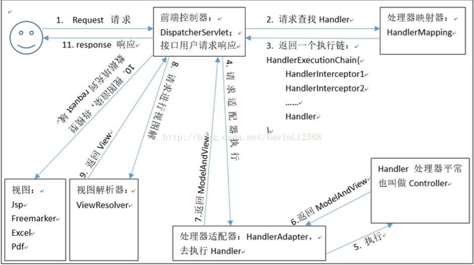
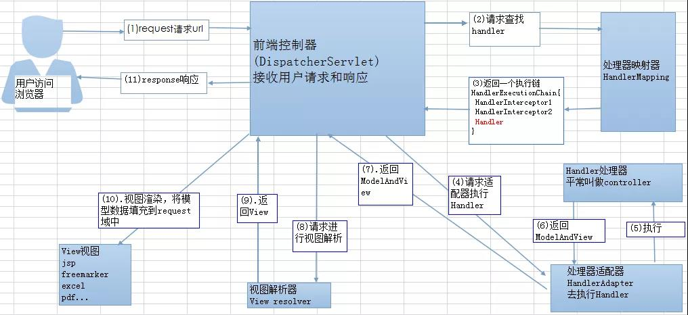
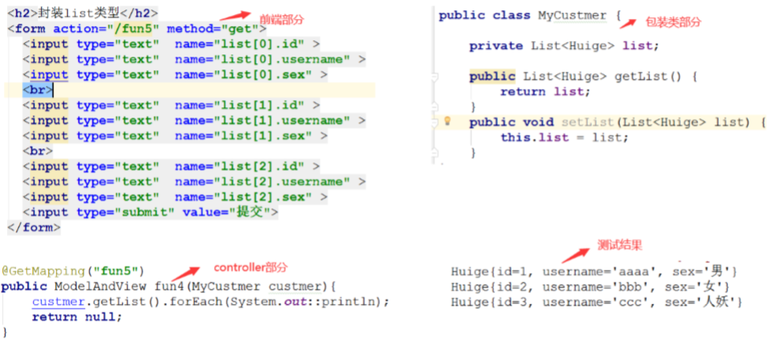
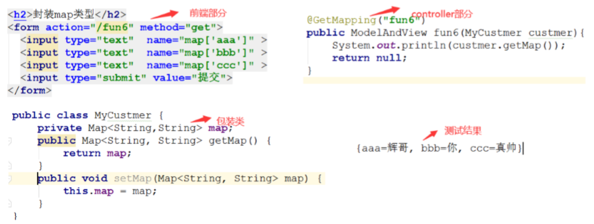
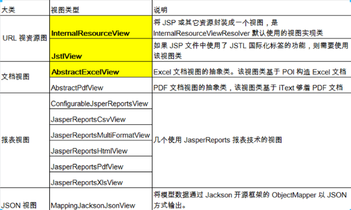
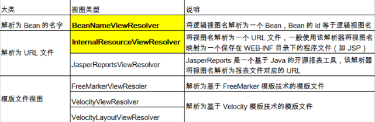

施工中

<!-- more -->

# SpringMVC

## 1.概述

- 一种轻量级的、基于MVC的Web层应用框架
- 通过一套 MVC 注解，让 POJO 成为处理请求的控制器，而无须实现任何接口
- 支持 REST 风格的 URL 请求
- 采用了松散耦合可插拔组件结构，比其他 MVC 框架更具扩展性和灵活性

## 2. SpringMVC的基本使用

### 2.0. 建Web工程，导jar包

导的包有：

spring-aop-4.0.0.RELEASE.jar
spring-beans-4.0.0.RELEASE.jar
spring-context-4.0.0.RELEASE.jar
spring-core-4.0.0.RELEASE.jar
spring-expression-4.0.0.RELEASE.jar
commons-logging-1.1.3.jar
spring-web-4.0.0.RELEASE.jar
spring-webmvc-4.0.0.RELEASE.jar

### 2.1. Web.xml中配置DispathcerServlet

```xml
<!-- 配置SpringMVC核心控制器： -->
<servlet>
        <servlet-name>springDispatcherServlet</servlet-name>
        <servlet-class>org.springframework.web.servlet.DispatcherServlet</servlet-class>

        <!-- 配置DispatcherServlet的初始化參數：设置文件的路径和文件名称
        如不想配置文件的路径，需配置一个/WEB_INF/<servlet-name>-servlet.xml文件 -->
        <init-param>
                <!-- contextConfigLocation：指定SpringMVC配置文件位置 -->
                <param-name>contextConfigLocation</param-name>
                <param-value>classpath:springmvc.xml</param-value>
        </init-param>
        <!-- Servlet在启动时加载，在第一次访问时创建对象。
        load-on-startup：服务器启动时创建对象，值越小优先级越高，越先创建对象 -->
        <load-on-startup>1</load-on-startup>
</servlet>
<servlet-mapping>
        <servlet-name>springDispatcherServlet</servlet-name>
        <!-- /*和/都是拦截所有请求。
        但/不能拦截*.jsp,能保证*.jsp访问正常；/*范围更大，会拦截到*.jsp这些文件 -->
        <url-pattern>/</url-pattern>
</servlet-mapping>
```

### 2.2. 配置springmvc.xml文件

**注意**：在使用IDEA导入各种名称空间时，一定仔细看看之后导入的约束文件是不是自己要的。比如：导入mvc的名称空间时，其相关schema约束的的地址的URL要选**以mvc结尾的**，不要选其他的。

```xml
<?xml version="1.0" encoding="UTF-8"?>
<beans xmlns="http://www.springframework.org/schema/beans"
       xmlns:xsi="http://www.w3.org/2001/XMLSchema-instance"
       xmlns:context="http://www.springframework.org/schema/context"
       xmlns:mvc="http://www.springframework.org/schema/mvc"
       xsi:schemaLocation="http://www.springframework.org/schema/beans
       http://www.springframework.org/schema/beans/spring-beans.xsd
       http://www.springframework.org/schema/context
       https://www.springframework.org/schema/context/spring-context.xsd
       http://www.springframework.org/schema/mvc
       https://www.springframework.org/schema/mvc/spring-mvc.xsd">
```

导入各种名称空间（beans,context,mvc……）后

```xml
<!-- 设置扫描组件的包： -->
<context:component-scan base-package="com.atguigu.springmvc"/>

 <!-- mvc:annotation-driven标签会默认会帮我们注册默认处理请求，参数和返回值的类 -->
<mvc:annotation-driven/>

<!-- 配置视图解析器：如何将控制器返回的结果字符串，转换为一个物理的视图文件-->
<bean id="internalResourceViewResolver" 
  class="org.springframework.web.servlet.view.InternalResourceViewResolver">
    <property name="prefix" value="/WEB-INF/views/"/>
    <property name="suffix" value=".jsp"/>
</bean>
```

### 2.3. 编写相应Controller类和success页面(success.jsp)进行测试等

## 3. SpringMVC内部流程图





### 流程说明(重要)

1. 客户端（浏览器）发送请求，直接请求到 `DispatcherServlet`。
2. `DispatcherServlet` 根据请求信息调用 `HandlerMapping`，解析请求对应的 `Handler`。
3. 解析到对应的 `Handler`（也就是我们平常说的 `Controller` 控制器）后，开始由 `HandlerAdapter` 适配器处理。
4. `HandlerAdapter` 会根据 `Handler`来调用真正的处理器来处理请求，并处理相应的业务逻辑。
5. 处理器处理完业务后，会返回一个 `ModelAndView` 对象，`Model` 是返回的数据对象，`View` 是个逻辑上的 `View`。
6. `ViewResolver` 会根据逻辑 `View` 查找实际的 `View`。
7. `DispaterServlet` 把返回的 `Model` 传给 `View`（视图渲染）。
8. 把 `View` 返回给请求者（浏览器）

## 4. 请求相关

### 4.0. 相关注解

#### 4.0.1. @RequestMapping

##### 属性

###### value

- 为控制器指定可以处理哪些URL请求
- **标记在类上：**提供初步的请求映射信息。路径相对于  WEB 应用的根目录
- **标记在方法上：**提供进一步的细分映射信息。路径相对于标记在类上的 URL。若类上未标注 @RequestMapping，则方法处标记的 URL 相对于 WEB 应用的根目录
- **示例：**@RequestMapping(value={"value1","value2"})

###### method

- 限定请求方式
- 不写method则默认什么请求都行
- **示例：**@RequestMapping(value="URL路径",method=RequestMethod.PUT)

###### params

- 限定请求参数

  param1: 表示请求必须包含名为 param1 的请求参数

  !param1: 表示请求不能包含名为 param1 的请求参数

  param1 != value1: 表示请求包含名为 param1 的请求参数，但其值不能为 value1

  param1 = value1: 表示请求包含名为 param1 的请求参数，但其值必须为 value1

- **示例：**params={"param1=value1", "param2","!param3","param4!=value4"}

  请求必须包含名为 param1,2 的请求参数

  param1 参数的值必须为 value1；param2的值随意；

  请求参数中不能有param3；参数中可以有param4，如果有，其值不能为value4

###### headers

- 指定request中必须包含某些指定的header值，才能让该方法处理请求，用法同params

  例：**@RequestMapping(headers={ "Accept-Language=en-US,zh;q=0.8"})**

###### consumes

- 指定处理请求的提交内容类型（Content-Type）

  例：@RequestMapping(consumes="application/json")

  ​	仅处理request的Content-Type中为“application/json”类型的请求

###### produces

- 指定返回的内容类型，仅当request请求头中的(Accept)类型中包含该指定类型才返回

  例：@RequestMapping(produces="application/json")

  ​	方法仅处理request请求中Accept头中包含了"application/json"的请求，

  ​	同时暗示了返回的内容类型为application/json;

##### @RequestMapping支持Ant资源路径风格

1. ###### 路径中带有？

   每一个**?**匹配单层路径中的一个字符 

   **例：**user/createUser??
   ​	匹配 /user/createUseraa、/user/createUserbb 等 URL

2. ###### 路径中带有*

   匹配单层路径中的任意字符

   **例：**/user/*/createUser
   ​	匹配 /user/aaa/createUser、/user/bbb/createUser 等 URL

3. ###### 路径中带有**

   匹配多层路径

   **例：**/user/**/createUser
   ​	匹配 /user/createUser、/user/aaa/bbb/createUser 等 URL

#### 4.0.2. @PathVariable

##### 简述

可以将 **URL 中占位符参数绑定到控制器处理方法的入参中**,常用于REST风格的传值

##### 示例：

```java
@RequestMapping(value="/testPathVariable/{id}")//{id}只能占一层路径
public String testPathVariable(@PathVariable("id") Integer c){
    System.out.println("testPathVariable...id="+c);
    return "success";
}
```

#### 4.0.3. @RequestParam

##### 简述

该注解在处理方法的入参处使用，可以把请求参数传给方法入参，常用于普通传值

##### 属性

###### value

指定要获取的请求参数的Key

###### required

请求参数是否必须。默认为true，表示请求参数里必须包含对应的参数，否则会抛异常

###### defaultValue

默认值，当required=false且没有传递参数时使用该值。默认为null

##### 示例：

```java
@RequestMapping(value="/testRequestParam")
public String testRequestParam(
@RequestParam(value="username") String username,
@RequestParam(value="age",required=false,defaultValue="0") int age){
        System.out.println("testRequestParam - username="+username +",age="+age);
        return "success";
}
```

#### 4.0.4. @RequestHeader

##### 简述

将请求报头的指定属性值绑定到处理方法的入参上

##### 属性

同@RequestParam   

##### 示例：

```java
@RequestMapping(value="/testRequestHeader")
public String testRequestHeader(@RequestHeader(value="Accept-Language") String al){
        System.out.println("testRequestHeader - Accept-Language："+al);
        return "success";
}
```

#### 4.0.5. @CookieValue

##### 简述

将请求中的指定的 Cookie 值绑定到处理方法的入参上

##### 属性

同@RequestParam

##### 示例：

```java
@RequestMapping("/testCookieValue")//
public String testCookieValue(@CookieValue("JSESSIONID") String sessionId) {
        System.out.println("testCookieValue: sessionId: " + sessionId);
        return "success";
}
```

其中的@CookieValue("JSESSIONID")相当于

```java
Cookie[] cookies = request.getCookies();
for (Cookie c : cookies) {
       if ("JESSIONID".euqals(c.getName())) {
            String cv = c.getValue();
       }    
}
```


#### 4.0.6. @RequestMapping的组合注解

@GetMapping、@PostMapping、@PutMapping、@DeleteMapping

以@GetMapping为例，@GetMapping**等同于**@RequestMapping(method=RequestMethod.GET)

### 4.1. 参数封装

#### 4.1.0. 普通参数类型

只要 **请求参数的key** 和 **方法的参数名** 一样，数据便会自动封装上。

若不一致，可在方法参数上添加@ReuquestParam注解，注解的**value值**还是要和**请求参数的key**一致

#### 4.1.1.数组类型

同 普通参数类型

#### 4.1.2. POJO类型

- 请求中的**参数名**、**参数类型**和方法参数的**POJO**里的**属性名**和**属性类型**要一一对应
- 自动匹配与方法**参数名**无关
- 请求中的参数可以比POJO里的属性少，但**不能多**
- 支持级联属性

#### 4.1.3. List集合类型



#### 4.1.4. Map集合类型



#### 4.1.5. Json格式字符串

1. 导包

   jackson-annotations-2.9.8.jar

   jackson-core-2.9.8.jar

   jackson-databind-2.9.8.jar

2. 在Controller里的指定方法的参数前**加@RequestBody**，让SpringMVC去请求体中获取参数对象。参数对象的属性要和Json字符串里的key对应

由于SpringMVC和SpringBoot默认支持jackson，所有我们在接受前端json格式的字符串的时候，就可以直接指定方法参数为对应的实体类类型，帮我们省略了将json字符串封装到对象中的步骤。

### 4.2. 使用Servlet API

SpringMVC支持调用原生Servlet API，Controller方法参数用ServletAPI类型的即可

可用的参数类型有：

**HttpServletRequest;HttpServletResponse;HttpSession;**

java.security.Principal;Locale;InputStream;OutputStream;Reader;Writer

### 4.3. 静态资源的处理

#### 处理方式一

在web.xml中配DispatcherServlet时，限定其拦截格式，没有被拦截的则交给**默认Servlet**处理

缺点：不符合REST风格

```xml
<servlet-mapping>
    <servlet-name>DispatcherServlet</servlet-name>
    <url-pattern>*.do</url-pattern>
</servlet-mapping>
```

#### 处理方式二(常用)

springmvc的配置文件中配两个标签

```xml
<mvc:annotation-driven/>
<mvc:default-servlet-handler/>
```

#### 处理方式三

springmvc的配置文件中配一个\<mvc:resources/>

```xml 
<!-- 配置静态资源映射
 	 mapping:请求路径规则
	 location:满足路径规则后，去哪找静态资源-->
<mvc:resources mapping="/pages/*" location="/pages"/><!-- *代表一层路径 -->
<mvc:resources mapping="/pages/**" location="/pages"/><!-- **代表多层路径 -->
```

## 5. 数据输出

除了在方法参数上传入原生的ServletAPI，Spring还提供了几种途径输出数据模型

### 5.1. 方法参数为Map、Model或ModelMap

Controller方法参数为Map、ModelMap或Model 时，最终都是BindingAwareModelMap工作。

里面保存的数据会放在请求域中，可以在页面进行获取。

### 5.2. 方法返回值类型为ModelAndView

ModelAndView既包含视图信息（页面地址）也包含模型数据（给页面带的数据）。数据仍放在了请求域中

可在jsp页面用 JSTL 和 EL 表达式取出

#### 示例：

```java
@RequestMapping("/testModelAndView")
public ModelAndView testModelAndView(){
    //通过构造方法指定返回的页面名称，也可以用setViewName()方法跳转到指定页面
    ModelAndView mv = new ModelAndView("success");
    mv.addObject("time",new Date().toString()); //实质上存放到request域中 
    return mv;
}
```

### 5.3. 方法返回值类型为String

#### 5.3.0. 跳转到jsp页面

##### 示例一：

```java
@GetMapping("/stringPage")
public String testStringPage() {
    //方法参数为空，返回jsp页面，且不携带数据
    return "success";
}
```

##### 示例二：

```java
@GetMapping("/stringPage")
public String testStringPage(Model model) {
    //参数类型为Model类型，返回jsp页面，用model携带了数据
    model.addAttribute("msg", "测试");
    return "success";
}
```

##### 示例三：

```java
@GetMapping("/stringPage")
public String testStringPage(Map map) {
    //参数类型为Map类型，返回jsp页面，用map携带了数据
    return "success";
}
```

#### 5.3.1. 将字符串返回到页面上

##### 示例一：

```java
@ResponseBody//使用后不会再走视图处理器，而是直接将数据写入到输入流中，将返回值输出到了页面
@GetMapping("/testString")
public String testString() {
    return "string";
}
```

##### 示例二：

```java
@ResponseBody//使用后不会再走视图处理器，而是直接将数据写入到输入流中，将返回值输出到了页面
@GetMapping(value="/testString", produces="text/html;charset=utf-8")
public String testString() {
    return "测试";//中文乱码用@GetMapping的produces属性解决了
}
```

#### 5.3.2. 转发和重定向

一般情况下，控制器方法返回字符串类型的值会被当成逻辑视图名处理。如果返回的字符串中带` forward: `或 `redirect: `前缀时，SpringMVC 会对他们进行特殊处理：将 `forward: `和 `redirect: `当成指示符，其后的字符串作为 URL 来处理

##### 转发

```java
@GetMapping("/testForward")
public String testForwad() {
    return "forward:string";//转发到url为string的请求中，还可以直接在后面写具体的静态资源名
}
```

##### 重定向

```java
@GetMapping("/testRedirect")
public String testForwad() {
    return "redirect:string";//重定向到url为string的请求中，还可以直接在后面写具体的静态资源名
}
```

### 5.4. 方法返回值为void（无返回值）

方法返回值为void，访问地址就变成了响应的视图页面。

#### 示例：

```java
@RequestMapping("/index")
public void testVoid() {
    //无返回值，默认找的是 配置路径 下的 '路径'+.jsp页面
}

//所以一般可以在无返回值的方法里转发或重定向
@RequestMapping("/testVoid")
public void testVoid02(HttpServletRequest request, HttpServletResponse response) {
    // request.getRequestDIspatcher("string").forward(request, response);
    response.sendRedirect("string");
}
```

### 5.5. 方法返回值为自定义对象

需要jackson的支持和@ResponseBody，将对象转成了json，实际返回的是json格式的字符串

#### 示例：

```java
@RequestMapping("/object")
@ResponseBody//不加该注解的话逻辑视图名为object.jsp,即返回的是object.jsp页面
public Student testObject() {
    Student stu = new Student(11, "张三");
    return stu;//加了@ResponseBody并导了jackson相关的包，返回的便是json格式的字符串
}
```

### 5.6. 方法返回值为ResponseEntity

#### 示例：

```java
/**
 * ResponseEntity内部提供状态码
 * 所以既能携带数据，又能携带状态码
 * 返回的也是Json格式的字符串
 * 依赖jackson，使用时不需加@ResponseBody注解
 */
@GetMapping("/responseEntity")
public ResponseEntity testentity() {
    Student stu = new Student(11, "张三");
    return ResponseEntity.status(HttpStatus.OK).body(stu);
    // 或使用这种写法，跟上面的那行表示的意思是一样的
    // return ResponseEntity.ok(stu);
}
```

## 6. 乱码问题

#### 6.0. 参数格式为key-value格式时的乱码

##### 6.0.0. GET请求乱码

GET请求在tomcat 8 版本以上不乱码，8版本以下乱码

###### 1. 解决方式一

接收参数后，用如下方式自己转一下

```java
String s = new String(username.getBytes("ISO‐8859‐1"), "utf‐8");
```

###### 2. 解决方式二

为tomcat中的config目录下 server.xml  添加  URIEncoding="utf‐8"。

如果有useBodyEncodingForURI="true"，注释掉

```xml
<Connector port="8080" protocol="HTTP/1.1"         
           connectionTimeout="20000"         
           redirectPort="8443"         
           disableUploadTimeout="true"         
           executor="tomcatThreadPool"         
           URIEncoding="utf‐8"/>
```

##### 6.0.1. POST请求乱码

web.xml文件中配置字符编码过滤器，**该过滤器需在其他过滤器的前面**

```xml
<!--CharacterEncodingFilter 在高版本的Spring中是可以解决 GET请求 和POST请求
    低版本,比如说4.X中 只能解决POST请求  不能解决GET请求 -->
<filter>
    <filter-name>encodingFilter</filter-name>
    <filter-class>org.springframework.web.filter.CharacterEncodingFilter</filter-class>

    <init-param>
        <!-- encoding：指定解决POST请求乱码 -->
        <param-name>encoding</param-name>
        <param-value>UTF-8</param-value>
    </init-param>

    <init-param>
        <!-- forceEncoding：解决响应乱码 -->
        <param-name>forceEncoding</param-name>
        <param-value>true</param-value>
    </init-param>

</filter>

<filter-mapping>
    <filter-name>encodingFilter</filter-name>
    <url-pattern>/*</url-pattern>
</filter-mapping>
```

#### 6.1. 参数格式为Json格式时的乱码

请求参数为Json格式时，因为走了jackson，所以没有乱码问题

#### 6.2. 响应乱码

##### 字符串乱码

通过设定@XxxMapping里的produces属性来避免字符串乱码

```java
// 该方式不走jackson
@GetMapping(value="/test", produces="text/html;charset=utf-8")
@ResponseBody//有该注解便可将字符串返回给页面
public String testString() {
    return "测试字符串";
}
```

##### Json格式乱码

```java
// 该方式走了jackson，jackson把乱码问题解决了
@GetMapping(value="/student")
@ResponseBody//有该注解便可通过jackson将Student对象转成json字符串返给前端
public Student testString() {
    Student stu = new Student(11, "张三");
    return stu;
}
```

## 7. REST风格的URL地址约束

表述性状态传递（Representational State Transfer，简称REST）。以简洁的URL提交请求，以请求方式区分对资源的操作

GET请求：获取数据；POST请求：登录和添加数据；DELETE请求：删除操作；PUT请求：修改操作。

浏览器可以发送GET和POST请求。DELETE和PUT请求需要转换

### 转换步骤

#### 1. web.xml中配置过滤器

```xml
<filter>
	<filter-name>HiddenHttpMethodFilter</filter-name>
	<filter-class>org.springframework.web.filter.HiddenHttpMethodFilter</filter-class>
</filter>
<filter-mapping>
	<filter-name>HiddenHttpMethodFilter</filter-name>
	<url-pattern>/*</url-pattern>
</filter-mapping>
```

#### 2. 前端代码

需满足几个条件：

1、前端请求必须为POST；

2、请求时必须要携带一个隐藏域，其参数名称为_method；参数值必须为PUT或DELETE(不区分大小写)

注意点：8.0版本tomcat会在jsp页面报405异常

解决方式：需在jsp页面中头标签中添加 isErrorpage="true"属性；`<%@ …… page isErrorPage="true"%>`

```html
<!-- 以PUT请求为例，测试 REST风格 PUT 请求 -->
<form action="springmvc/testRESTPut/1" method="POST">
    <input type="hidden" name="_method" value="PUT">
    <input type="text" name="name" value="张三">
    <input type="text" name="age" value="13">
    <input type="submit" value="restPath">
</form>
```

#### 3. 后端代码

```java
@PutMapping(value="/restPath/{name}/{age}")
public String testREST(@PathVarible("name")sname, @PathVarible("age")sage) {
    System.out.println("sanme=" + sname + ";sage" + sage);
    return "success";
}
```

## 8. 视图和视图解析器

### 8.0. 视图

视图对象由视图解析器负责实例化。由于视图是无状态的，所以不会有线程安全的问题

视图的顶级接口为View

#### 8.0.0. 常用视图实现类图示




### 8.1. 视图解析器

视图解析器根据方法的返回值得到视图对象。ViewResolver 是其顶级接口

#### 8.1.0. 常用视图解析器图示



### 8.2. 其它

若想直接响应通过 SpringMVC 渲染的页面，而不经过Controller来执行结果，可在SpringMVC的配置文件中添加**\<mvc:view-controller/>**标签。

#### 8.2.0. 示例：

```xml
<mvc:view-controller path="/success" view-name="success"/>
```

#### 8.2.1. 注意点

配置**\<mvc:view-controller/>**会导致其他请求路径失效。解决方式：再配一个**\<mvc:annotation-driven/>**标签

## 9. 国际化

针对不同的国家进行不同的视图显示，JstlView可以解析Jstl语言进行国际化操作

### 9.0. 实现步骤

#### 9.0.0. 创建资源文件

资源文件的命名规范：基名\_语言\_国家.properties

例：base_zh_CN.properties；i18n_zh_CN.properties

#### 9.0.1. springmvc.xml中配置特定\<bean/>标签

```xml
<!-- 加载国际化资源文件 bean的id="messageSource",是固定的，因为springMVC在启动时会自动查询这个bean并加载-->
<bean id="messageSource"class="org.springframework.context.support.ResourceBundleMessageSource">
    <property name="basename" value="i18n"></property>
</bean>
```

#### 9.0.2. 导包，配fmt标签

要导的包：jstl.jar和standard.jar

在具体的jsp页面里导入jstl下的fmt名称空间，并书写相应的标签。

\<fmt:message key="resource.welcome"/>

## 10. 文件上传

流行的文件上传方式：提交表单（包括异步）的方式；Base64的方式

### 10.0. 文件上传之提交表单

提交表单的三要素：

- 前端请求必须为POST
- 前端必须要有**\<input tupe="file"/>**
- form标签里必须要有enctype属性，且`enctype="mutlipart/form-data"`。

#### 10.0.0. 文件上传之Part的方式

该方式只导个servlet-api.jar，不需配置任何视图解析器

##### 单文件Part上传

###### 1. 编写前端页面

```html
<form action="/upload" method="post" enctype="multipart/form-data">
    <input type="file" name="image"/>
    <input type="submit" value="上传图片"/>
</form>
```

###### 2. 添加配置信息

在**web.xml中**的DispatcherServlet中添加一个**\<multipart-config/>**标签

```xml
<servlet>
	......
    <!-- 单位Byte -->
    <multipart-config>
    	<max-file-size>20848820</max-file-size>
        <max-request-size>418018841</max-request-size>
        <file-size-threshold>1048576</file-size-threshold>
    </multipart-config>
</servlet>
```

###### 3.编写Controller类

```java
@Controller
public class UploadController { 
    @PostMapping("upload")
    public String upload(HttpServletRequest request) throws Exception{
    	Part file = request.getPart("image");
        String realPath = request.getServletContext().getRealPath("/WEB-INF/");
        file.write(realPath + file.getSubmittedFileName());
        return "success";
    }
}
```

##### 多文件Part上传

###### 1. 编写前端页面

```html
<form action="/upload" method="post" enctype="multipart/form-data">
    <!-- 相比单文件上传该标签里多了一个multiple属性 -->
    <input type="file" name="image" multiple/>
    <input type="submit" value="上传图片"/>
</form>
```

###### 2. 添加配置信息

在**web.xml中**的DispatcherServlet中添加一个**\<multipart-config/>**标签

```xml
<servlet>
	......
    <!-- 单位Byte -->
    <multipart-config>
    	<max-file-size>20848820</max-file-size>
        <max-request-size>418018841</max-request-size>
        <file-size-threshold>1048576</file-size-threshold>
    </multipart-config>
</servlet>
```

###### 3. 编写Controller类

```java
@Controller
@MultipartConfig
public class UploadController {
    
    @PostMapping("upload")
    public String upload(HttpServletRequest request) throws Exception{
    	Collection<Part> parts = request.getParts();
        String realPath = request.getServletContext().getRealPath("/WEB-INF/");
        parts.forEach(part -> {
            try {
                part.write(realPath + file.getSubmittedFileName());
            } catch (IOException e) {
                e.printStackTrace();
            }
        });
        return "success";
    }
}
```

#### 10.0.1. 多文件上传之SpringMVC

该方式也是以表单的方式上传的，单文件上传和多文件上传差不多，就不写了。

需要导jar包，配多媒体视图解析器

##### 1. 导jar包

commons-io-1.4.jar和commons-fileupload-1.2.1.jar

##### 2. 配置多媒体视图解析器

```xml
<!-- 其id值固定 -->
<bean id="multipartResolver"
      class="org.springframework.web.multipart.commons.CommonsMultipartResolver">
	<property name="defaultEncoding" value="UTF-8"></property>
	<!-- 上传文件的最大值，单位Byte;如果-1，表示无限制 -->
	<property name="maxUploadSize"  value="102400"></property>
</bean>
```

##### 3. 前端页面

```html
<form action="/upload" method="post" enctype="multipart/form-data">
    <input type="file" name="files" multiple/>
    <input type="submit" value="上传"/>
</form>
```

##### 4. 编写Controller类

注：**MultipartFile数组的名字需要和前端页面的\<input type="file">标签的name值一致**。

```java
@Controller
public class UploadController {
    @PostMapping("upload")
    public String upload(HttpServletRequest request, MultipartFile[] files) throws Exception{
    	String realPath = request.getServletContext().getRealPath("/WEB-INF/images/");
        File file = new File(realPath);
        if (!file.exists()) {
            file.mkdirs();
        }
        
        for (int i = 0; i < files.length; i++) {
            String fileName = files[i].getOriginalFilename();
            files[i].transferTo(new File(file, fileName));
        }  
        return "success";
    }
}
```

## 11. 文件下载

### 11.0. 下载方式一

直接在前端给出下载链接

#### 前端页面

```html
<a href="/download/测试.xlsx">下载表格</a>
```

#### springmvc.xml添加配置

```xml
<mvc:annotation-driven/>
<mvc:default-servlet-handler/>
```

### 11.1. 下载方式二

#### 前端页面

```html
<!-- 此链接请求的是后端的Controlelr -->
<a href="/download">点此下载</a>
```

#### 后端代码

```java
@GetMapping("/download")
public ResponseEntity<byte[]> testDownload(HttpServletRequest request)
    throws IOException {
    String realPath = request.getServletContext().getRealPath("/download/测试.docx");
    FileInputStream in = new FileInputStream(realPath);
    byte[] buffer = new byte[in.available()];
    String fileName = realPath.substring(realPath.lastIndexOf("\\") + 1);
    
    HttpHeaders headers = new HttpHeaders();
    // 第一个参数，固定值attachment；第二个参数为文件名，会出现乱码问题，用URLEncoder.encode(fileName, "utf-8")处理一下
    headers.setContentDispositionFormData("attachment", URLEncoder.encode(fileName, "utf-8"));
    
    // 用ResponseEntity返给前端一个字节数组
    ResponseEntity<byte[]> entity = new ResponseEntity<byte[]>(buffer, headers, HttpStatus.OK);
    
    return entity;
}
```

## 12. 类型转换

### 12.0. key-value格式转Date

#### 解决方式一（局部配置）

在实体类的Date属性上添加@DateTimeFormat注解。

例：@DateTimeFormat(pattern="yyyy-MM-dd")

​	或@DateTimeFormat(pattern="**yyyy-MM-ddTHH:mm:ss**")

缺点：需要转换的属性都要加注解，做不到统一维护

#### 解决方式二(全局配置)

##### 1. 新建类型转换器

```java
//Converter ，下面的泛型表示将String转换成Date类型
public class MyConvert implements Converter<String,Date> {     
    @Override   
    public Date convert(String s) {       
        SimpleDateFormat sdf = new SimpleDateFormat("yyyy‐MM‐dd");       
        try {           
            Date parse = sdf.parse(s);           
            return parse;       
        } catch (ParseException e) { 
            SimpleDateFormat sdf1 = new SimpleDateFormat("yyyy/MM/dd");           
         	try { 
                return sdf1.parse(s);           
            } catch (ParseException e1) {
              e1.printStackTrace();
            }
        }
        return null;
    }
```

##### 2. SpringMVC配置文件中配置转换器

```xml
<bean id="conversionService" 
      class="org.springframework.format.support.FormattingConversionServiceFactoryBean">
    <property name="conventers">
        <set>
            <bean class="com.xxx.cn.MyConvert"/> 
        </set>
    </property>
</bean>
<!-- 将conversionService注册到annotation-driven中 -->
<mvc:annotation‐driven conversion‐service="conversionService"/>
```

### 12.1. Json格式转Date

#### 解决方式一（局部配置）

##### 1. 导包

jackson-annotations-2.9.8.jar；jackson-core-2.9.8.jar；jackson-databind-2.9.8.jar

##### 2. 加注解

在相应的Date属性上加@JsonFormat注解，且能在注解的值内自定义日期格式。

**不加注解的话**，也能通过jackson转换，默认支持yyyy-MM-dd**T**HH:mm:ss和yyyy-MM-dd 格式的转换

#### 解决方式二(全局配置)

使用该种配置，不仅支持Json参数转Date类型，也支持Date类型转Json。

##### 1. 导包

jackson-annotations-2.9.8.jar；jackson-core-2.9.8.jar；jackson-databind-2.9.8.jar

##### 2. springmvc的配置文件

```xml
<mvc:annotation‐driven>         
    <mvc:message‐converters>
        <bean 
            class="org.springframework.http.converter.json.MappingJackson2HttpMessageConverter">
            <property name="objectMapper" ref="objectMapper"/>             
        </bean>           
    </mvc:message‐converters>     
</mvc:annotation‐driven>       

<bean id="objectMapper" 
      class="org.springframework.http.converter.json.Jackson2ObjectMapperFactoryBean"
      p:indentOutput="true" 
      p:simpleDateFormat="yyyy‐MM‐dd HH:mm:ss"/>
```

### 12.2. key-value格式转LocalDate&LocalDateTime

#### 解决方式一(局部配置)

在实体类的Date属性上添加@DateTimeFormat注解。

例：@DateTimeFormat(pattern="yyyy-MM-dd")(不能加在LocalDateTime上)

​	@DateTimeFormat(pattern="**yyyy-MM-dd HH:mm:ss**")(两种类型都可加)

缺点：需要转换的属性都要加注解，做不到统一维护

#### 解决方式二(全局配置)

##### 1. 定义两个类型转换器(Convert)

```java
public class MyConvert1 implements Converter<String,LocalDateTime> {     
    @Override     
    public LocalDateTime convert(String s) {
        return LocalDateTime.parse(s,DateTimeFormatter.ofPattern("yyyy‐MM‐dd  HH:mm:ss"));     
    } 
}

public class MyConvert2 implements Converter<String,LocalDate> {     
    @Override     
    public LocalDate convert(String s) {
        return LocalDate.parse(s,DateTimeFormatter.ofPattern("yyyy‐MM‐dd"));     
    } 
}
```

##### 2.配置转换器

```xml
<bean id="conversionService" 
      class="org.springframework.format.support.FormattingConversionServiceFactoryBean">
    <property name="converters">               
    	<set>
            <!-- 此处放置的为内部bean。也可在外部定义，内部来引用 -->
        	<bean class="com.shangma.cn.MyConvert1"/>    
            <bean class="com.shangma.cn.MyConvert2"/>
    	</set>           
    </property>       
</bean>

<!-- 将conversionService注册到annotation-driven中 -->
<mvc:annotation‐driven conversion‐service="conversionService"/>
```

### 12.3. Json格式转LocalDate&LocalDateTime

#### 解决方式一

##### 1. 导包

jackson-annotations-2.9.8.jar；jackson-core-2.9.8.jar

jackson-databind-2.9.8.jar；**jackson-datatype-jsr310-2.9.8.jar**

##### 2. 加注解

@JsonFormat(pattern="yyyy-MM-dd")(不能加在LocalDateTime上)

@JsonFormat(pattern="**yyyy-MM-dd HH:mm:ss**")(两种类型都可加)

**不加注解的话**，也能通过jackson转换，默认支持yyyy-MM-dd HH:mm:ss和yyyy-MM-dd 格式的转换

#### 解决方式二

##### 1. 导包

jackson-annotations-2.9.8.jar；jackson-core-2.9.8.jar

jackson-databind-2.9.8.jar；**jackson-datatype-jsr310-2.9.8.jar**

##### 2. SpringMVC配置文件

```xml
<mvc:annotation‐driven>         
    <mvc:message‐converters>
        <bean 
            class="org.springframework.http.converter.json.MappingJackson2HttpMessageConverter">                 <property name="objectMapper" ref="objectMapper"/>             
        </bean>           
    </mvc:message‐converters>     
</mvc:annotation‐driven>       

<bean id="objectMapper" 
      class="org.springframework.http.converter.json.Jackson2ObjectMapperFactoryBean"
      p:indentOutput="true" 
      p:modules-ref="module"/>

<bean id="module" 
      class="com.fastxml.jackson.datatype.jsr310.JavaTimeModule"/>
```

### 12.4. Date&LocalDate&LocalDateTime转Json

局部解决方式

#### 1. 导包

jackson-annotations-2.9.8.jar；jackson-core-2.9.8.jar

jackson-databind-2.9.8.jar；**jackson-datatype-jsr310-2.9.8.jar**

#### 2. 加注解

@JsonFormat(pattern="yyyy-MM-dd")(不能加在LocalDateTime上)

@JsonFormat(pattern="**yyyy-MM-dd HH:mm:ss**")(两种类型都可加)

**不加注解的话**，时间类型会转成**Json格式的时间辍**

## 13. 拦截器

### 13.0. 使用步骤

#### 1. 创建自定义拦截器

```java
public class FirstInteceptor implements HandlerInterceptor {       
    // Controller方法执行前执行       
    //返回false  程序不往下执行     
    // 返回true  程序继续往下执行 类似放行的意思     
    @Override     
    public boolean preHandle(HttpServletRequest request, 
                             HttpServletResponse response,  Object handler) {
        System.out.println("preHandle执行了");         
        return true;     
    }
    //Controller 方法执行完成后 还没有返回视图时执行   
    @Override
    public void postHandle(HttpServletRequest request, 
                           HttpServletResponse response, 
                           Object  handler, ModelAndView modelAndView) {
        System.out.println("postHandle执行了");   
    }     
    //请求和响应都完成了才执行
    @Override
    public void afterCompletion(HttpServletRequest request,
                               	HttpServletResponse response,
                                Object handler,Exception e) {
        System.out.println("afterCompletion执行了");
    }
```

#### 2. 配置springmvc.xml文件

```xml
<mvc:interceptors>
    <!-- 配置具体的拦截路径 -->
    <mvc:interceptor>
        <!-- 指定拦截的路径,基于ant风格 -->
        <mvc:mapping path="/**"/>  
        <!-- 指定不拦截的路径 -->
        <mvc:exclude-mapping path="/handler/testUpload"/> 
        <bean  class="org.lanqiao.interceptor.MyInterceptor"></bean>
    </mvc:interceptor>
    <!-- 配置具体的拦截路径 -->
    <mvc:interceptor>
        <!-- 指定拦截的路径,基于ant风格 -->
        <mvc:mapping path="/**"/>
        <!-- 指定不拦截的路径 -->
        <mvc:exclude-mapping path="/handler/testUpload"/> 
        	<bean  class="org.lanqiao.interceptor.MySecondInterceptor"></bean>
    </mvc:interceptor>

</mvc:interceptors>
```

## 14. 异常处理

### 14.0. 处理方式一

##### 1. 指定错误页面

```jsp
<error-page>
	<location>/WEB-INF/pages/error.jsp</location>
</error-page>
```

##### 2. 异常时会跳转到该页面

缺点：页面固定，传值麻烦

### 14.1. 处理方式二

缺点：虽然可以动态显示错误信息 但是只能返回jsp页面 想要返回html页面 需要依赖模板引擎 

##### 1. 创建异常处理类

```java
@Component// 使用注解加入到容器当中
public class MyExceptionHander implements HandlerExceptionResolver {
    
    @Override
    public ModelAndView resolverException(
        HttpServletRequest httpServletRequest, 
        HttpServletResponse httpServletResponse, 
        Object o, Exception e) {
        
        ModelAndView mv = new ModelAndView();
        mv.addObject("msg", e.getMessage());
        mv.setViewName("error");
        return mv;
    }
}
```

##### 2. 修改error.jsp

```xml
<body>
	${msg}<!-- EL表达式取值 -->
</body>
```

##### 3. 编写Controller类

```java
@Controller
public class ErrorController {
    
    @GetMapping("error")
    public String error() {
        if (true) {
            throw new RuntimeException("抛出异常");
        }
        
        return "success";
    }
}
```

### 14.2. 处理方式三

必须掌握，该方式是通过**AOP通知功能**进行的自定义异常处理

#### 1. 自定义状态信息的枚举类

```java
package com.xxx.cn.common.http.response;

public enum StatusEnum {
	ERROR(40001, "操作失败"),
	OK(20000, "操作成功"),
	PHONE_specification_ERROR(40002, "手机号格式错误"),
	PHONE_NUMBER_ERROR(40003, "手机号位数错误"),
	PHONE_EMPTY(40004, "手机号为空"),
	ADMIN_NOT_FOUND(40005, "用户未查到"),
	CODE_SENT(20001, "验证码已发送"),
	LOGIN_ERROR(40006, "验证码错误，登录失败"),
	LOGIN_SUCCESS(20002, "登录成功"),
	;
	private Integer status;
	private String message;

	StatusEnum(Integer status, String message) {
		this.status = status;
		this.message = message;
	}

	// getter、setter和toStirng方法，略
}
```

#### 2. 自定义异常类

```java
public class MyException extends RuntimeException {
	private StatusEnum statusEnum;
	public MyException (StatusEnum statusEnum) {
		this.statusEnum = statusEnum;
	}
	public StatusEnum getStatusEnum() {
		return statusEnum;
	}

	public void setStatusEnum(StatusEnum statusEnum) {
		this.statusEnum = statusEnum;
	}
}
```

#### 3. 自定义异常响应Bean

```java
public class ResponseBean {
	private Integer status;
	private String message;

	public ResponseBean(StatusEnum statusEnum) {
		this.status = statusEnum.getStatus();
		this.message = statusEnum.getMessage();
	}
	// getter、setter和toStirng方法，略
}
```

```java
public class DataResponseBean extends ResponseBean {
	private Object data;
	public DataResponseBean(StatusEnum statusEnum, Object data) {
		super(statusEnum);
		this.data = data;
	}
	// getter、setter和toStirng方法，略
}
```


#### 4. 在Controller类里抛出异常

```java
@Controller
public class ErrorController {
    
    @GetMapping("/error")
    @ResponseBody
    public String error() {
        if (true) {
            throw new MyException(StatusEnum.ERROR);
        }
        
        return "success";
    }
}
```

#### 5. 自定义异常处理类

此类要想能捕获到异常需要加入到容器中。**或者说在配置文件中配包扫描的时候要能扫到它**

```java
@ControllerAdvice // 或 @RestControllerAdvice
public class MyExceptionHandler {
	@ExceptionHandler(MyException.class)
	public ResponseEntity EmployeeExceptionHandler (MyException e) {
		return ResponseEntity.ok(new ResponseBean(e.getStatusEnum()));
	}
}
```
