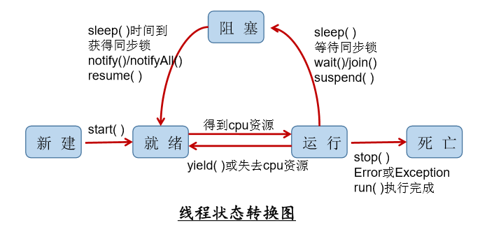

多线程的学习

<!-- more -->

# 多线程

## 0. 基本概念

### 0.0. 程序(program)

是为完成特定任务、用某种语言编写的一组指令的集合。指一段**静态的代码**，静态对象。

### 0.1. 进程(process)

是程序的一次执行过程，或是正在运行的一个程序。是一个**动态的过程**，有它自身的产生、存在和消亡的过程。是操作系统管理和调度的最小单位。每个进程之间的内存相互独立。

### 0.2. 线程(thread)

线程是程序内部的一条执行路径。是CPU调度任务的最小单位。线程共享同一个进程的内存。

### 0.3. 并行

并行：**多个CPU同时执行多个任务**。例：多个人同时做不同的事。

### 0.4. 并发

并发：一个CPU(采用时间片)同时执行多个任务。例：秒杀、多个人做同一件事。

### 0.5. 何时需要多线程

- 程序需要执行**两个或多个任务**
- 程序需要**实现一些需要等待的任务**时，如用户输入、文件读写操作、网络操作、搜索等
- 需要一些**后台运行的程序**时

## 1. 线程的创建和使用

### 1.0. JDK1.5之前

- 继承Thread类的方式
- 实现Runnable接口的方式

### 1.1. JDK1.5之后

- 继承Thread类的方式
- 实现Runnable接口的方式
- 实现Callable接口的方式
- 使用线程池

#### 1.1.0. 方式一：继承Thread类

- 继承Thread类
- 重写`public void run()`方法
- 创建线程对象
- 启动线程：`线程对象.start();`

##### 注意点

- 手动调用`run()`方法，是启动不了线程的，要想启动线程，得调用`start()`方法。
- 一个线程对象只能调用一次`start()`方法，否则抛出**IllegalThreadStateException**异常

#### 1.1.1. 方式二：实现Runnable接口

- 实现Runnable接口
- 实现`public void run ()`方法
- 创建线程对象
- 启动线程：借助Thread类的对象，`new Thread (自定义的线程对象).start()`

#### 1.1.2. 上面二者的区别 

- **继承限制**：
  - 继承Thread类**会有单继承的限制**；
  - 实现Runnable接口则**不会有单继承的限制**。
- **共享数据**：
  - 继承Thread类的方式，**共享数据方面比较麻烦**；
  - 而实现Runnable接口的方式，共享数据时，只需要**共用同一个Runnable接口的实现类对象**即可。
- **同步锁选择**：
  - 继承Thread类的方式，**同步的锁要么选static对象，要么选当前类Class的对象，即类名.class**；
  - 实现Runnable接口的方式，同步锁可**直接选this.对象**。
- **线程代码存放位置**：
  - 继承Thread类的方式，线程代码存放在Thread子类的`run()`方法中；
  - 实现Runnable接口的方式，线程代码存放在接口的实现类的`run()`方法中。

#### 1.1.3. 方式三：实现Callable接口 

- 实现Callable接口

- 重写call()方法

- 创建Callable实现类对象

- 将此对象传到FutrueTask构造器中，创建FutrueTask对象 

- 将此对象传到Thread构造器中，创建Thread对象，并调用`start()`方法

  ```java
  public class ThreadNew {
      public static void main(String[] args) {
          // 3. 创建Callable接口实现类的对象 
          NumThread numThread = new NumThread();
          // 4. 将此Callable接口实现类的对象传递到FutureTask构造器中，创建FutureTask的对象
          FutureTask futureTask = new FutureTask(numThread);
          new Thread(futureTask).start();
          // 5.将FutureTask的对象作为参数传递到Thread类的构造器中，创建Thread的对象，并start()
          try {
              // get方法返回值即为FutureTask构造器参数Callable实现类重写的call()的返回值
              Object sum = futureTask.get();
              System.out.println("总和为：" + sum);
          } catch (InterruptedException e) {
              e.printStackTrace();
          } catch (ExecutionException e) {
              e.printStackTrace();
          }
      }
  }

  // 1. 创建一个实现Callable的实现类
  class NumThread implements Callable {
      // 2. 实现call方法，将此线程需要执行的操作声明在call方法中
      @Override
      public Object call() throws Exception {
          int sum = 0;
          for (int i = 0; i < 100; i++) {
              if (i % 2 == 0) {
                  System.out.println(i);
                  sum += i;
              }
          }
          return sum;
      }
      
  }
  ```

#### 1.1.4. Callable方式与Runnable方式的区别

相比于Runnable方式，Callable方式创建线程功能更强大。

- Callable方式，`run()`方法可以有返回值
- 方法可以抛出异常
- 支持泛型的返回值
- 需要借助FutureTask类(Future接口的实现类)，来**获取返回结果**，**对Callable任务执行结果进行取消、查询是否完成等**。

#### 1.1.5. 使用线程池

提前创建好多个线程，放入线程池中，使用时直接获取，使用完放回池中。

##### 特点

- 提高响应速度(减少创建新线程的时间)
- 降低资源消耗(重复利用线程池中的线程，不需要每次都创建)
- 便于线程管理

##### 线程池相关API

JDK5.0起提供了线程相关的API：**ExecutorService** 和 **Executors** 

###### ExecutorService

ExecutorService，真正的线程池接口。常见子类**ThreadPoolExecutor**

- **void execute (Runnable command)**：执行任务，没有返回值，一般用来执行Runnable
- **<T> Future <T> submit (Callable <T> task)**：执行任务，有返回值，一般用来执行Callable
- **void shutdown()**：关闭连接池

###### Executors

Executors ，工具类、线程池的工厂类。用于创建并返回不同类型的线程池。

- **Executors.newCachedThreadPool()**：创建一个可根据需要创建新线程的线程池 
- **Executors.newFixedThreadPool(n)**：创建一个可重用固定线程数的线程池 
- **Executors.newSingleThreadExecutor()** ：创建一个只有一个线程的线程池
- **Executors.newScheduledThreadPool(n)**：创建一个线程池，它可安排在给定延迟后运 行命令或者定期地执行。

###### 示例

```java
class NumberThread implements Runnable{
    @Override
    public void run() {
        for(int i = 0;i <= 100;i++){
            if(i % 2 == 0){    System.out.println(Thread.currentThread().getName() + ": " + i);
            }
        }
    }
}

class NumberThread1 implements Runnable{

    @Override
    public void run() {
        for(int i = 0;i <= 100;i++){
            if(i % 2 != 0){
                System.out.println(Thread.currentThread().getName() + ": " + i);
            }
        }
    }
}

public class ThreadPool {

    public static void main(String[] args) {
        //1. 提供指定线程数量的线程池
        ExecutorService service = Executors.newFixedThreadPool(10);
        ThreadPoolExecutor service1 = (ThreadPoolExecutor) service;
        //设置线程池的属性
//        System.out.println(service.getClass());
//        service1.setCorePoolSize(15);
//        service1.setKeepAliveTime();


        //2.执行指定的线程的操作。需要提供实现Runnable接口或Callable接口实现类的对象
        service.execute(new NumberThread());//适合适用于Runnable
        service.execute(new NumberThread1());//适合适用于Runnable

//        service.submit(Callable callable);//适合使用于Callable
        //3.关闭连接池
        service.shutdown();
    }

}
```

## 2. Thread类的相关方法

- **void start()**:  启动线程，并执行对象的run()方法 
- **run()**:  线程在被调度时执行的操作 
- **String getName()**:  返回线程的名称 
- **void setName(String name)**:设置该线程名称 
- **static Thread currentThread()**: 返回当前线程。在Thread子类中就 是this，通常用于主线程和Runnable实现类
- **static  void  yield()**：线程让步 
  - 暂停当前正在执行的线程，把执行机会让给优先级相同或更高的线程 
  - 若队列中没有同优先级的线程，忽略此方法 
- **join()** ：当某个程序执行流中调用其他线程的 join() 方法时，调用线程将 被阻塞，直到 join() 方法加入的 join 线程执行完为止
  - 低优先级的线程也可以获得执行
- **static  void  sleep(long millis)**：(指定时间:毫秒)
  - 令当前活动线程在指定时间段内放弃对CPU控制,使其他线程有机会被执行,时间到后 重排队。 
  - 抛出InterruptedException异
- **stop()**: 强制线程生命期结束，不推荐使用
- **boolean isAlive()**：返回boolean，判断线程是否还活着

## 3. 线程的优先级

**优先级指的是被调用概率的大小**；**线程创建时继承父线程的优先级**。

### 优先级设置

**MAX_PRIORITY**:10

**MIN_PRIORITY**:1

**NORM_PRIORITY**:5

### 涉及方法

- **getPriority()**:返回线程优先值
- **setPriority(int newPriority)**:改变线程的优先级

## 4. 线程的分类

Java中的线程分为两类：一种是**守护线程**，一种是**用户线程**。

- 它们在几乎每个方面都是相同的，唯一的区别是判断**JVM何时离开**。 
- 守护线程是用来服务用户线程的，通过在`start()`方法前调用 `thread.setDaemon(true)`可以把一个用户线程变成一个守护线程。 
- Java垃圾回收就是一个典型的守护线程。 
- 若JVM中都是守护线程，当前JVM将退出。

## 5. 线程的生命周期

- **新建**： 当一个Thread类或其子类的对象被声明并创建时，新生的线程对象处于新建状态 
- **就绪**：处于新建状态的线程被`start()`后，将进入线程队列等待CPU时间片，此时它已具备了运行的条件，只是没分配到CPU资源 
- **运行**：当就绪的线程被调度并获得CPU资源时,便进入运行状态， `run()`方法定义了线程的操作和功能 
- **阻塞**：在某种特殊情况下，被人为挂起或执行输入输出操作时，让出CPU 并临时中止自己的执行，进入阻塞状态 
- **死亡**：线程完成了它的全部工作或线程被提前强制性地中止或出现异常导致结束

#### 线程生命周期图



## 6. 线程的同步

多线程会出现安全问题。问题的原因是当多条语句在操作同一个线程共享数据时，一个线程对多条语句只执行了一部分，还没有执行完，另一个线程参与进来执行，导致共享数据的错误。 

解决办法： 对多条操作共享数据的语句，只能让一个线程都执行完，在执行过程中，其他线程不可以参与执行。即Java的**同步锁机制**。

使用**锁**时，必须**确保使用同一个资源的多个线程共用一把锁**，这个非常重要，否则就无法保证共享资源的安全。

### 6.0. Synchronized 

**Synchronized**既可以修饰代码块，又可以修饰方法。

#### 6.0.0. Synchronized的锁

- **任意对象**都可以作为同步锁。所有对象都自动含有单一的锁（监视器）。 
- 同步方法的锁：静态方法（**类名.class**）、非静态方法（**this**）
- 同步代码块：自己指定，很多时候也是指定为**this**或**类名.class** 

### 6.1. Lock

JDK 5.0开始，Java提供了更强大的线程同步机制——通过显式定义同 步锁对象来实现同步。同步锁使用**Lock对象**充当。

#### 6.1.0. 接口Lock 

java.util.concurrent.locks.Lock接口是控制多个线程对共享资源进行访问的工具。锁提供了对共享资源的独占访问，每次只能有一个线程对Lock对象 加锁，**线程开始访问共享资源之前应先获得Lock对象**。

#### 6.1.1. ReentrantLock 

ReentrantLock 类实现了 Lock ，它拥有与 synchronized 相同的并发性和 内存语义，在实现线程安全的控制中，比较常用的是ReentrantLock，可以 显式加锁、释放锁。

```java
class A{
    private final ReentrantLock lock = new ReenTrantLock();
    public void m(){
        lock.lock(); 
        try{ 
            //保证线程安全的代码; 
        } finally{ 
            lock.unlock();  
        } 
    }
}
```

### 6.3. Synchronized和Lock的区别 

- Lock是**显式锁**（手动开关），synchronized是**隐式锁**（出了作用域自动释放）
- Lock只有**代码锁**，synchronized两者都有
- Lock性能更好，具有更好的扩展性（提供更多的子类）

### 6.4. 使用顺序

Lock-->同步代码块（已经进入了方法体，分配了相应资源）--> 同步方法 （在方法体之外）

### 6.5. 锁的释放

#### 6.5.0. 释放锁的操作

- 当前线程的同步方法、同步代码块**执行结束**。 
- 当前线程在同步代码块或同步方法中遇到**break、return**终止了该代码块或该方法的继续执行。 
- 当前线程在同步代码块、同步方法中出现了未处理的Error或Exception，导致**异常结束**。 
- 当前线程在同步代码块、同步方法中执行了线程对象的`wait()`方法，当前线程暂停，并释放锁。

#### 6.5.1. 不释放锁的操作

- 线程执行同步代码块或同步方法时，程序调用`Thread.sleep()`、 `Thread.yield()`方法暂停当前线程的执行。
- 线程执行同步代码块时，其他线程调用了该线程的`suspend()`方法将该线程 挂起，该线程不会释放锁。
  - 应尽量避免使用`suspend()`和`resume()`来控制线程

### 6.6. 线程的死锁

不同的线程分别占用对方需要的同步资源不放弃，都在等待对方放弃自己需要的同步资源，就形成了线程的死锁。

出现死锁后，不会出现异常，不会出现提示，只是所有的线程都处于阻塞状态，无法继续。

#### 6.6.0. 解决方法

- 专门的算法、原则
- 尽量减少同步资源的定义
- 尽量避免嵌套同步

#### 6.6.1. 死锁示例

施工中

### 6.7. 线程安全的懒汉式

```java
class Singleton{
    private static Singleton instance = null; 
    private Singleton(){} 
    
    public static Singleton getInstance(){ 
        if(instance==null){ 
            synchronized(Singleton.class){ 
                if(instance == null){ 
                    instance=new Singleton(); 
                } 
            } 
        } 
        return instance; 
    } 
} 

public class SingletonTest{ 
    public static void main(String[] args){ 
        Singleton s1=Singleton.getInstance(); 
        Singleton s2=Singleton.getInstance();
        System.out.println(s1==s2); 
    } 
}
```

## 7. 线程的通信 

### 7.0. 线程通信相关方法

以下方法只有在**synchronized方法**或**synchronized代码块**中才能使用，否则会报 java.lang.IllegalMonitorStateException异常。调用者必须是同步代码块或同步方法中的**同步监视器**(锁对象)。

- **wait()/wait(毫秒)** : 使当前线程进入阻塞状态，并释放锁。
- **notify()** :唤醒等待的一个线程
- **notifyAll()** :唤醒全部等待的线程

### 7.1. Sleep()和wait()的异同

相同点：使线程进入阻塞状态 

不同点：**两方法声明位置不同**，Thread类中声明sleep(),Object类中声明wait() 

     **调用要求不同**：sleep()可以在任何场景下使用，wait()必须在同步代码或同步方法中 

### 7.2. 生产者，消费者例题

​生产者(Productor)将产品交给店员(Clerk)，而消费者(Customer)从店员处取走产品，店员一次只能持有固定数量的产品(比如:20），如果生产者试图生产更多的产品，店员会叫生产者停一下，如果店中有空位放产品了再通知生产者继续生产；如果店中没有产品了，店员会告诉消费者等一下，如果店中有产品了再通知消费者来取走产品。

这里可能出现两个问题：

  生产者比消费者快时，消费者会漏掉一些数据没有取到。   

​	消费者比生产者快时，消费者会取相同的数据。

```java
public class ProductTest {
    public static void main(String[] args) {
        Clerk clerk = new Clerk();

        Producer p1 = new Producer(clerk);
        p1.setName("生产者1");
        Consumer c1 = new Consumer(clerk);
        c1.setName("消费者1");
        Consumer c2 = new Consumer(clerk);
        c2.setName("消费者2");
        
        p1.start();
        c1.start();
        c2.start();
    }

}

class Clerk {
    private int productCount = 0;
    // 生产产品
    public synchronized void produceProduct() {
        if (productCount < 20) {
            productCount ++;
            System.out.println(Thread.currentThread().getName() + ":开始生产第" + productCount + "个产品。");
            notify();
        }else {
            try {
                wait();
            } catch (InterruptedException e) {
                // TODO Auto-generated catch block
                e.printStackTrace();
            }
        }
    }
    // 消费产品
    public synchronized void consumProduct() {
        if (productCount > 0) {
            System.out.println(Thread.currentThread().getName() + "：开始消费第" + productCount + "个产品。");
            productCount --;
            notify();
        }else {
            try {
                wait();
            } catch (InterruptedException e) {
                // TODO Auto-generated catch block
                e.printStackTrace();
            }
        }
    }

}

class Producer extends Thread{// 生产者
    private Clerk clerk;

    public Producer(Clerk clerk) {
        super();
        this.clerk = clerk;
    }

    @Override
    public void run() {
        super.run();
        System.out.println(getName() + ":开始生产产品......");

        while (true) {

            try {
                Thread.sleep(20);
            } catch (InterruptedException e) {
                e.printStackTrace();
            }
            clerk.produceProduct();
        }
    }
}

class Consumer extends Thread{// 消费者
    private Clerk clerk;

    public Consumer(Clerk clerk) {
        super();
        this.clerk = clerk;
    }

    @Override
    public void run() {
        super.run();
        System.out.println(getName() + ":开始消费产品......");

        while (true) {

            try {
                Thread.sleep(100);
            } catch (InterruptedException e) {
                e.printStackTrace();
            }
            clerk.consumProduct();
        }
    }

}
```


