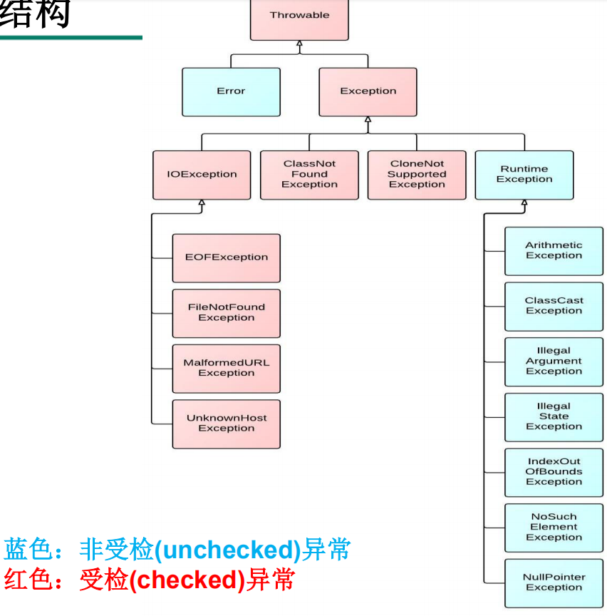

简单学习一下异常

<!-- more -->

# 异常

## 0. 异常概述

> 在Java语言中，将程序执行中发生的不正常情况称为”异常“。
> (开发过程中的语法错误和逻辑错误不是异常)

### 0.0. 异常事件分类

- java.lang.Error：Java虚拟机无法解决的严重问题。如JVM系统内部错误、资源耗尽等严重情况。
  - VirtualMachineError
    - StackOverflowError
    - OutOfMemoryError：简称OOM

- java.lang.Exception：其他因编程错误或偶然的因素导致的一般性问题，可以使用针对性代码进行处理。
  - RntimeException(运行时异常)
    - NullPointerException(空指针异常)
    - ArrayIndexOutOfBoundsException(数组下标越界异常)
    - ClassCastException(类型转换异常)
    - ArithmeticException(算术异常)
    - NumberFormatException(数字格式化)

  - 编译时异常(受检异常)

    - 在编译阶段必须要进行处理，否则编译不通过 
    - 例：SQLException,IOException等

    ​

### 0.1. 异常图解



## 1. 异常处理机制

### 1.0. 过程描述

> Java虚拟机会在发生异常的那句代码的位置，创建一个异常的对象，并且抛出。这时，它会检测有没有try...catch，如果有对应的catch，那么程序正常运行，如果没有合适的catch，会被往上抛出，如果一路上都没有被catch，最终会导致程序终止运行。

### 1.1. try-catch-finally

```java
try {
    // 可能会发生的代码
} catch (异常类型 e) {
    // 捕获该异常后如何处理
} catch (异常类型 e) {
    // 捕获该异常后如何处理
} finally {
    // 最后一定会执行的代码
}
```

- 如果try中有异常，try剩下的代码就不执行了。会去找对应的catch，没找到对应的catch块，执行完finally后将异常抛出，抛到上级
- `try-catch-finally`，三选二，try必须要有
- 多个catch异常类型的顺序是“**子上父下**”
- 如果finally中有return，那么一定是从finally中返回的
- 如果finally中没有return，会先执行finally中的语句，然后return结束，reutrn返回的值是在执行finally之前就赋好值的

### 1.2. throws

> 如果方法可能生成某种异常，但不确定如何处理，则此方法应显示声明抛出异常，表明该方法将不对这些异常进行处理，而由该方法的调用者处理

- **throws**用在方法处，可以声明抛出异常，抛出的异常可以有多个

- **throws**抛出的异常类型可以是方法中产生的异常类型，也可以是它的父类

  ​


### 1.3. throw

> Java异常类对象除了由系统自动生成并抛出外，也用**`throw`手动抛出**
>
> 手动抛出的异常必须是Throwable或其子类的实例

```java
throw new IOException();
```

## 2. 自定义异常类

- 一般来说，自定义异常类都是**RuntimeException**的子类
- 自定义异常类通常需要编写几个**重载的构造器**
- 自定义异常类通常要序列化，并提供**serialVersionUID**
- 自定义异常类通过`throw`抛出

## 3. 异常的方法

- **public String getMessage()**：返回关于发生的异常的详细信息。

- **public Throwable getCause()**：返回一个Throwable 对象代表异常原因。

- **public String toString()**：使用getMessage()的结果返回类的串级名字。

- **public void printStackTrace()**：打印toString()结果和栈层次到System.err，即错误输出流。

  ……